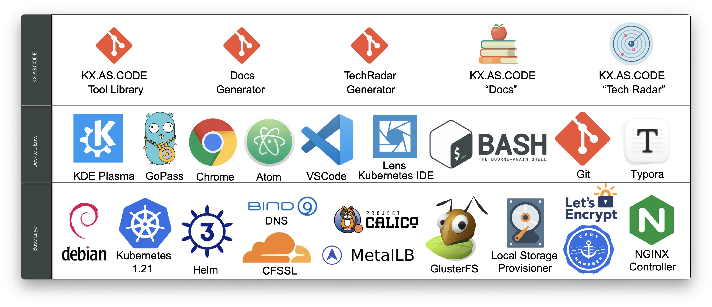
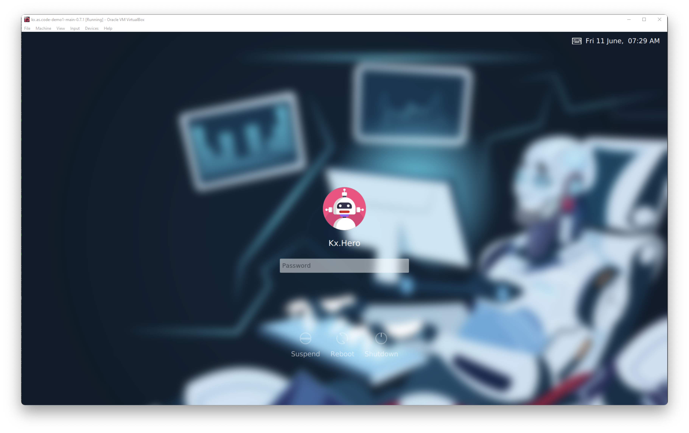
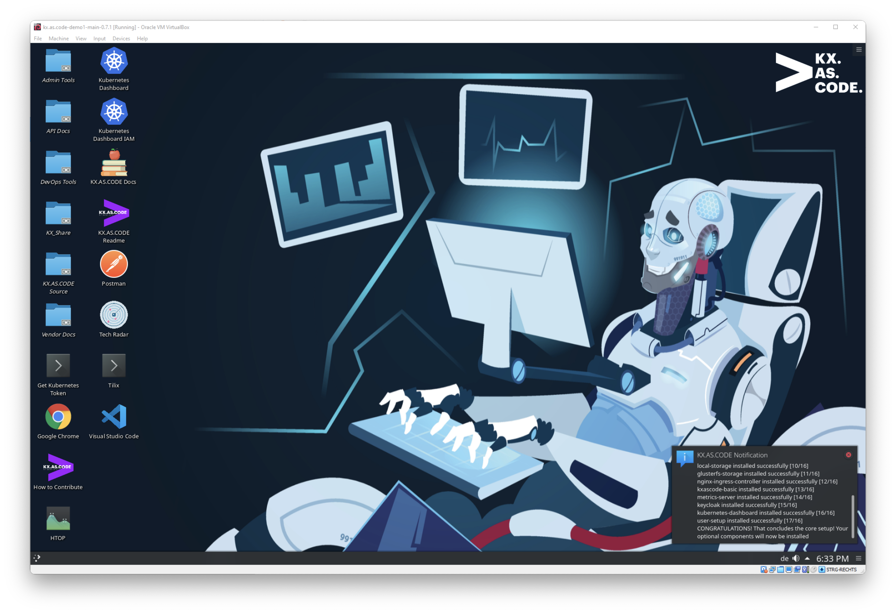
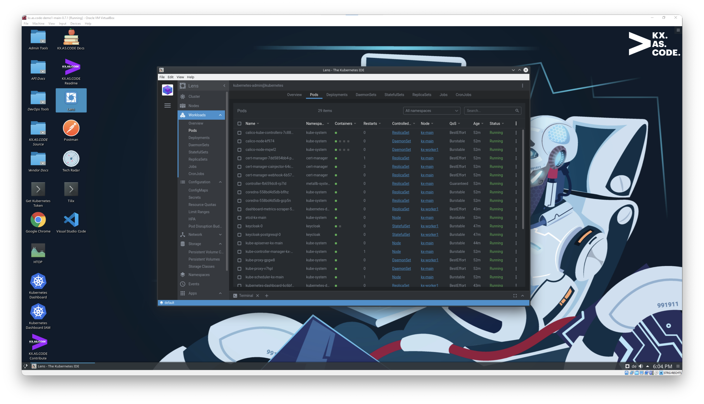
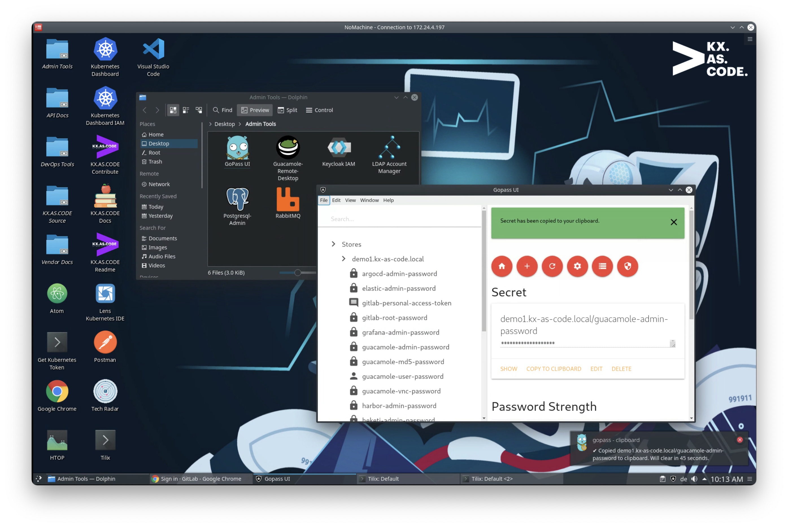
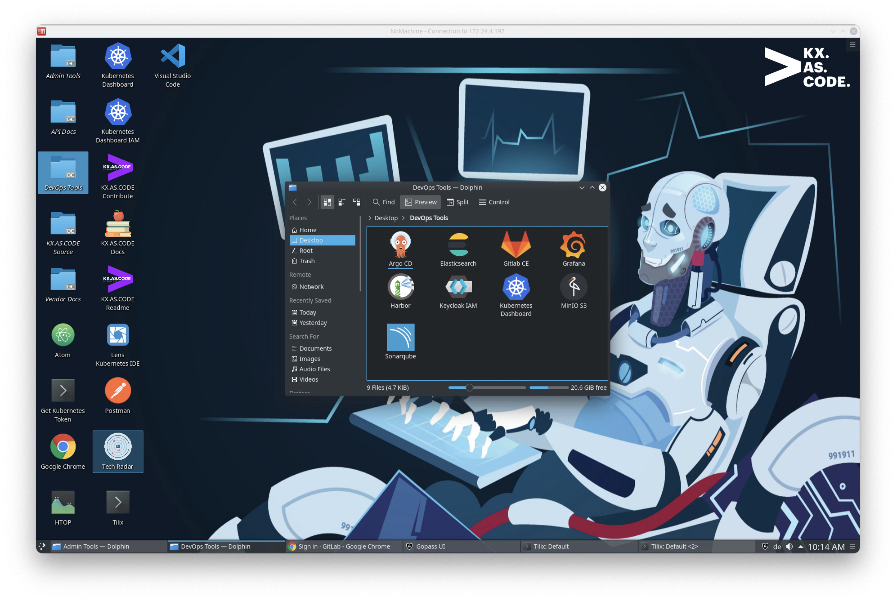
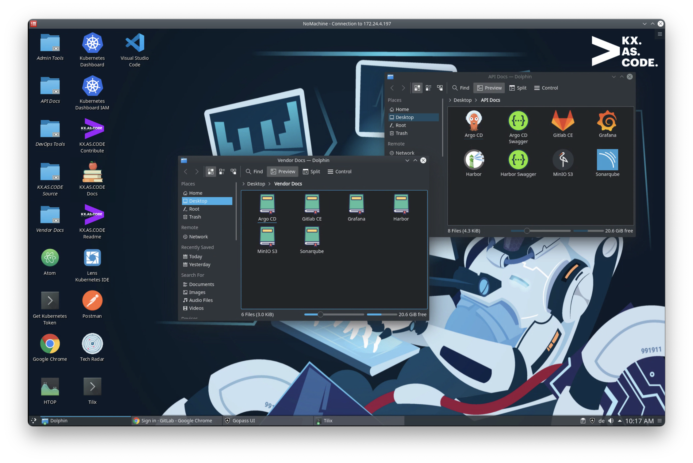
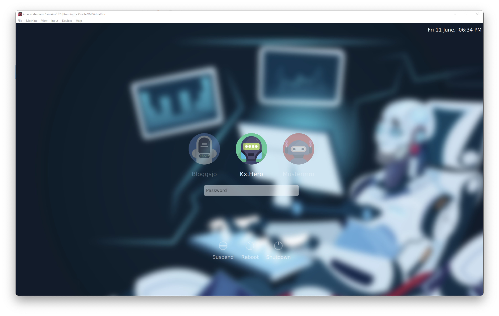

# Welcome!

Welcome to the KX.AS.CODE learning workstation. This virtual workstation was created with two primary goals in mind.

*   Play, learn, experiment, fail, learn, succeed :muscle: :trophy:
*   Share knowledge a code!

As well as learning and sharing knowledge, there are several more use cases for this KX workstation. Here just a few more:

*   Use it for demoing new technologies/tools/processes
*   Keep your physical workstation clean whilst experimenting
*   Have fun playing around with new technologies
*   Use it as an accompaniment to trainings and certifications
*   Experimenting and innovating

## What is the KX.AS.CODE Workstation?

It can be considered as a local cloud like Kubernetes environment with a lot of things you would expect to see when managing a Kubernetes cluster in the cloud, including an ingress controller, storage cluster, DNS, a certificate authority... and the best bit, you just have to fill out a couple of config files and vagrant up/terraform apply, and you are on your way!

## Why did we create this workstation?
Many reasons! For our own learning and fun, for enabling others to enjoy and get into DevOps, as well as to give something back to the community, because we and everyone else in DevOps, benefit hugely from the wonderful OpenSource tools that are out there!

Additionally, the machines we use at work or have sitting at home are getting more powerful all the time, and not everyone has access to a cloud account, so lets use that power we have at home or at work to do more! :metal:

## What makes this different to other solutions?
As this we originally envisaged this as a DevOps training/enablement environment, we didn't just want to deploy a bunch of empty tools, but to make it feel like a live project environment, with repositories and docker images already populated, and some processes in place, to demonstrate for example, topics such as container runtime security or GitOps.

This depends on what you choose to install, as the solution is flexible - you can choose up front in a JSON file, which tools should be installed once the base system is up.

## Where can I deploy KX.AS.CODE?
KX.AS.CODE can be deployed locally or in the cloud, be it a private or public cloud. The most tested solutions are currently OpenStack and VirtualBox. Here a full list of solutions we have run KX.AS.COEE on.

1. VMWare Workstation/Fusion (MacOSX, Linux and Windows)
2. VirtualBox (MacOSX, Linux and Windows)
3. Parallels (MacOSX)
4. AWS
5. OpenStack
6. VMWare VSphere (needs updating)

## What type of deployments does KX.AS.CODE support?
Depending on how big your laptop, desktop or server is, you can either deploy KX.AS.CODE in standalone mode, which means that everything happens in the one VM, or you can enable to have multiple worker and main nodes provisioned.  

It is possible through configuration, if physical resources are low, to have an additional worker node, and still have workloads started on the Kubernetes master.

## What is the minimal specification?
Whilst we have run it on some laptops with just 8GB ram, you will not have a good experience with this setup, even in standalone mode. The absolute minimum is a laptop/desktop/server with 12GB ram (allocating 8GB to KX.AS.CODE), although to have a good experience, it is recommended the host has at least 16GB ram, so that 12GB can be allocated to KX.AS.CODE.  

After that, the more the merrier! 32GB upwards things are starting to look good. The less memory and CPU cores you have, the less solutions/tools you can provision on your Kubernetes cluster.
If you are deploying to the public cloud, then your possibilities are endless, and you can deploy the entire stack - currently around 30 DevOps tools and more to come!

## Sounds good! Where can I get the images?
Currently, we do not have a public repository for the images needed for each virtualization solution. However, we have made it very easy to build your own. We have provided detailed instructions, but in short, you just need to fill out an environment file, run the Jenkins launch script, which creates your build environment, and finally, depending on the underlying solution, you can run the deployment jobs.

Only the VMs for the local virtualization environments (VMWare, VirtualBox, Parallels) can be deployed via Jenkins at the moment. The private and public cloud deployments need some command line love, but it's as easy as changing into the directory and executing `terraform apply`.

## Where is the solution now?

I guess it will never be "finished". DevOps is a fast paced world with lots of great tools coming out all the time. KX.AS.CODE was created and continues to be worked on as a side project by some very passionate and dedicated DevOps Engineers at Accenture Interactive ASGR, who have not lost their appetite for learning and trying new tools, so expect more releases to come in future! :partying_face:

## Contributing
We are happy to receive contributions, ideas and dare I say it, bug fixes or suggestions on how to do things better! We never stop learning! :nerd_face:  

For more details on how you can contribute to the project, checkout the [CONTRIBUTE.md](docs/contribute.md) file

## Screenshots

I hope you enjoy the workstation!

Patrick Delamere  
Accenture Interactive ASGR DevOps Lead  
[kx.as.code@accenture.com](mailto:kx.as.code@accenture.com)
