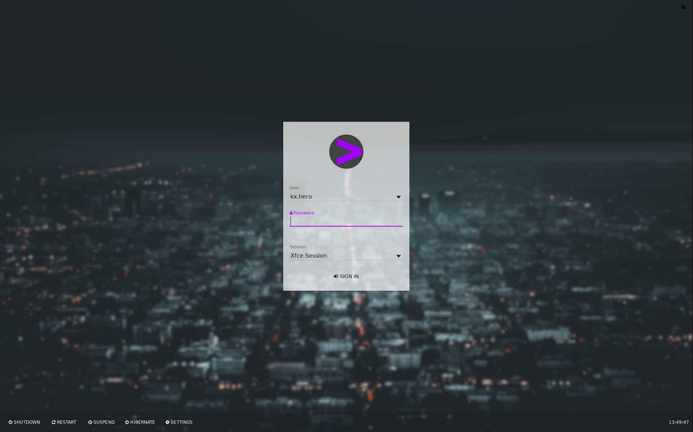
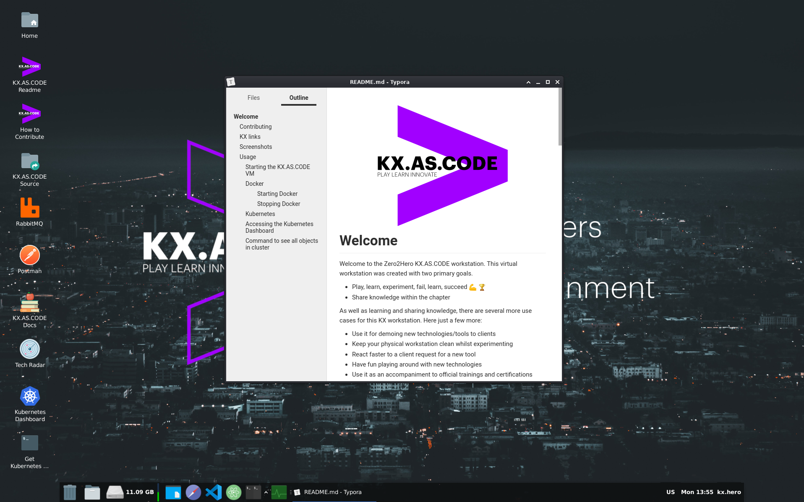

# Welcome

Welcome to the Zero2Hero KX.AS.CODE workstation. This virtual workstation was created with two primary goals.

*   Play, learn, experiment, fail, learn, succeed :muscle: :trophy:
*   Share knowledge within the chapter


As well as learning and sharing knowledge, there are several more use cases for this KX workstation. Here just a few more:

*   Use it for demoing new technologies/tools to clients
*   Keep your physical workstation clean whilst experimenting
*   React faster to a client request for a new tool
*   Have fun playing around with new technologies
*   Use it as an accompaniment to official trainings and certifications
*   Experimenting and innovating!

## Contributing
For more details on how you can contribute to the project, checkout the [CONTRIBUTE.md](CONTRIBUTE.md) file

## KX links
Here you can find all the links related KXAS project:

- [Gitlab](https://dev.ares.accenture.com/gitlab/kx.as.code/kx.as.code)
- [Blog](https://blog.accenture.com/kx-as-code/)

Here the [link](https://blog.accenture.com/kx-as-code/2020/05/05/v2-1-2/) to the full release note on our blog.


For previous releases, you can visit the following [page](https://blog.accenture.com/kx-as-code/category/releases/).

## Screenshots





## Usage
Currently the DevOps world is headed in two directions for running application and DevOps services -> Docker and Kubernetes.
For an in-depth guide on each one, see the following documentation:

- [Kubernetes](https://kubernetes.io/de/docs/)
- [Docker](https://docs.docker.com/)

### Starting the KX.AS.CODE VM

`IMPORTANT NOTE`
If you save all your data in the virtual machine, you will lose all data next time you want to renew the VM to get the latest version!
It is therefore recommended to mount a data directory on your host machine/laptop into the VM.
If you call the share "KX_Share" it will be mounted automatically.

As it is mostly automated, the only action remaining for VirtualBox is to open the shared folder settings of the downloaded virtual machine (.OVA) and correct the local host folder location.


### Docker
Docker is already started by default, nevertheless, here the commands to start and stop docker services in the KX.AS.CODE virtual machine.

##### Starting Docker
```bash
$ sudo systemctl start docker
```

##### Stopping Docker
```bash
$ sudo systemctl stop docker
```

You can test the installation by running the following command:
```bash
$ docker run hello-world
```

### Kubernetes

Kubernetes is automatically started with the virtual machine.
To access it, simply click on the "Kubernetes Dashboard" icon on the desktop.

### Accessing the Kubernetes Dashboard

To access the Kubernetes Dashboard, you will need to generate a token.

For your convenience, there is an icon already on the desktop that you only need to double click. Once done, copy the token and use it to login to Kubernetes.

### Command to see all objects in cluster

If you want to use the command line, just open up a terminal window and execute commands via kubectl.
For example, here a command to view all objects in Kubernetes across all namespaces.

```bash
# To see all objects:
$ kubectl get all --all-namespaces
```

Enjoy Contributing!
Your KX.AS.CODE Team :smiley:
