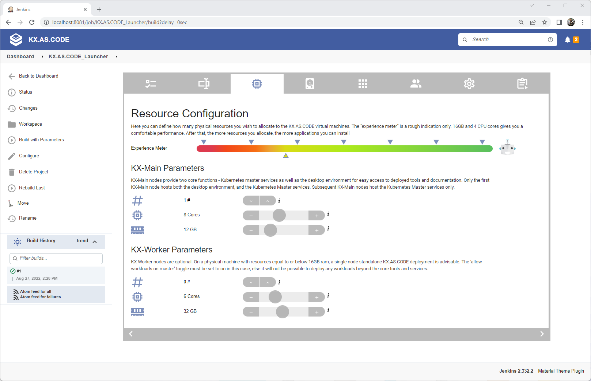
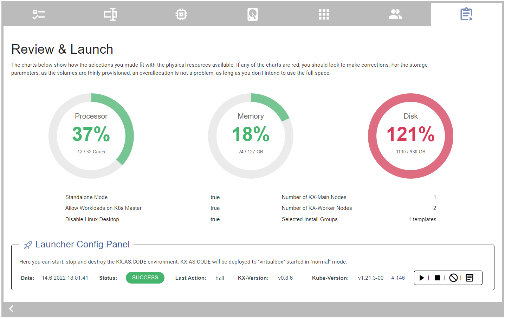
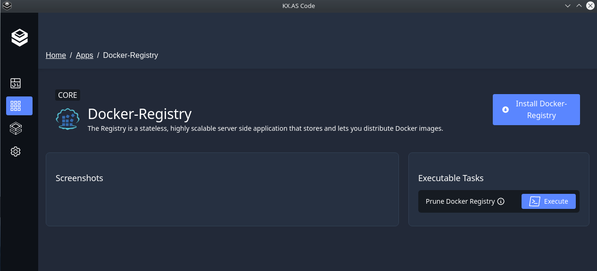

# Welcome!

Welcome to the KX.AS.CODE workstation. This virtual workstation was initially created with two primary goals in mind, but has since become so much more!

* Play, learn, experiment, innovate! :muscle: :trophy:
* Share knowledge as code!

Since then, due to the increase in the power and feature-set of KX.AS.CODE, the use case has expanded to the following more complex usage (see [use case example](https://accenture.github.io/kx.as.code/Overview/Use-Case-Example/)):

* Dynamic on-demand provisioning/destruction of test environments in the public/private cloud
* End-to-end developer workstation to enhance local quality assurance capabilities

### Message from the creator of KX.AS.CODE
> <i>I am a big fan of OpenSource technologies. Happy to give something back to the community. Without all the OpenSource technologies out there, this workstation wouldn't even be possible!</i>
-- Patrick Delamere, :slightly_smiling_face:
>
><i>P.S. Would be great if you could come and say hello in our [Discord channel](https://discord.gg/TbwD9cmqUC) and tell us how you are using KX.AS.CODE!</i> :partying_face:

## What is the KX.AS.CODE Workstation?

KX.AS.CODE is a dynamic fully configurable and customizable `local cloud like` `Kubernetes environment` with a number of functionalities you would expect to see when managing a `Kubernetes cluster` in the `cloud`, including an `ingress controller`, `local and network storage services`, `load-balancer`, `domain services`, `identity management`, `secrets management`, `remote desktop services`, a `certificate authority`... and the best bit, you can launch it very quickly from our Jenkins based configurator and launcher. See the [Quick Start Guide](https://accenture.github.io/kx.as.code/Quick-Start-Guide/)!

Once the base services are up, KX.AS.CODE has a built in `App Store` for quickly installing additional solutions on top of the base outlined above, such as `Gitlab`, `Grafana`, `InfluxDB`, `SonarQube`, `NeuVector`, `IntelliJ IDEA`, `MSSQLServer`... and many many more!

As a bonus, you also get a `desktop` for easily accessing and managing deployed applications. The desktop makes things easier, but if you prefer, you can also deploy KX.AS.CODE without it.

Check out the [applications library](https://accenture.github.io/kx.as.code/Overview/Application-Library/), to see which solutions can be installed with a single click!

## Where can I deploy KX.AS.CODE?
KX.AS.CODE can be deployed locally or in the cloud, be it a private or public cloud. The most tested solutions are currently OpenStack and VirtualBox. Here a full list of solutions we have run KX.AS.CODE on.

1. VMWare Workstation/Fusion (MacOSX, Linux and Windows)
2. VirtualBox (MacOSX, Linux and Windows)
3. Parallels (MacOSX)
4. AWS
5. OpenStack
6. VMWare VSphere (needs updating)

For the full guide on KX.AS.CODE, read full [documentation](https://accenture.github.io/kx.as.code/).

## What are we currently working on?

Raspberry Pi enablement &#10083;&#65039;  

 
Whilst the solution already works on Parallels, VirtualBox, VMWare, OpenStack and AWS, it's time to prepare for ARM64 compatibility. Currently, KX.AS.CODE is limited to running on AMD64 CPU architectures. 

The Raspberry Pi project will add ARM64 to the mix. Once done, the next step will be to test and optimize for Mac M1/M2 CPUs as well.

This is also the first time we run KX.AS.CODE on bare-metal, which is an additional bonus. :smile:

You can follow our Raspberry Pi enablement progress on our [Discord Raspberry Pi channel](https://discord.gg/XC64HNgeXK).

Here some screenshots from our current project.

## Screenshots

Here some impressions of KX.AS.CODE. Read our [documentation](https://accenture.github.io/kx.as.code/) on GitHub Pages for a more comprehensive view on KX.AS.CODE.

### Jenkins based launcher for building and launching KX.AS.CODE

Configure your KX.AS.CODE instance using the Jenkins based launcher. On this screen you can select between K3s and K8s amongst others.

### Hardware resource allocation for virtual machine(s)

Here you determine how much physical resource you want to allocate to the kx-main and the optional kx-worker node(s). The experience bar gives you a very rough indication as to the experience you may expect given the allocation.

### Optionally select application groups to install

You can also configure application groups that will be installed on first launch of KX.AS.CODE. More groups and individual applications can be added later.

### Review configuration and launch KX.AS.CODE

Once done configuring KX.AS.CODE in the launcher, you can review the settings and launch the KX.AS.CODE environment.

### KX.AS.CODE login screen

Depending on whether the defaults were changed or not, you can either log in with your own user, or the default `kx.hero`.

### KX.AS.CODE Desktop

This is the home of KX.AS.CODE from where you can launch the deployed applications, read manuals, test API calls, administer the VM, and so on.

### KX.AS.CODE installed applications, as selected in the KX.AS.CODE Launcher

The applications folder show the icons of the applications that have been installed so far and are available to launch. Use `GoPoass` to get the password for accessing the application.

### Gitlab Installed to KX.AS.CODE

Here an example Gitlab application that was installed via the KX.AS.CODE automated install scripts.

### Administration Tools

The tools for administering some elements of KX.AS.CODE. More details will be published on the administration page (wip).

### Application API Manuals

Since we are in the world of DevOps here, API documentation is important for automating any workflows. API documentation is automatically linked for all applications installed via KX.AS.CODE.

### Harbor Swagger API

If an application has a Swagger endpoint, this is also accessible via the API docs folder.

### Postman API documentation

If an application has a Postman endpoint or public link, this is also accessible via the API docs folder.

### Application Manuals

Administration and user manuals are useful if you are new to an application and want to read up on how it works.

### Source code in VSCode

Since the original concept of KX.AS.CODE was all about sharing knowledge as code (it has since become so much more), a pre-configured VSCode is installed that includes all the KX.AS.CODE source code.

### Credential Management with GoPass

All administration passwords for accessing all admin tools and applications are stored here. The passwords for the users are also available here.

### Kubernetes Management with OpenLens

OpenLens, known as the Kubernetes IDE, displays information about the running workloads in Kubernetes and their status. It is useful for debugging if there is an issue with any of the workloads.

### KX.AS.CODE Management with the KX.AS.CODE Portal (ALPHA)

The KX.AS.CODE portal makes adding and removing applications easier, and provides status on current installed items.

### KX.AS.CODE Portal - App Store

Applications can be removed and added from the KX.AS.CODE Portal's app store screen.

### KX.AS.CODE Portal - Application Details

The application details screen shows more information about the application. It is also possible to execute `tasks` from this screen.
In the future, this screen will also allow the user to enter values for input arguments.

### KX.AS.CODE Portal - Application Groups

Applications can be installed in integrated groups. This is still in development, so the install button currently does not execute the group installation.
See the [manual installations](Deployment/Manual-Provisioning/#installation-groups) page, on how to install the groups manually without the portal.

