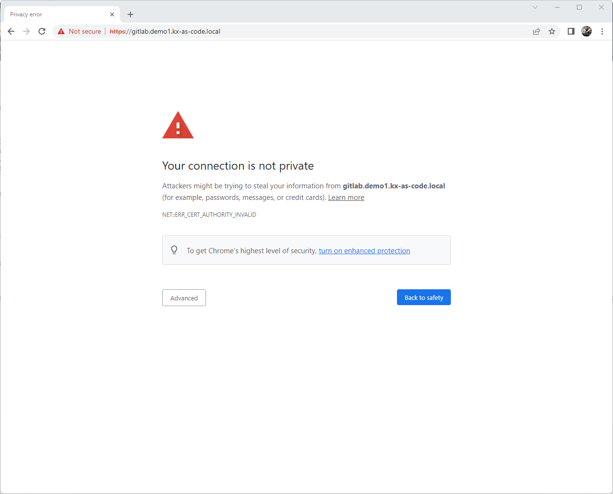
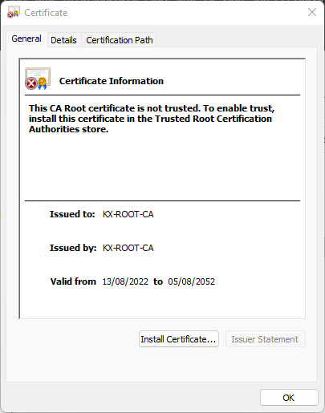
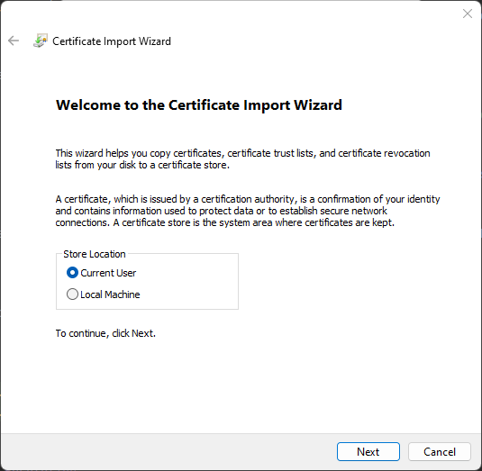
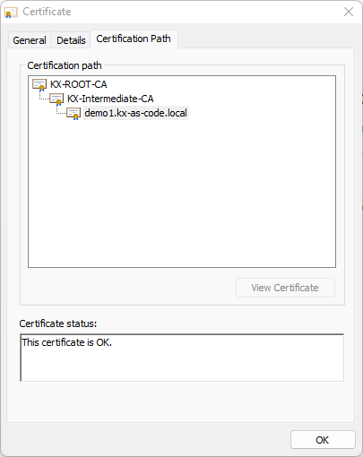
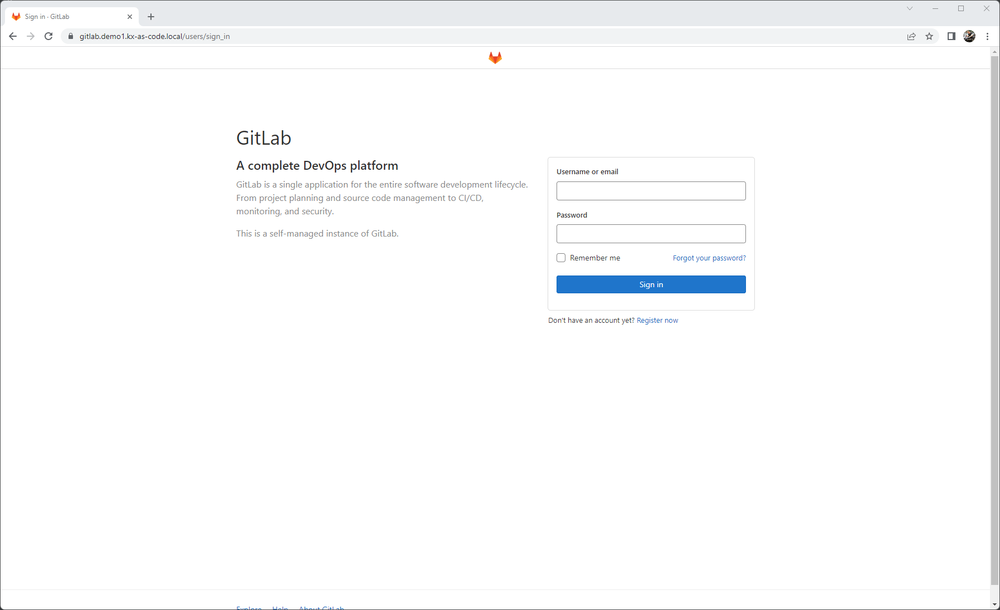

# External Application Access

Check the following [page](../../Deployment/Remote-Access/) for accessing the remote desktop. This page will cover how to access the application URLs remotely.

This page is particularly relevant if you have gone for a minimal setup with the remote desktop disabled.

There are just three things that need to be performed.
 
- Create a NAT rule within your virtualization solution, from your host machine to the KX-Main1 VM on port 443 (source and destination port) (already done automatically, just adding it here for completeness)
- Install the KX.AS.CODE certificate authority root and intermediate root CAs to your certificate trust store
- Add host entries to your `/etc/hosts` for Linux/Mac or `C:\Windows\System32\drivers\etc\hosts` for Windows 

All the files you need are made available to you during the initial core setup of KX.AS.CODE.

{: .zoom}
!!! danger "Important"
    If you are running KX.AS.CODE in a public cloud, it is recommended to access the deployed applications via an `allow list`. Check your cloud's documentation on how to do this.

### Fully Qualified Domain Name (FQDN) Resolution

To be able to access the application URLs from outside the VM, the ingress port is already exposed automatically.
However, to access the applications, it is necessary to use the domain names, else the NGINX ingress controller will not know how to route the request.

To that end, you need to make the domain name KX.AS.CODE is deployed with (either default `demo1.kx-as-code.local`, or an alternative one if you configured it), resolvable outside of the VM.

The hosts file can be found in the profile directory for the virtualization solution you started (likely to be one of `kx.as.code/profiles/vagrant-parallels`, `kx.as.code/profiles/vagrant-virtualbox` or `kx.as.code/profiles/vagrant-vmware-desktop`) you will find a directory called `kx-external-access`. In this directory you will find both the `hosts file` and the `CA certificates`.

Once done, if you access one of the applications in the hosts file, you are likely to see the following in your browser.

{: .zoom}

The error that "Your connection is not private" is normal, as you have likely not yet imported the KX.AS.CODE certificate authority root certificates. The SSL section below will explain how to do this.  

!!! warning
    If you already had something running on port 443, you will need to find out what port is set instead. This is because vagrant is set to automatically assign a new port, in case the one it has been requested to listen on, is already blocked by another service.

!!! tip
    You could of course also expose the DNS server running on KX-Main1, again, by creating a NAT rule for it, and then updating your network settings to also use the KX.AS.CODE DNS server for domain name resolution.

    If you are running in a cloud, you may want to create a DNS entry in your Route53 or equivalent service, for reaching the NGINX ingress controller. Don't forget you may also need to update your firewall rules. 

### SSL
When KX.AS.CODE is deployed, it creates a new `Certificates Authority`. All SSL certificates created for KX.AS.CODE are signed with this CA.

Therefore, to access the URLs remotely and have a green padlock in your browser, you will need to install these to your workstation.

As we saw in the section above, before the certificates are trusted, your browsers will show an error. Digging a little deeper, you would see the following:

{: .zoom}

Most of the time, regardless of what operating system you are working on, double-clicking the certificate normally gives the option to install it to the local certificate store.

!!! danger "Important"
    Regardless of the operating system you are using, you are likely to have several certificate stores to which you can import the KX.AS.CODE CA certificates. You must select the trusted certificate store!

Below an example for Windows.

As in the first screenshot above, there are 2 certificates (`Kx-root-ca.crt` and `kx-intermediate-ca.crt`) in the kx-external-access directory.
Double click each one and follow the process in the screenshots below.
Where there is no screenshot, simply press next or ok to proceed to the next step.

{: .zoom}

Very important to select the `Trusted Root Certification Authorities`. For the intermediate certificate file import, you may choose the `Intermediate Certification Authorities` store

{: .zoom}

After the certificates are imported, be sure to restart your browser, or open a new tab in incognito mode.

Certificate chain complete

{: .zoom}

Gitlab now loading with a trusted certificate and the error message has gone

{: .zoom}

