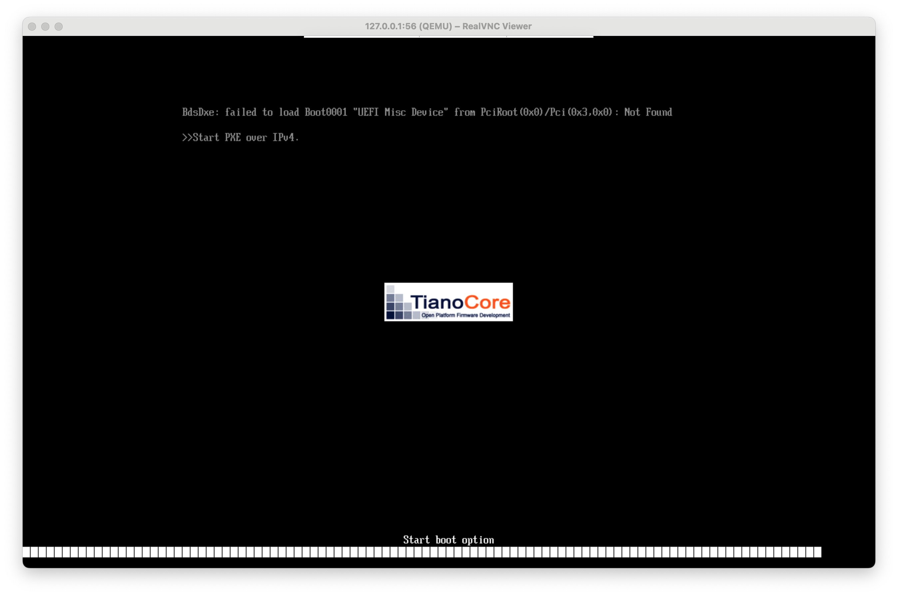
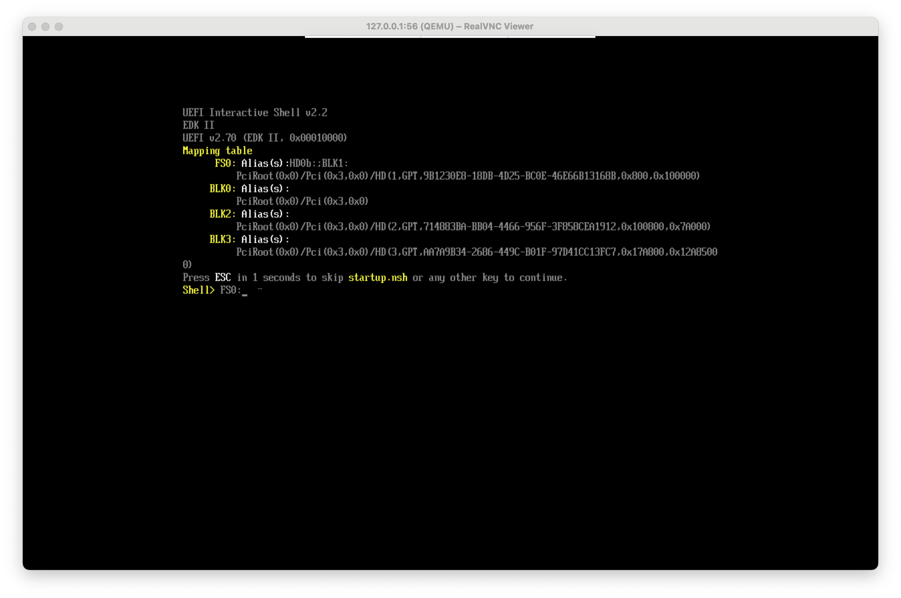
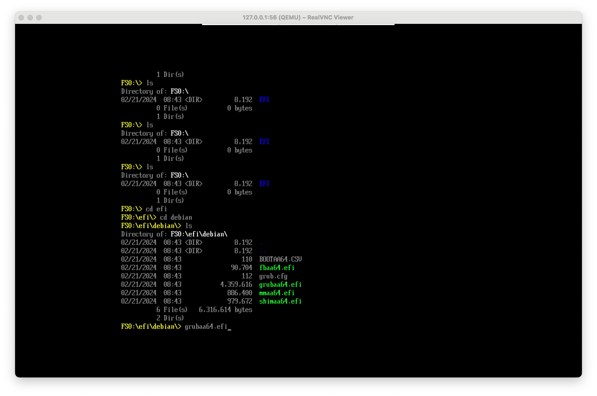
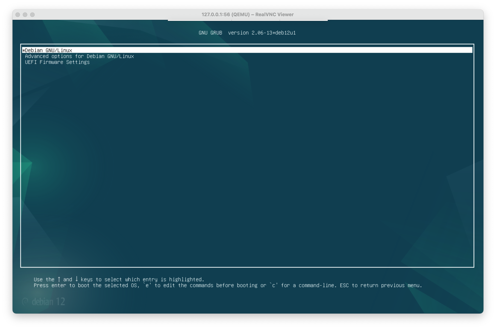

# Deployment on a MacBook with ARM Chips (Apple M1, M2, ...)

This guide will detail how to deploy images from Vagrant Cloud to your local MacBook using qemu.

## Software Pre-requisites

This is the software stack used:
- Chip: >= Apple M1 Pro. Check at Apple --> About this Mac
- MacOS: >= Sonoma 14.2.1. Check at Apple --> About this Mac
- [Homebrew](https://brew.sh/)
- [Vagrant](https://developer.hashicorp.com/vagrant/install#darwin)
- Qemu: `brew install qemu`
- Vargrant plugin: `vagrant plugin install vagrant-qemu`

## Create Vagrant Qemu `kx-main` Instance

```shell
mkdir kx-master
cd kx-master
vagrant box add kxascode/kx-main
```

Create the `Vagrantfile`

```
curl -o kx.as.code_virtualbox.erb https:/raw.githubusercontent.com/Accenture/kx.as.code/feature/mac-arm-architecture/base-vm/templates/kx.as.code_qemu.erb
vagrant init kxascode/kx-main --box-version 0.8.16 --template kx.as.code_qemu.erb
```

## First time start of the `kx-main` instance

```shell
vagrant up
````

Use [VNC](https://www.realvnc.com/de/connect/download/viewer/) to connect to 127.0.0.1:56 . 
You should see UEFI trying to boot. 



Wait several minutes until you see the `UEFI Interactive Shell`



Type:
```shell
FS0:
ls
```

!!! tip
    Unfortunately you will not see what you type. You have to close and reopen the vnc connection to see the result.

Type: 
```shell
cd efi
cd debian
grubaa64.efi
```



A GRUB screen will show up



Just wait or select the first entry.

The login screen will show up.


## Set UEFI Boot Entry

Switch back to your local shell and enter
```shell
vagrant ssh
sudo efibootmgr --create --disk /dev/?da --part 1 --write-signature --label debian --loader '\EFI\debian\grubaa64.efi'
```