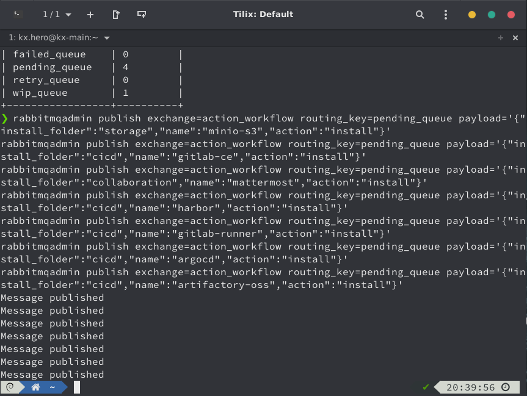
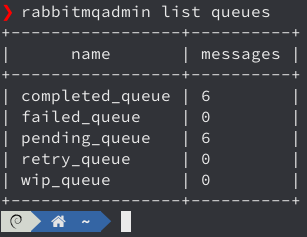
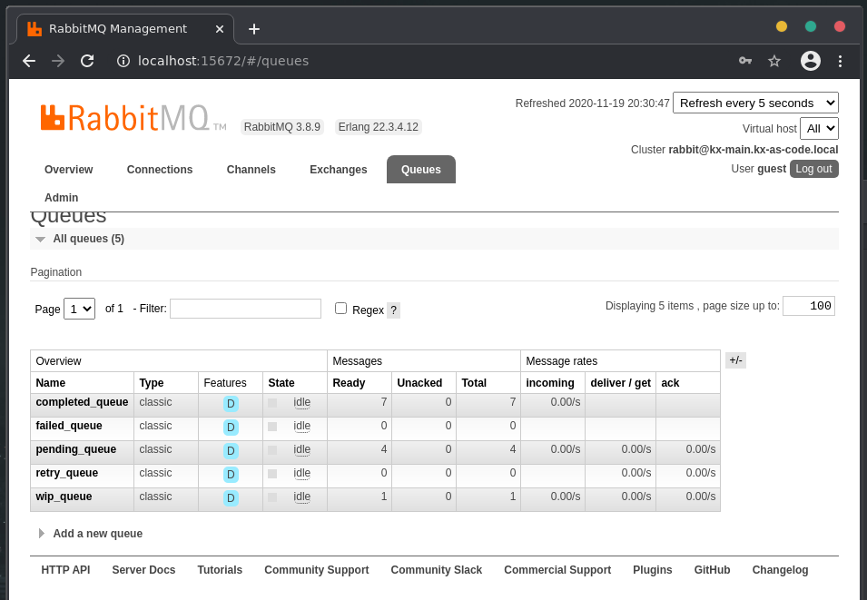
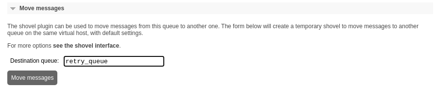

# Manual Provisioning

The development of the NodeJS based KX.AS.CODE Portal is currently in progress in order to select application and tools for installation into the KX.AS.CODE workstation. The application will drop messages onto a queue which will be picked up by the install script.

## Available Applications
Until that is ready, there is also the possibility to add items to the installation queue manually. Here are the commands for doing so.

All you need to do is find the application you are interested in, copy the install command, then paste it into a command line session within the KX.AS.CODE environment.

|                         Application                          | Category          | Short  Description                         | Install  Command                                             |
| :----------------------------------------------------------: | ----------------- | ------------------------------------------ | ------------------------------------------------------------ |
|              ArgoCD              | CICD              | Git-Ops                                    | rabbitmqadmin publish exchange=action_workflow  routing_key=pending_queue  payload='{"install_folder":"cicd","name":"argocd","action":"install","retries":"0"}'|
| Elastic ElasticSearch | Monitoring        | Data Store and Search Engine               | rabbitmqadmin publish  exchange=action_workflow routing_key=pending_queue  payload='{"install_folder":"monitoring","name":"elastic-elasticsearch-oss","action":"install","retries":"0"}' |
|       Elastic Filebeat       | Monitoring        | Log Aggregation                            | rabbitmqadmin publish  exchange=action_workflow routing_key=pending_queue  payload='{"install_folder":"monitoring","name":"elastic-filebeat-oss","action":"install","retries":"0"}' |
|          Elastic Kibana          | Monitoring        | Monitoring Visualization                   | rabbitmqadmin publish  exchange=action_workflow routing_key=pending_queue  payload='{"install_folder":"monitoring","name":"elastic-kibana-oss","action":"install"} |
|               Gitea                | CICD              | Git Repository                             | rabbitmqadmin publish  exchange=action_workflow routing_key=pending_queue  payload='{"install_folder":"cicd","name":"gitea","action":"install","retries":"0"}' |
|               Gitlab CE                | CICD              | Git Repository and CICD  Pipelines         | rabbitmqadmin publish  exchange=action_workflow routing_key=pending_queue  payload='{"install_folder":"cicd","name":"gitlab-ce","action":"install","retries":"0"}' |
|          Gitlab Runner           | CICD              | Gitlab Runner Agent                        | rabbitmqadmin publish  exchange=action_workflow routing_key=pending_queue  payload='{"install_folder":"cicd","name":"gitlab-runner","action":"install","retries":"0"}' |
|            Grafana             | Monitoring        | Monitoring Visualization                   | rabbitmqadmin publish  exchange=action_workflow routing_key=pending_queue  payload='{"install_folder":"monitoring","name":"grafana","action":"install","retries":"0"}' |
|     Grafana Image Renderer     | Monitoring        | Image Rendering for Grafana  -> Mattermost | rabbitmqadmin publish  exchange=action_workflow routing_key=pending_queue  payload='{"install_folder":"monitoring","name":"grafana-image-renderer","action":"install","retries":"0"}' |
|           Graphite           | monitoring        | Time-Series Database for  SiteSpeed.io     | rabbitmqadmin publish  exchange=action_workflow routing_key=pending_queue  payload='{"install_folder":"monitoring","name":"graphite","action":"install","retries":"0"}' |
|              Harbor              | CICD              | Docker Registry                            | rabbitmqadmin publish  exchange=action_workflow routing_key=pending_queue  payload='{"install_folder":"cicd","name":"harbor","action":"install","retries":"0"}' |
|         HashiCorp Consul         | CICD              | Service Discovery                          | rabbitmqadmin publish  exchange=action_workflow routing_key=pending_queue  payload='{"install_folder":"cicd","name":"consul","action":"install","retries":"0"}' |
|          HashiCorp Vauilt          | Security          | Secure Credential Store                    | rabbitmqadmin publish  exchange=action_workflow routing_key=pending_queue  payload='{"install_folder":"security","name":"vault","action":"install","retries":"0"}' |
|            Jenkins             | CICD              | Continuous Delivery                        | rabbitmqadmin publish  exchange=action_workflow routing_key=pending_queue  payload='{"install_folder":"cicd","name":"jenkins","action":"install","retries":"0"}' |
| JFrog Artifactory OSS  | CICD              | Artifact Store                             | rabbitmqadmin publish  exchange=action_workflow routing_key=pending_queue  payload='{"install_folder":"cicd","name":"artifactory-oss","action":"install","retries":"0"}' |
|         KX.AS.CODE "Docs"          | KX.AS.CODE        | KX.AS.CODE Documentation                   | rabbitmqadmin publish  exchange=action_workflow routing_key=pending_queue  payload='{"install_folder":"kx_as_code","name":"kx.as.code_docs","action":"install","retries":"0"}' |
|    KX.AS.CODE TechRadar    | KX.AS.CODE        | Technology Radar                           | rabbitmqadmin publish  exchange=action_workflow routing_key=pending_queue  payload='{"install_folder":"kx_as_code","name":"kx.as.code_techradar","action":"install","retries":"0"}' |
|        Mattermost        | Collaboration     | ChatOps                                    | rabbitmqadmin publish  exchange=action_workflow routing_key=pending_queue  payload='{"install_folder":"collaboration","name":"mattermost","action":"install","retries":"0"}' |
|              MinIO-S3              | Storage           | S3 Object Storage                          | rabbitmqadmin publish  exchange=action_workflow routing_key=pending_queue  payload='{"install_folder":"storage","name":"minio-s3","action":"install","retries":"0"}' |
|         Nextcloud          | Storage           | Cloud Storage                              | rabbitmqadmin publish  exchange=action_workflow routing_key=pending_queue  payload='{"install_folder":"storage","name":"nextcloud","action":"install","retries":"0"}' |
|            Nexus 3 OSS             | CICD              | Artifact Store                             | rabbitmqadmin publish  exchange=action_workflow routing_key=pending_queue  payload='{"install_folder":"cicd","name":"nexus","action":"install","retries":"0"}' |
|        Prometheus        | Monitoring        | Monitoring Store                           | publish  exchange=action_workflow routing_key=pending_queue  payload='{"install_folder":"monitoring","name":"prometheus","action":"install","retries":"0"}' |
|        RocketChat        | Collaboration     | ChatOps                                    | rabbitmqadmin publish  exchange=action_workflow routing_key=pending_queue  payload='{"install_folder":"collaboration","name":"rocketchat","action":"install","retries":"0"}' |
|           Selenium           | Quality Assurance | E2E Browser Test Automation                | rabbitmqadmin publish  exchange=action_workflow routing_key=pending_queue  payload='{"install_folder":"quality_assurance","name":"selenium","action":"install","retries":"0"}' |
|         SonarQube          | Quality Assurance | Code Quality                               | rabbitmqadmin publish  exchange=action_workflow routing_key=pending_queue  payload='{"install_folder":"quality_assurance","name":"sonarqube","action":"install","retries":"0"}' |
|     Sysdig Falco     | Security          | Container Runtime Security                 | rabbitmqadmin publish  exchange=action_workflow routing_key=pending_queue  payload='{"install_folder":"security","name":"sysdig-falco","action":"install","retries":"0"}' |
|     loki                     | Monitoring        | Datastore and logging                      | rabbitmqadmin publish  exchange=action_workflow routing_key=pending_queue  payload='{"install_folder":"monitoring","name":"loki","action":"install","retries":"0"}'}' |


## Managing the Queues

When you copy the lines above into a shell in the KX.AS.CODE workstation, you will see the following.




In the example above, multiple messages were posted, as the GitOps group below was used in this example.

To get a status on the installation process, just enter `rabbitmqadmin list queues`.





You can also get a status by visiting the MQ admin site, by double clicking on it's icon on the desktop:


The username and password is the default guest/guest.

Once opened, navigate to the "queues".




If anything ends up in the `failed_queue`, you must either `purge` it from the queue, or fix whatever it was that prevented it from installing and then move the item to the `retry_queue`.

Moving a message is simple. Just go into the failed_queue detail page by clicking it's name on the queue list and then scrolling down to `move_messages` and entering `retry_queue` in the `Destination queue` field, subseqeuently hitting the `Move messages` button.




## Installation Groups

The advantage in KX.AS.CODE of installing groups of applications is that they are scripted to integrate with each other. This may not be the case if you install individual applications that have not been scripted and tested to work together.

To make things easier, here a couple of tools groups for you to try. Just copy and paste the following lines into the KX.AS.CODE command line:


### GitOps Group

Included in this group are:

- MinIo-S3
- Gitlab CE
- Gitlab Runner
- Mattermost
- Harbor
- ArgoCD
- jFrog Artifactory


```bash
rabbitmqadmin publish exchange=action_workflow routing_key=pending_queue payload='{"install_folder":"storage","name":"minio-s3","action":"install","retries":"0"}'
rabbitmqadmin publish exchange=action_workflow routing_key=pending_queue payload='{"install_folder":"cicd","name":"gitlab-ce","action":"install","retries":"0"}'
rabbitmqadmin publish exchange=action_workflow routing_key=pending_queue payload='{"install_folder":"collaboration","name":"mattermost","action":"install","retries":"0"}'
rabbitmqadmin publish exchange=action_workflow routing_key=pending_queue payload='{"install_folder":"cicd","name":"harbor","action":"install","retries":"0"}'
rabbitmqadmin publish exchange=action_workflow routing_key=pending_queue payload='{"install_folder":"cicd","name":"gitlab-runner","action":"install","retries":"0"}'
rabbitmqadmin publish exchange=action_workflow routing_key=pending_queue payload='{"install_folder":"cicd","name":"argocd","action":"install","retries":"0"}'
rabbitmqadmin publish exchange=action_workflow routing_key=pending_queue payload='{"install_folder":"cicd","name":"artifactory-oss","action":"install","retries":"0"}'
```


### CICD Group

- Jenkins
- Gitea
- Nexus3
- RocketChat

```bash
rabbitmqadmin publish exchange=action_workflow routing_key=pending_queue payload='{"install_folder":"cicd","name":"jenkins","action":"install","retries":"0"}'
rabbitmqadmin publish exchange=action_workflow routing_key=pending_queue payload='{"install_folder":"cicd","name":"gitea","action":"install","retries":"0"}'
rabbitmqadmin publish exchange=action_workflow routing_key=pending_queue payload='{"install_folder":"collaboration","name":"rocketchat","action":"install","retries":"0"}'
rabbitmqadmin publish exchange=action_workflow routing_key=pending_queue payload='{"install_folder":"cicd","name":"nexus3","action":"install","retries":"0"}'
```


### Quality Assurance Group

Included in this group are:

- SonarQube
- Selenium

```bash
rabbitmqadmin publish exchange=action_workflow routing_key=pending_queue payload='{"install_folder":"quality_assurance","name":"sonarqube","action":"install","retries":"0"}'
rabbitmqadmin publish exchange=action_workflow routing_key=pending_queue payload='{"install_folder":"quality_assurance","name":"selenium","action":"install","retries":"0"}'
```


### Monitoring and Log Aggregation Group

- Prometheus
- Grafana
- Grafana Image Renderer
- Graphite
- Elastic ElasticSearch
- Elastic Kibana
- Elastic Filebeat

```bash
rabbitmqadmin publish exchange=action_workflow routing_key=pending_queue payload='{"install_folder":"monitoring","name":"prometheus","action":"install","retries":"0"}'
rabbitmqadmin publish exchange=action_workflow routing_key=pending_queue payload='{"install_folder":"monitoring","name":"grafana","action":"install","retries":"0"}'
rabbitmqadmin publish exchange=action_workflow routing_key=pending_queue payload='{"install_folder":"monitoring","name":"grafana-image-renderer","action":"install","retries":"0"}'
rabbitmqadmin publish exchange=action_workflow routing_key=pending_queue payload='{"install_folder":"monitoring","name":"graphite","action":"install","retries":"0"}'
rabbitmqadmin publish exchange=action_workflow routing_key=pending_queue payload='{"install_folder":"monitoring","name":"elastic-elasticsearch-oss","action":"install","retries":"0"}'
rabbitmqadmin publish exchange=action_workflow routing_key=pending_queue payload='{"install_folder":"monitoring","name":"elastic-kibana-oss","action":"install","retries":"0"}'
rabbitmqadmin publish exchange=action_workflow routing_key=pending_queue payload='{"install_folder":"monitoring","name":"elastic-filebeat-oss","action":"install","retries":"0"}'
```


### Security Group

Included in this group are:

- HashiCorp Vault
- Sysdig Falco

```bash
rabbitmqadmin publish exchange=action_workflow routing_key=pending_queue payload='{"install_folder":"security","name":"vault","action":"install","retries":"0"}'
rabbitmqadmin publish exchange=action_workflow routing_key=pending_queue payload='{"install_folder":"security","name":"vault","action":"install","retries":"0"}'
```
