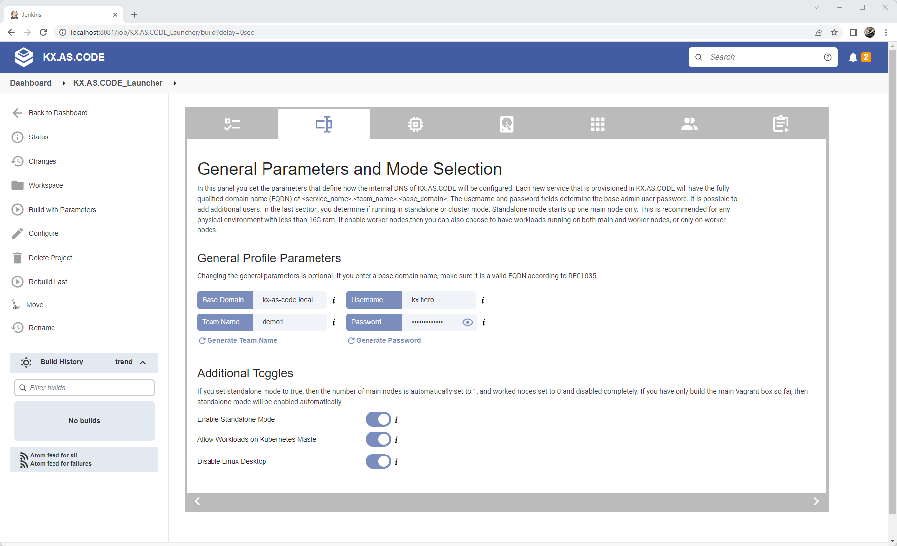
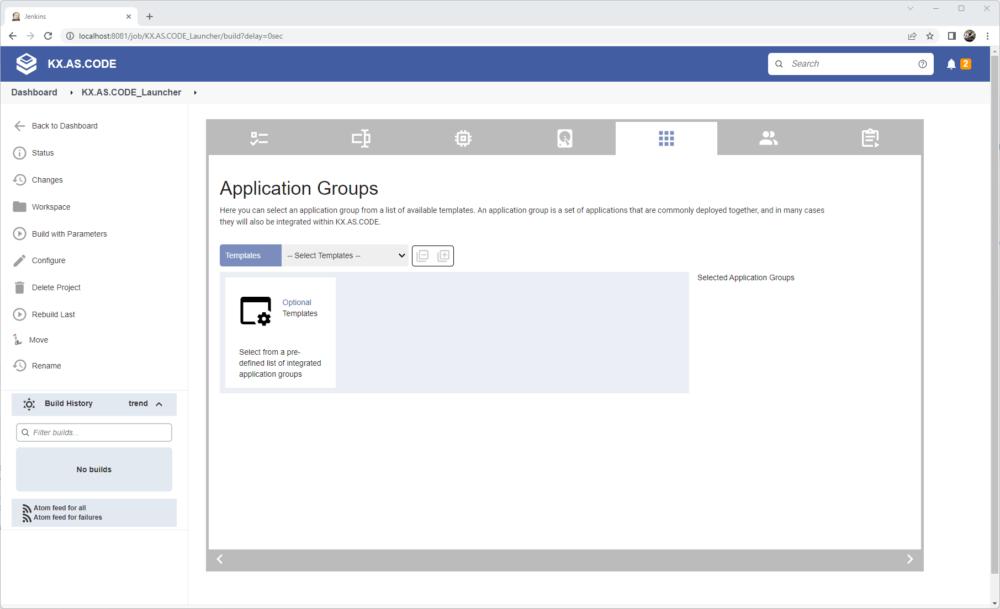

# Minimal Deployment

For host systems with low cpu and memory resources, it is best to start KX.AS.CODE with a minimal setup.

Here are the steps to make that happen:

1. Select `Minimal` startup mode and `K3s` as the Kubernetes orchestrator

    {: .zoom}

    The following table shows what is/is not installed, when selecting the minimal startup mode.
    
    | Start Up Mode | Normal | Lite | Minimal |
    | ---------------|----------------|----------------|----------------|
    | KX-Portal | :white_check_mark: | :white_check_mark: | :white_check_mark: |
    | GoPass Credential Manager | :white_check_mark: | :white_check_mark: | :white_check_mark: |
    | Certificate Authority | :white_check_mark: | :white_check_mark: | :white_check_mark: |
    | Kubernetes | :white_check_mark: | :white_check_mark: | :white_check_mark: |
    | Docker Registry | :white_check_mark: | :white_check_mark: | :white_check_mark: |
    | Calico Network | :white_check_mark: | :white_check_mark: | :white_check_mark: |
    | Local Storage Volumes | :white_check_mark: | :white_check_mark: | :white_check_mark: |
    | NGINX Ingress Controller | :white_check_mark: | :white_check_mark: | :white_check_mark: |
    | MetalLB Load Balancer | :white_check_mark: | :white_check_mark: | |
    | OpenLDAP Server | :white_check_mark: | :white_check_mark: | |
    | Keycloak SSO Server | :white_check_mark: | :white_check_mark: | |
    | Kubernetes Metrics Server | :white_check_mark: | :white_check_mark: | |
    | OpenLens Kubernetes IDE | :white_check_mark: | :white_check_mark: | |
    | Cert Manager | :white_check_mark: | | |
    | Kubernetes Dashboard| :white_check_mark: | | |
    | Network Storage Services | :white_check_mark: | | |
    | Remote Desktop Services | :white_check_mark: | | |
    | Multi-User Support| :white_check_mark: | | |

2. Select `Standalone mode`, `Allow Workloads on Master` and `Disable Linux Desktop` on General Parameters config panel

    {: .zoom}

3. Ensure only 1 Main node is selected, and 0 worker nodes

    {: .zoom}

4. Ensure no group installation templates are selected, so that you can add apps individually later, depending on the remaining available resources

    {: .zoom}
   
5. Review your settings and click play!

    {: .zoom}

!!! info
    Finally, once up, as you don't have a desktop, you will need to access the application URLs from outside the VM. To make that work, follow the [External Application Access guide](../../Deployment/External-Application-Access/).
