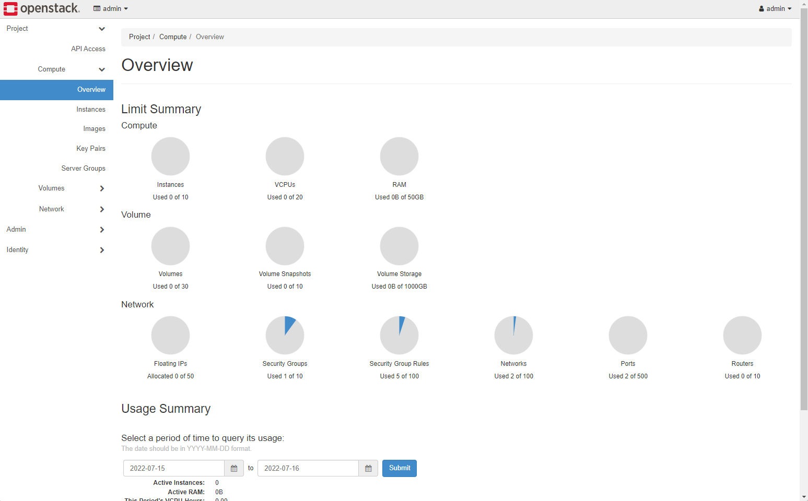

# Private Cloud

## OpenStack

If you do not yet have access to an OpenStack or DevStack environment, you can follow our [guide](../Prerequisites/OpenStack-Setup.md) for setting up DevStack.

To start KX.AS.CODE on OpenStack, you first need to follow the [OpenStack build guide](../Build/Private-Clouds.md), as these images are not publicly avaialable.

To deploy KX.AS.CODE to OpenStack, open a command line session, checkout the KX.AS.CODE repository, and  navigate to the OpenStack deployment profile folder.

```bash linenums="1"
git clone https://github.com/Accenture/kx.as.code.git
cd kx.as.code/profiles/terraform-openstack
```

In the folder you will see a file called `profile-config.json`. As with the other platforms, it is usually sufficient to simply adjust this file.

```json linenums="1" hl_lines="13-22"
{
    "config": {
        "vm_properties": {
            "main_node_count": 1,
            "admin_main_node_cpu_cores": 4,
            "admin_main_node_memory": 16384,
            "replica_main_node_cpu_cores": 2,
            "replica_main_node_memory": 8192,
            "worker_node_count": 2,
            "worker_node_cpu_cores": 4,
            "worker_node_memory": 8192,
            "environment_prefix": "demo1",
            "openstack": {
                "user_name":            "admin",
                "tenant_name":          "admin",
                "password":             "***************",
                "region":               "RegionOne",
                "auth_url":             "http://10.10.10.10/identity",
                "kx_main_image_id":     "66b3d176-aa34-49bf-8d27-a1973c893e05",
                "kx_node_image_id":     "ca0f5673-e905-44d7-86aa-23478f758235",
                "external_network_id":  "4de90ec4-ed5c-4907-8e2b-7b21049be93c"
            }
        },
        "allowWorkloadsOnMaster": true,
        "disableSessionTimeout": true,
        "certificationMode": false,
        "disableLinuxDesktop": false,
        "defaultKeyboardLanguage": "de",
        "local_volumes": {
            "one_gb": 5,
            "five_gb": 5,
            "ten_gb": 5,
            "thirty_gb": 0,
            "fifty_gb": 0
        },
        "virtualizationType": "private-cloud",
        "environmentPrefix": "demo1",
        "glusterFsDiskSize": "200",
        "sslProvider": "self-signed",
        "baseDomain": "kx-as-code.local",
        "baseUser": "kx.hero",
        "basePassword": "L3arnandshare",
        "baseIpType": "dynamic",
        "dnsResolution": "hybrid",
        "metalLbIpRange": {
            "ipRangeStart": "10.10.76.100",
            "ipRangeEnd": "10.10.76.150"
        },
        "docker": {
            "dockerhub_username": "",
            "dockerhub_email": "",
            "dockerhub_password": ""
        },
        "proxy_settings": {
            "http_proxy": "",
            "https_proxy": "",
            "no_proxy": ""
        }
    }
}
```

The OpenStack specific configuration items are highlighted above. The table below describes those items in more details. The rest are already described in the more generic page describing `profile-config.jso`n.

|Property Name|Description|Mandatory/Optional|
|---|---|---|
|config.openstack.user_name|User authorized to create resources in OpenStack|Mandatory|
|config.openstack.tenant_name|The project name. For DevStack, this is usually `demo` or `admin`|Mandatory|
|config.openstack.password|The user's password|Mandatory|
|config.openstack.region|For DevStack this is usually `RegionOne`|Mandatory|
|config.openstack.auth_url|If you installed DevStack, you can get this value from |Mandatory|
|config.openstack.kx_main_image_id|The ID of the built VM|Mandatory|
|config.openstack.kx_node_image_id|The ID of the built VM. Only needed if starting a multi node KX.AS.CODE environment|Optional|
|config.openstack.external_network_id|The public gateway with access to the internet|Mandatory|

You can get these values either by using the OpenStack GUI, or by executing OpenStack commands on the command line.

{: .zoom}

Alternatively, on the command line you can enter:

```bash linenums="1"
# Authenticate
. /opt/stack/devstack/openrc admin
export OS_AUTH_TOKEN=$(openstack token issue -c id -f value)

# Get built image IDs
openstack image list

# Get network IDs
openstack network list
```

Once you are satisfied the configuration is correct, you can start KX.AS.CODE with the following commands, executed from inside the OpenStack profile directory.

```bash linenums="1"
terraform init
terraform apply
```

After a few minutes you should have a running KX.AS.CODE environment.

For the private and public clouds, you will need to use the installed [remote desktop facilities](./Remote-Access.md) to access the desktop.

Alternatively, expose the applications externally, so they can be accessed without the desktop. More on this topic in a future guide.
