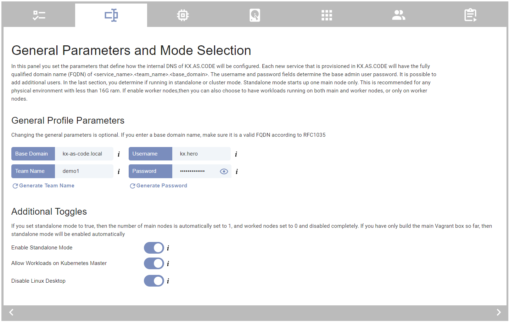

# User Management

There are two ways to deploy KX.AS.CODE with additional users. The first is via the Jenkins based KX.AS.CODE launcher, and the second is by editing `users.json` in the respective profile directory manually.

!!! info
    See also the [IAM and SSO Guide](../../Overview/IAM-and-SSO/) for more details on the backend 

!!! note
    The initial password for the users will be generated automatically on creation. They will be available in the GoPass password repository of the base user.

!!! warning
    Not all tool installations have implemented a difference between `user` and `admin`. This is something that still needs to be implemented for the various component installations. For now, most users will get full rights.

## Jenkins Base Launcher

Go to the user management tab in the Jenkins based KX.AS.CODE configurator and add the requested details for each user. Click the add button for each entered user to add it to the table.

{: .zoom}

Each time a user is added, the profile's `users.json` is updated. 

You cannot remove the `kx.hero` user as it is a standard user. It is possible to change the base default user by changing it in the general properties tab.

{: .zoom}

!!! tip
    The `kx.hero` user will never be deleted. When you change the base user in the general parameters tab, the user is created as a new base user and will be the default login. The old user will be hidden from the desktop's login screen, but not entirely deleted.

It is also possible to create / populate the `users.json` file manually. See below.

## Users.json

To create additional user on first start of KX.AS.CODE, a `users.json` file must be placed in the profile's directory. 

Most of the fields in the JSON below should be self-explanatory. For the keyboard_language field, there are currently the following valid options.

`de, es, gb, us, it`

Example `user.json`:

```json
{
    "config": {
        "additionalUsers":
        [
            {
                "firstname": "Joe",
                "surname": "Bloggs",
                "email": "joe@kx-as-code.local",
                "keyboard_language": "us",
                "role": "admin"
            },
            {
                "firstname": "Max",
                "surname": "Mustermann",
                "email": "max@kx-as-code.local",
                "keyboard_language": "de",
                "role": "user"
            }
        ]
    }
}
```

