# Adding a Solution

Adding a new solution is straightforward.

First an important note, relevant regardless of the chosen installation method (eg. ArgoCD, Helm or Scripts).

!!! note
    The configuration file, `metadata.json`, is absolutely mandatory for each component directory. This tells the KX.AS.CODE installation framework exactly what and how to install the application in question.
    See the following [guide](./Solution-Metadata.md) that describes `metadata.json` in detail.

Below an example walk-through adding NeuVector as an application installed via the helm installation method.

!!! tip
    Remember that there are many [functions](./Central-Functions.md) available that you can directly utilize in your scripts.

    In particular for [KeyCloak SSO integration](./Central-Functions.md/#keycloak-sso), it is highly advisable to use the [enableKeycloakSSOForSolution()](./Central-Functions.md#enablekeycloakssoforsolution) function, as it takes care to call all the other needed functions.

Below a complete walk through for adding an application with helm. ArgoCD and Script based methods will also be covered, but in less detail. as the main flow is the same.

In summary, the example walk-through covers the following flow.

1. Create your feature branch
2. Determine target category for solution
3. Determine install method
4. Create the base directories.
5. Populate the directory with the relevant files
6. Create metadata.json and values_template.yaml
7. Test the developed solution
8. Check that the solution came up successfully
9. Once fixed, move item to the restart queue
10. Re-Test application
11. Commit the code to GitHub.com
12. Create pull request

### Create your feature branch

Start by creating a new feature branch from the develop branch. Remember that you will need a GitHub account to commit your changes afterwards.

<pre>
<code>cd /usr/share/kx.as.code/git/kx.as.code
git checkout develop
<span style="opacity: 0.5">#git checkout -b feature/add-<i>&lt;name of application&gt;</i>-application</span>
git checkout -b feature/add-neuvector-application
</code>
</pre>

### Determine target category for solution

Current available categories are as follows.

| Category | Examples |
| --- | --- |
|cicd| Gitlab, TeamCity, Artifactory, Nexus3, Jenkins |
|collaboration| RocketChat, Mattermost, Jira, Confluence, WikiJs |
|dev_tools| BackStage, Atom, Postman|
|monitoring|Prometheus, Tick-Stack, Elastic-Stack, Loki-Stack, Netdata |
|quality_assurance|Selenium-Grid, SonarQube|
|security|BitWarden, NeuVector, Hashicorp Vault, Sysdig Falco|
|storage|Minio-S3, NextCloud|

### Determine install method

Current possibilities are ArgoCD, [Helm](https://helm.sh/){:target="\_blank"} or purely Script based. In future we will look to also enable deployment with [Kustomize](https://kustomize.io/){:target="\_blank"}.

### Create the base directories

{: .zoom}

### Populate the directory with the relevant files

The number of scripts or screenshots will differ per solution per solution.

<pre><code>├── auto-setup
│   ├── security
│   │   └── <b>neuvector</b>
│   │       ├── post_install_scripts
│   │       │   ├── change_admin_password.sh
│   │       ├── pre_install_scripts
│   │       │   ├── create_certs_secret.sh
│   │       │   ├── create_service_account.sh
│   │       ├── screenshots
│   │       │   ├── neuvector_screenshot1.png
│   │       │   ├── neuvector_screenshot2.png
│   │       │   ├── neuvector_screenshot3.png
│   │       │   ├── neuvector_screenshot4.png
│   │       │   ├── neuvector_screenshot5.png
│   │       │   ├── neuvector_screenshot6.png
│   │       │   └── neuvector_screenshot7.png
│   │       ├── <b>metadata.json</b>
│   │       ├── neuvector.png
│   │       └── values_template.yaml</code>
</pre>

In NeuVector we created 7 screenshots. This may vary from solution to solution. The naming convention is important here, so that they are picked up by the KX-Portal.

### Create metadata.json and values_template.yaml

Best to copy the helm values file from the solution's GitHub repository and modify it to match the KX.AS.CODE environment.

In the example with NeuVector, we copied the default [values.yaml](https://github.com/neuvector/neuvector-helm/blob/master/charts/core/values.yaml){:target="\_blank"}, and modified it as per the solution's [documentation](https://github.com/neuvector/neuvector-helm/tree/master/charts/core){:target="\_blank"}.

For a simple solution, it is also possible to get away with only having the base directory and `metadata.json`, since it is possible to represent change to the Helm values file also in the form of a `set_key_values` block in `metadata.json`.

See the [Solution Metadata](./Solution-Metadata.md#helm) documentation for Helm for more details on the possible parameters.

Taking the example for the values file added for NeuVector, the json in metadata.json would look as follows:

!!! tip
    In the default NeuVector `values.yaml` file, the `imageTag` was `5.0.0`. It's always worth to check in the source registry (in this case [Docker Hub](https://hub.docker.com/r/neuvector/controller/tags){:target="\_blank"}), to see if there is a new version available.

    Word of caution, a minor version change is probably safe. Careful with updating to a new major version, as it may not be compatible with the helm chart. 

    For NeuVector, `5.0.1` was available. This was added to metadata.json and referenced in the values file, as you can see in the example below.

!!! example

    First define the environment variable with the new version. This is relevant for both approaches, using either `set_key_values[]` or the `values_template.yaml` file, or a combination of both.

    ```json linenums="1" hl_lines="2"
        "environment_variables": {
            "imageTag": "5.0.1"
        },
    ```

    Example `metadata.json` using inline Helm parameters with `set_key_values[]` block

    ```json linenums="1" hl_lines="3 12 13"
        "helm_params": {
            "repository_url": "https://neuvector.github.io/neuvector-helm/",
            "repository_name": "neuvector/core",
            "helm_version": "2.2.0-b2",
            "set_key_values": [
                "tag={{imageTag}}",
                "controller.ingress.enabled=true",
                "controller.ingress.tls=true",
                "controller.ingress.secretName=kx-certificates",        
                "controller.ingress.ingressClassName=nginx",
                "controller.ingress.host[0]={{componentName}}.{{baseDomain}}",
                "controller.ingress.path=\/",
                "controller.pvc.enabled=true",
                "controller.pvc.capacity=1Gi",
                "controller.pvc.storageClass=gluster-heketi"
            ]
        }
    ```

    Example if using `values_template.yaml`

    ``` yaml linenums="1" hl_lines="8"
    # Default values for neuvector.
    # This is a YAML-formatted file.
    # Declare variables to be passed into the templates.
    
    openshift: false
    
    registry: docker.io
    tag: {{imageTag}}
    oem:
    imagePullSecrets:
    psp: false
    serviceAccount: default
    ```

!!! tip 
    Notice also the `{{ mustache }}` variables in the `set_key_values[]` block. These will also be replaced automatically with both global variables and those in `metadata.json`.
!!! warning
    Important. As in the example, `/` must be escaped with a `\`
!!! note
    The above snippet is just an example and doesn't represent all the changes made to the values file for NeuVector.

In this example however, we have chosen not to do use the inline `set_key_values[]` in `metadata.json`, and to create the `values_template.yaml` instead. See screenshot.
It is also possible to mix, and have both the JSON and the values file. As per `Helm` standard, the `set_key_values[]` will override those in the values file.

Notice in `metadata.json` the set environment variable `imageTag`, and how it is referenced in `values_template.yaml` as `{{imageTag}}`.
The KX.AS.CODE framework will automatically substitute the placeholder in `values_template.yaml` with the variable in `metadata.json`.

!!! info
    For a full description on the configurable options in `metadata.json`, visit the [Solution Metadata](./Solution-Metadata.md) page.

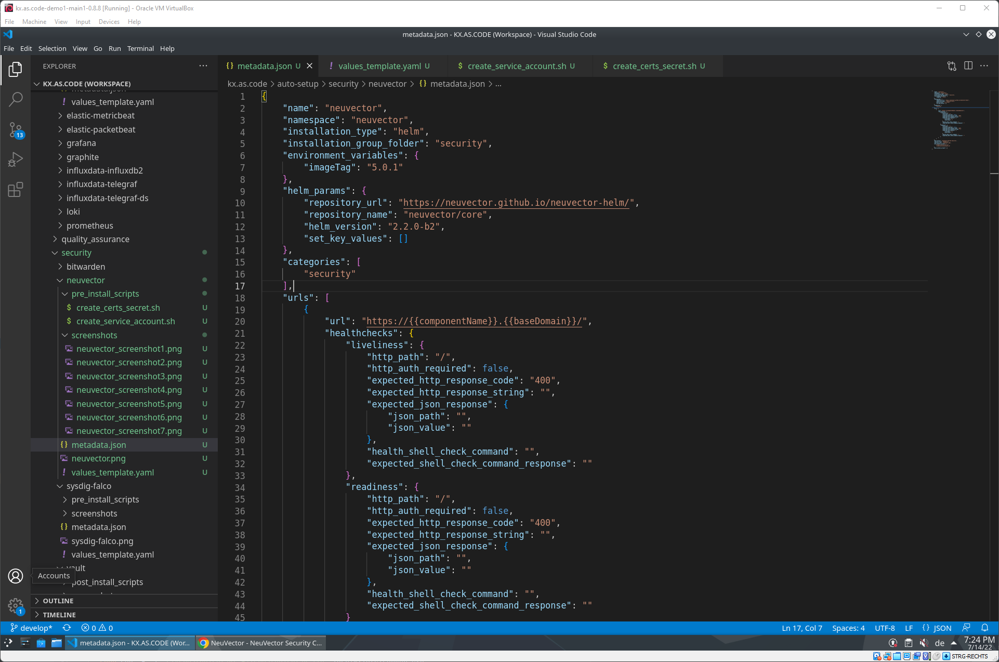{: .zoom}
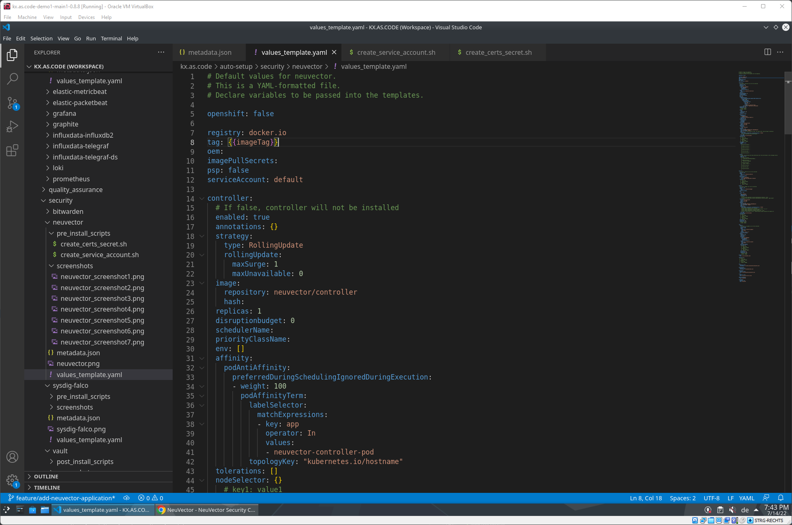{: .zoom}

### Test the developed solution

Once the initial development is done, publish the new solution to the message queue, in order to test it.

<pre>
<code>
<span style="white-space: pre-wrap; opacity: 0.5"># In your case, don't forget to change the installation folder "security" and application name "neuvector" to whatever is relevant for your application</span>
<span style="white-space: pre-wrap;">rabbitmqadmin publish exchange=action_workflow routing_key=pending_queue payload='{"install_folder":"security","name":"neuvector","action":"install","retries":"0"}'</span>
</code>
</pre>

Once the message is added to the `pending_queue`, you should get an installation started message.

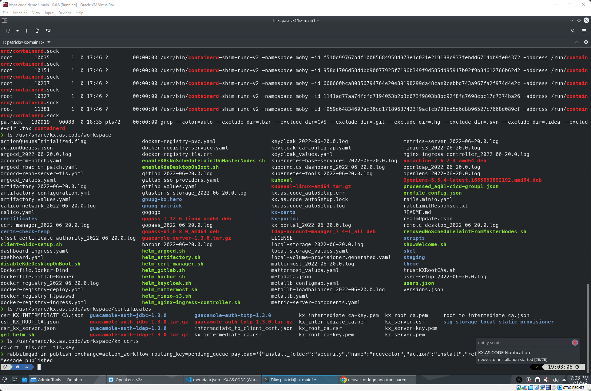{: .zoom}

### Check that the solution came up successfully

For demonstration purposes, this one failed. Open either the `Kubernetes Dashboard`, the `OpenLens` application, or use the `kubectl` CLI, to figure out what went wrong.

In our example, it was an incorrect setting on the `pvc`.

{: .zoom}
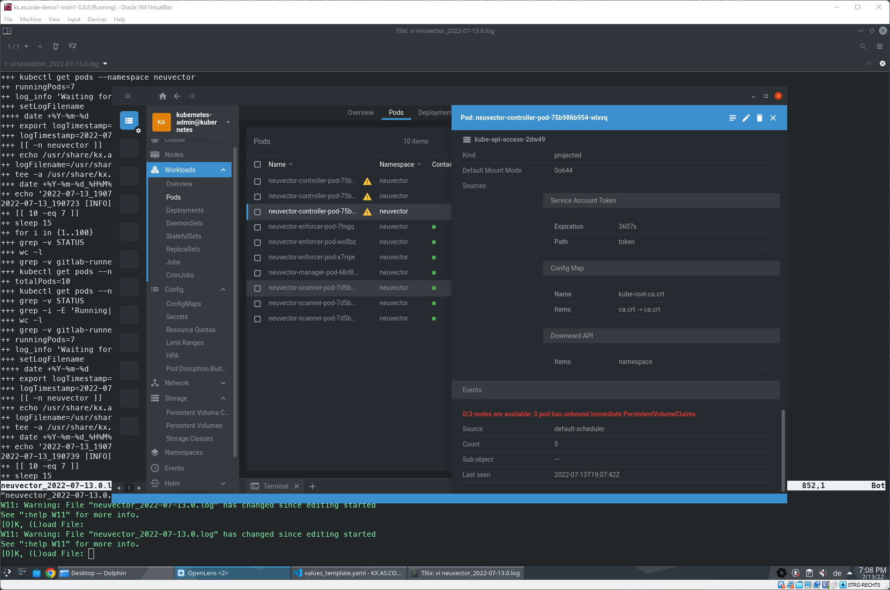{: .zoom}

### Once fixed, move item to the restart queue

Go to the RabbitMQ admin folder on the desktop and open RabbitMQ.
Once open, go to Queues, and figure out if the message is in the `failed_queue` or `wip_queue`.
If on the `failed_queue`, enter that queue and move it to the `retry_queue`. The new attempt to install should start shortly after.
If on the `wip_queue`, use the GUI to move the message to the `retry_queue`. In this event, you will also need to restart the poller, as the old run will still be executing.

`sudo systemctl restart kxAsCodeQueuePoller.service`

!!! warning 
    In some cases it may be needed to also un-install the application before re-installing, if for example fixing a Kubernetes resource that is not changeable. This can be done with

    helm uninstall _<application name\>_ --namespace _<namespace\>_

    !!! example
        `helm uninstall neuvector --namespace neuvector`

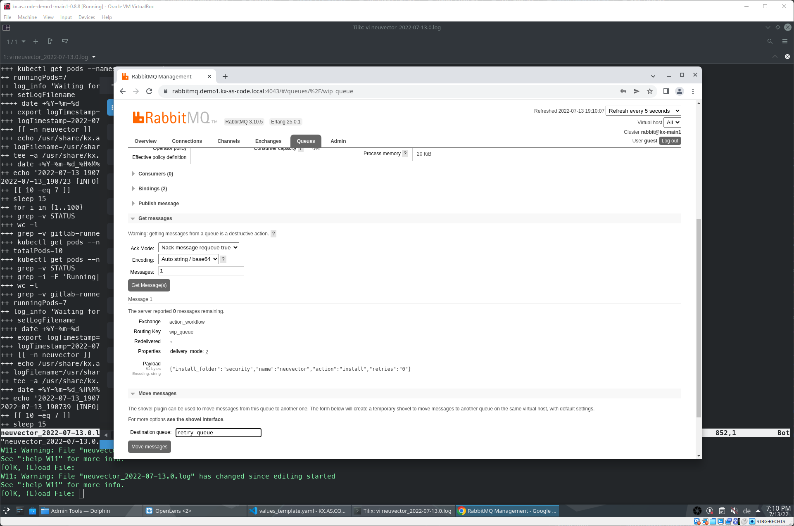{: .zoom}
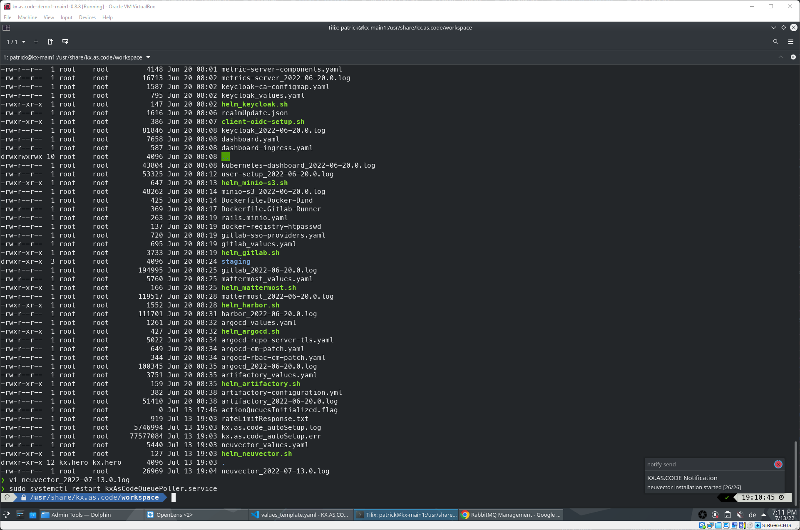{: .zoom}

### Re-Test Application

Once the installation is successful and all pods are green, check that the desktop icon has appeared in the Desktop's Applications folder with the correct icon and tha the page opens up correctly and is functional, eg. login works and there are no errors inside the application.

{: .zoom}
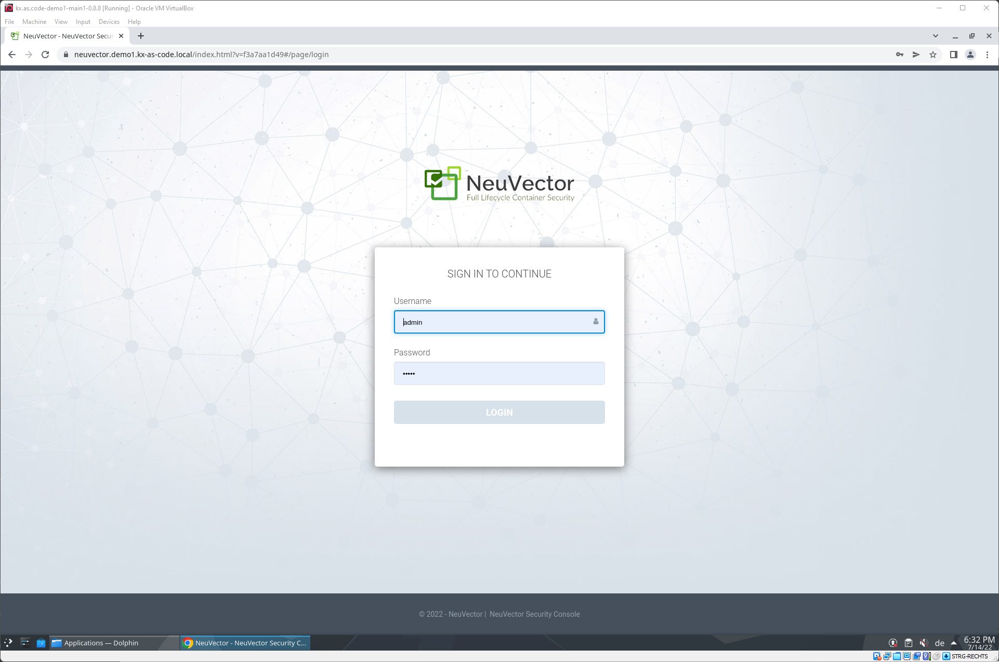{: .zoom}
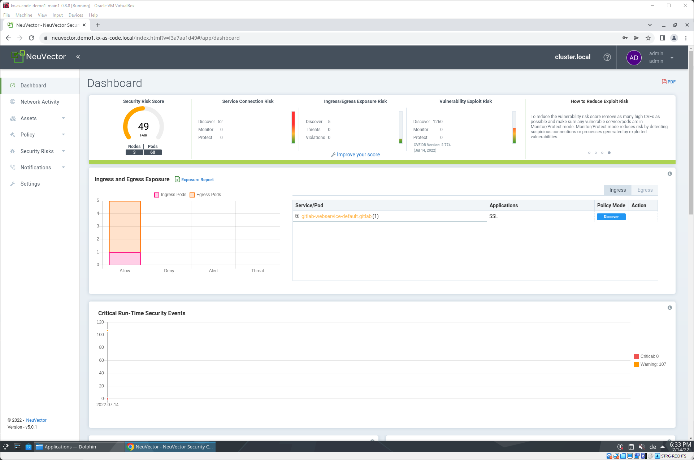{: .zoom}

### Commit the Code to GitHub.com

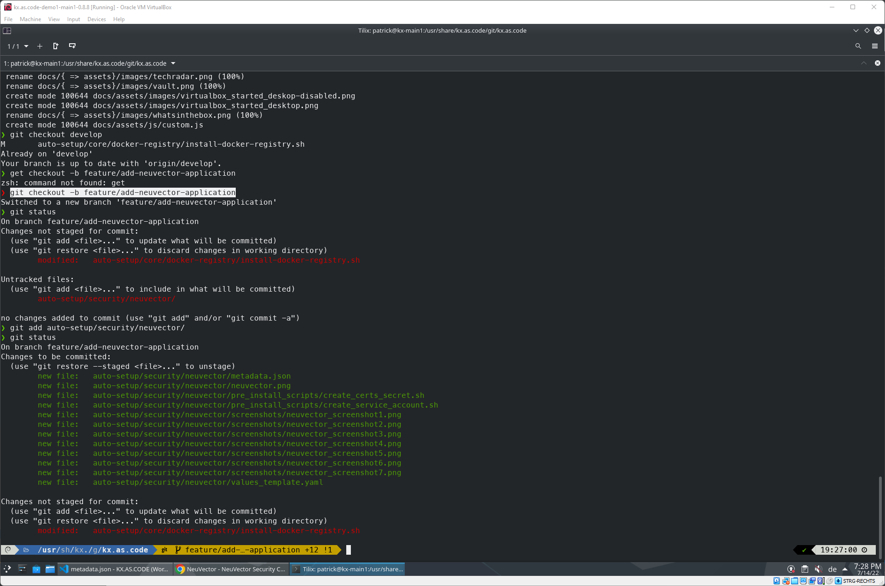{: .zoom}

You can also complete the actions in the VSCode built into the KX.AS.CODE VM, such as here, completing the final commit and push of the code, after creating the feature branch on the command line.

{: .zoom}

### Create pull request

Once committed, go to [GitHub.com](https://github.com/Accenture/kx.as.code/compare){:target="\_blank"} and create a [pull request](https://docs.github.com/en/pull-requests/collaborating-with-pull-requests/proposing-changes-to-your-work-with-pull-requests/creating-a-pull-request){:target="\_blank"}.

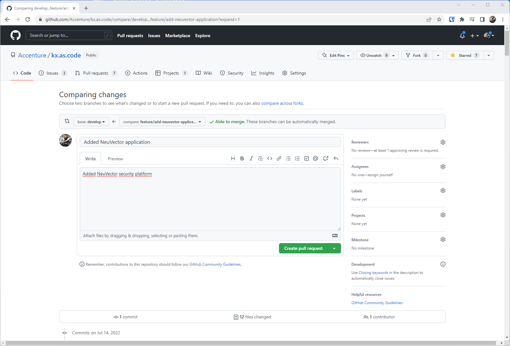{: .zoom}

Someone from the core KX.AS.CODE development team will review your change and either approve and merge right away, or provide feedback on any required changes.

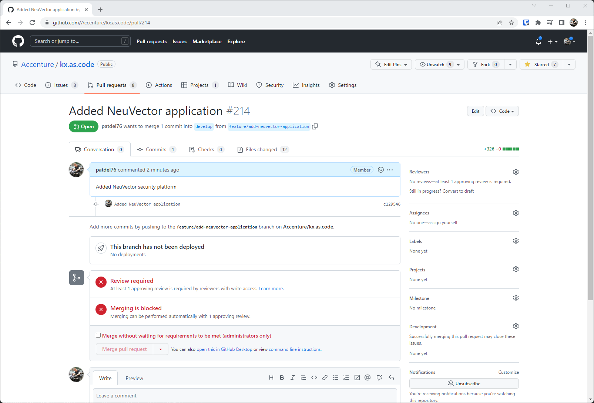{: .zoom}

## ArgoCD

As with Helm, there are some ArgoCD specific parameters that need to be included in `metadata.json`.

!!! note
    You must have installed ArgoCD before you can use this installation method

!!! tip
    If you also install Gitlab, you can automatically push code there and use that as the source repo url reference. See the [Grafana component](https://github.com/Accenture/kx.as.code/tree/main/auto-setup/monitoring/grafana) for an example on how to do this. Here the two functions, [createGitlabProject](./Central-Functions.md#creategitlabproject) and [populateGitlabProject](./Central-Functions.md#populategitlabproject), are used to achieve this.

For general information on ArgoCD, visit their [docs site](https://argo-cd.readthedocs.io/en/stable/){:target="\_blank"}.

Most oof the steps are the same as for the Helm installation method, but here some additional information for steps 5 & 6.

#### 5. Populate the directory with the relevant files

In this scenario, instead of the `values_template.yaml` file, you should create a `deployment_yaml` directory, and place YAM files for all the resources you wish to create in there. See the following [example](https://github.com/Accenture/kx.as.code/tree/main/auto-setup/monitoring/grafana/deployment_yaml){:target="\_blank"}.

#### 6. Create metadata.json

See the [Solution Metadata](./Solution-Metadata.md#argocd) documentation for ArgoCD, for more details on the possible parameters.

!!! note
    See also the available functions for ArgoCD based installations [here](./Central-Functions.md#argocd).

## Scripts

This is the easiest approach, as it does not require any specific configuration, such as those needed for Helm and ArgoCD to operate.

That said, consider the following points.

- You can also use this method to install files in `deployment_yaml` without ArgoCD. Simply add the needed YAML files to this directory within your component's directory, and then call the [deployYamlFilesToKubernetes()](./Central-Functions.md#deployyamlfilestokubernetes) function in your main script. The function checks that the YAML is valid with [kubeVal](https://kubeval.instrumenta.dev/){:target="\_blank"} before applying.
