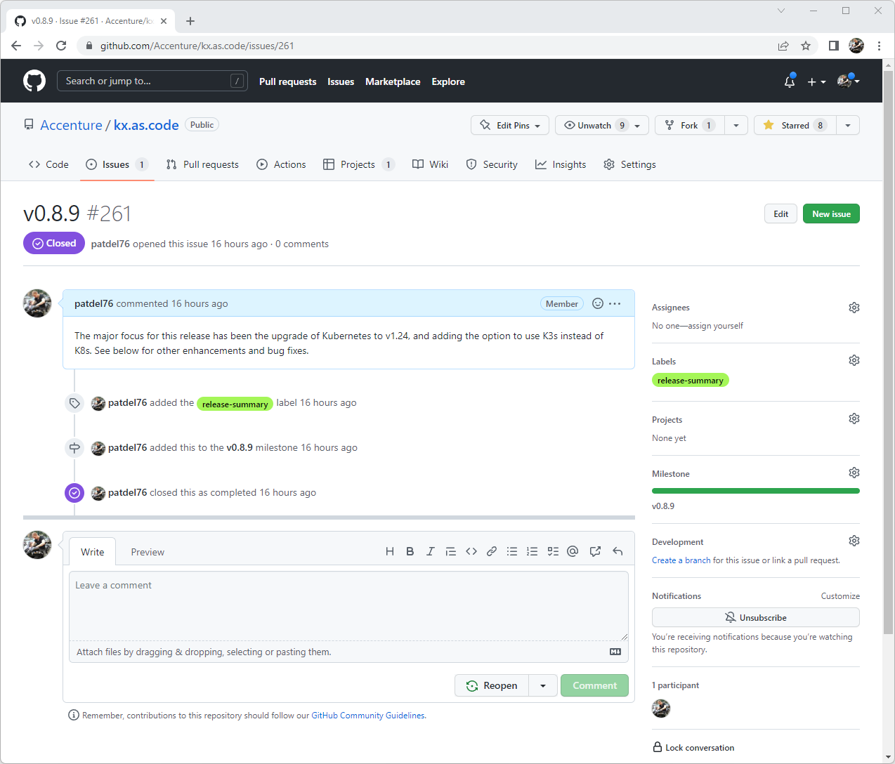
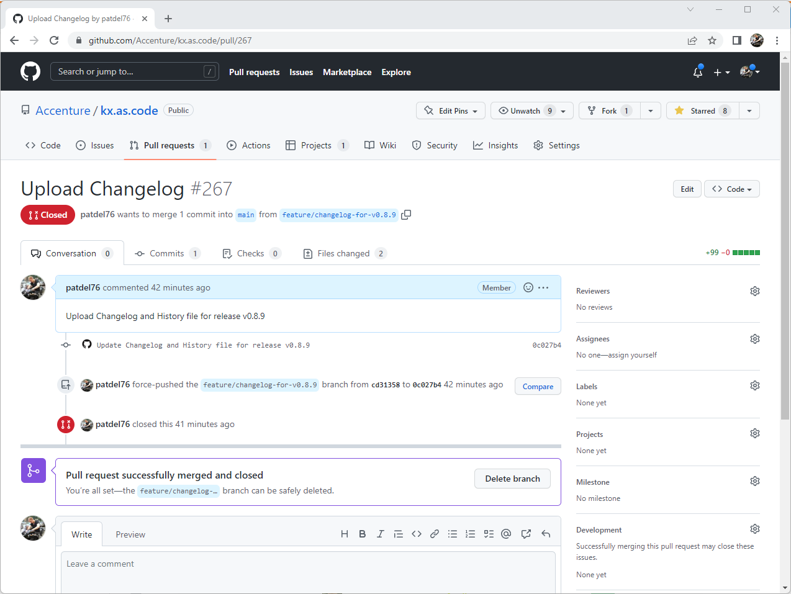

# Releasing

When a version of KX.AS.CODE is ready for release, the following actions need to be taken.

1. Build all the images using the `main` branch for `Parallels`, `VirtualBox` and `VMWare Desktop/Fusion` and upload to the [Vagrant Cloud](https://app.vagrantup.com/kxascode/){:target="\_blank"}.
 
2. Create a PR to merge the latest code from `develop` to `main`.

3. Create a Git tag with the milestone version

    ```bash
    # Example
    git tag v0.8.9
    git push origin v0.8.9
    ```

4. Create the Git release from the Git tag

    A new release can be created with the following [link](https://github.com/Accenture/kx.as.code/releases/new){:target="\_blank"}.  The title of the release should be the version number. The release can be created without the text initially, however, once it is generated in the next step, it should be added to the release description.
    
    {: .zoom}

5. Create a release summary issue, which will form the high level description in the automated release note

    !!! danger
        The summary issue must be tagged with the label `release-summary` and the associated release must be set in the `milestone` field.

    {: .zoom}
  

6. Execute the GitHub Action [release-process](https://github.com/Accenture/kx.as.code/actions/workflows/release.yml){:target="\_blank"} to generate release not and send a message to the Discord "release-notes" channel

    All going well, at the end of the GitHub Action, there should be a PR ready for review, approval and merge, for the generated change log.

    {: .zoom}
    
    ... and a release notification sent to Discord.
    
    {: .zoom}

## Preparing to develop on the next release

1. Add a new `milestone` version, and associate new or existing issues to it, using the following [GitHub link](https://github.com/Accenture/kx.as.code/milestones/new){:target="\_blank"}.
2. Update `versions.json` in the repository root with the new version number in the `develop` branch 

    !!! danger "Important"
        The `main` branch should not be touched anymore until the next release