All the tools below are installable either from the [Jenkins based launcher](/Quick-Start-Guide/), the KX-Portal, or via the [command line](/Deployment/Manual-Provisioning/).

## Core

### Kubernetes Dashboard
<a href="https://github.com/Accenture/kx.as.code/tree/main/auto-setup/core/kubernetes-dashboard" target="_blank">Installation Files</a> | <a href="https://kubernetes.io/docs/tasks/access-application-cluster/web-ui-dashboard/" target="_blank">Application Documentation</a> | <a href="https://github.com/kubernetes/dashboard" target="_blank">Application Source Code</a>

<q><i>
Dashboard is a web-based Kubernetes user interface. You can use Dashboard to deploy containerized applications to a Kubernetes cluster, troubleshoot your containerized application, and manage the cluster resources. You can use Dashboard to get an overview of applications running on your cluster, as well as for creating or modifying individual Kubernetes resources (such as Deployments, Jobs, DaemonSets, etc). For example, you can scale a Deployment, initiate a rolling update, restart a pod or deploy new applications using a deploy wizard.
Dashboard also provides information on the state of Kubernetes resources in your cluster and on any errors that may have occurred.
</i></q> - kubernetes.io

    

        

            

            
Core

            

                

                    

                        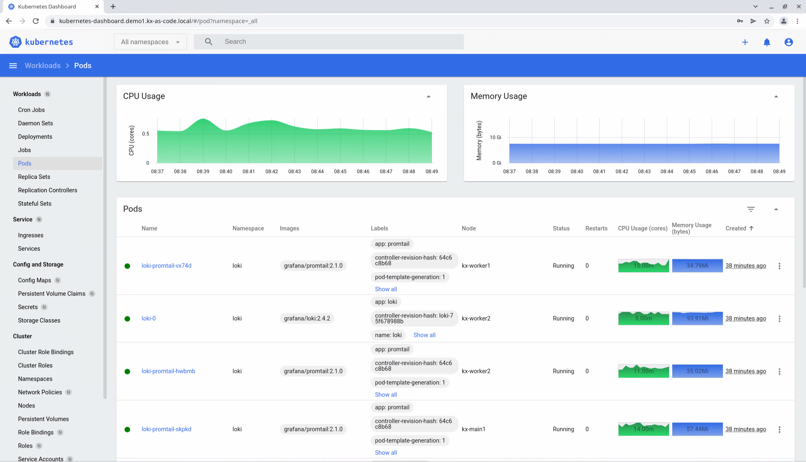
                    

                    

                        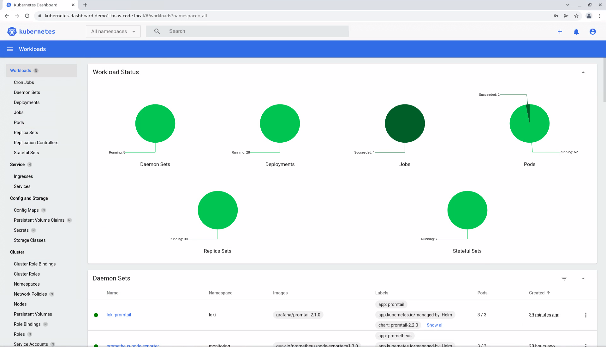
                    

                    <a class="prev" onclick="plusSlides(-1,'kubernetes-dashboard')">&#10094;</a>
                    <a class="next" onclick="plusSlides(1,'kubernetes-dashboard')">&#10095;</a>
                

                

                    
                    
                

            

        

    

### OpenLens
<a href="https://github.com/Accenture/kx.as.code/tree/main/auto-setup/core/openlens" target="_blank">Installation Files</a> | <a href="https://docs.k8slens.dev/main/" target="_blank">Application Documentation</a> | <a href="https://github.com/lensapp/lens" target="_blank">Application Source Code</a>

<q><i>
Lens IDE provides the full situational awareness for everything that runs in Kubernetes. It's lowering the barrier of entry for people just getting started and radically improving productivity for people with more experience.
</i></q> - github.com/lensapp/lens

    

        

            

            
Core

            

                

                    

                        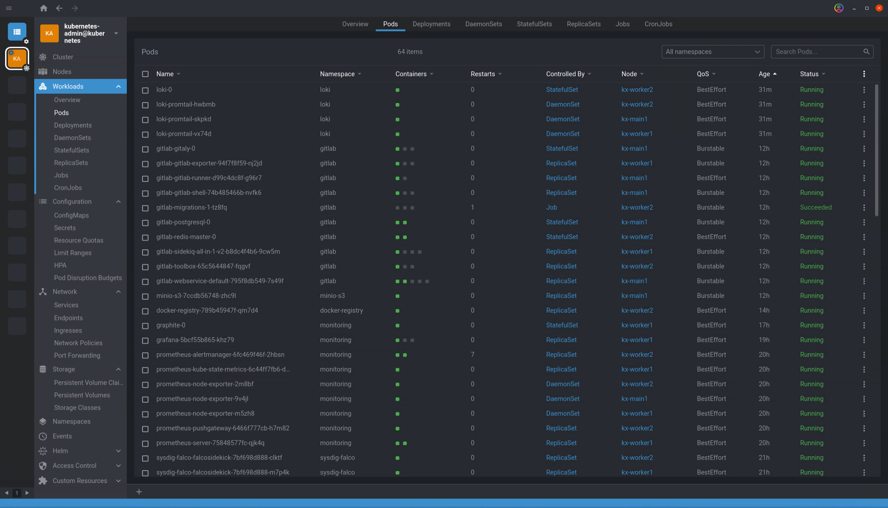
                    

                    

                        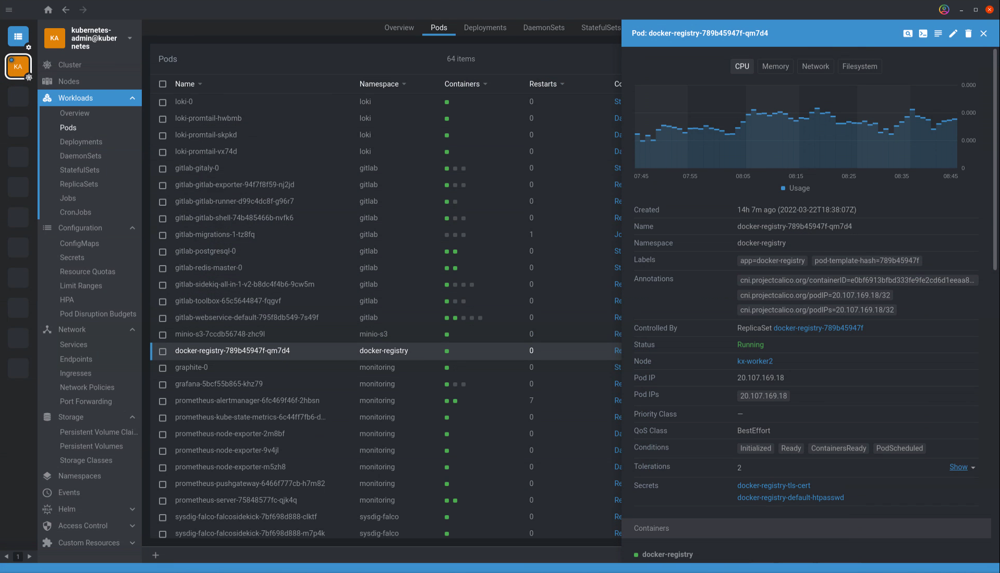
                    

                    

                        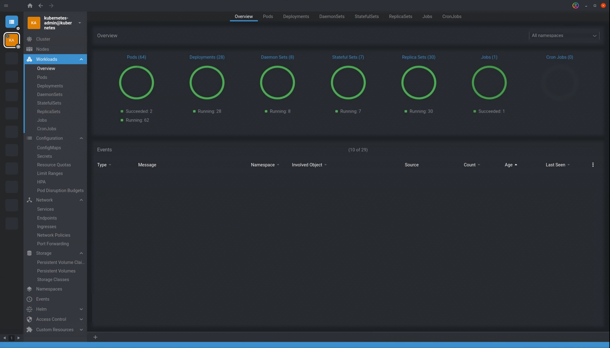
                    

                    

                        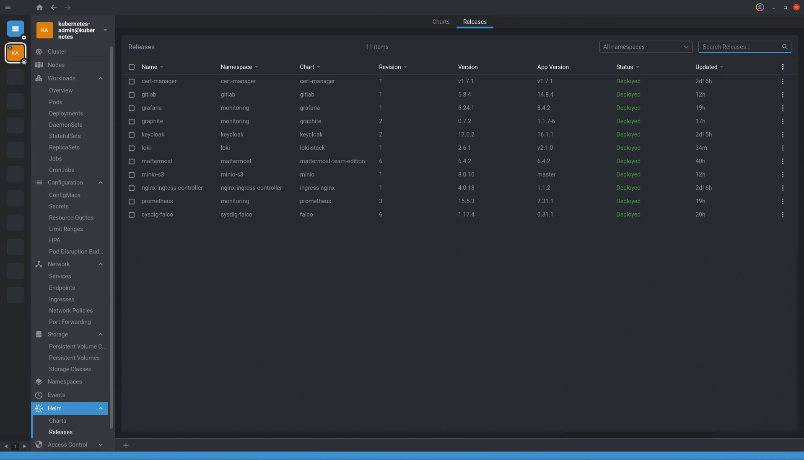
                    

                    <a class="prev" onclick="plusSlides(-1,'openlens')">&#10094;</a>
                    <a class="next" onclick="plusSlides(1,'openlens')">&#10095;</a>
                

                

                    
                    
                    
                    
                

            

        

    

### GoPass
<a href="https://github.com/Accenture/kx.as.code/tree/main/auto-setup/core/gopass" target="_blank">Installation Files</a> | <a href="https://github.com/gopasspw/gopass/tree/master/docs" target="_blank">Application Documentation</a> | <a href="https://github.com/gopasspw/gopass" target="_blank">Application Source Code</a>

<q><i>
gopass is a password manager for the command line written in Go. It works on all major desktop and server operating systems (Linux, MacOS, BSD, Windows).
</i></q> - github.com/gopasspw/gopass

(The GoPass UI is from https://github.com/codecentric/gopass-ui)

    

        

            

            
Core

            

                

                    

                        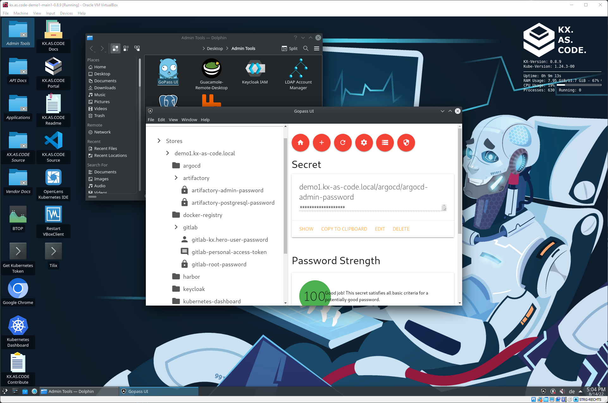
                    

                    <a class="prev" onclick="plusSlides(-1,'gopass')">&#10094;</a>
                    <a class="next" onclick="plusSlides(1,'gopass')">&#10095;</a>
                

                

                    
                

            

        

    

### Keycloak
<a href="https://github.com/Accenture/kx.as.code/tree/main/auto-setup/core/keycloak" target="_blank">Installation Files</a> | <a href="https://www.keycloak.org/documentation" target="_blank">Application Documentation</a> | <a href="https://github.com/keycloak/keycloak" target="_blank">Application Source Code</a>

<q><i>
Add authentication to applications and secure services with minimum effort.
No need to deal with storing users or authenticating users.
Keycloak provides user federation, strong authentication, user management, fine-grained authorization, and more.
</i></q> - keycloak.org

    

        

            

            
Core

            

                

                    

                        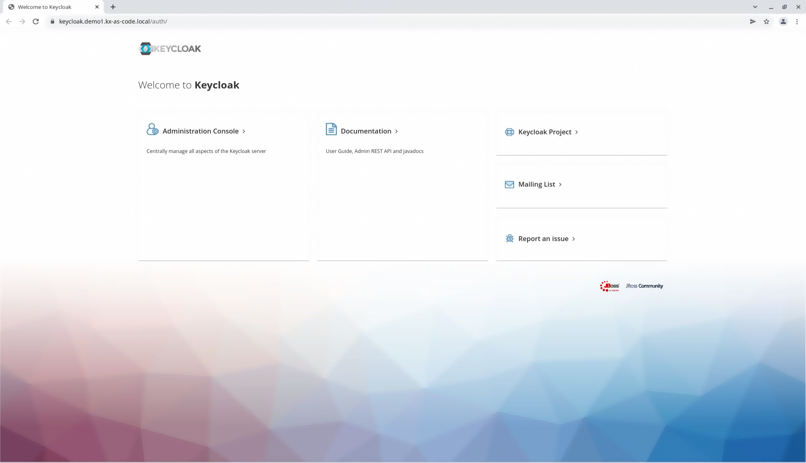
                    

                    

                        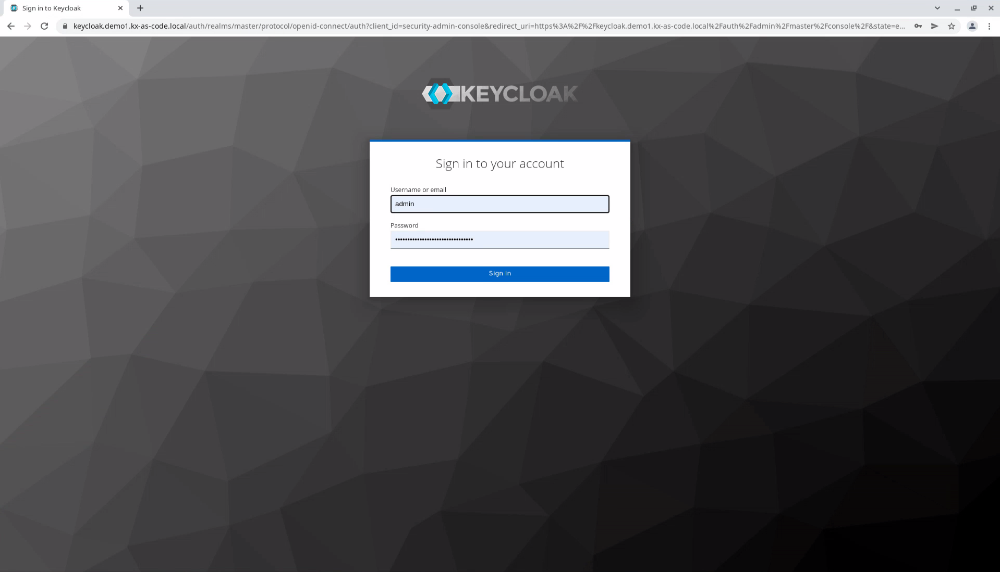
                    

                    

                        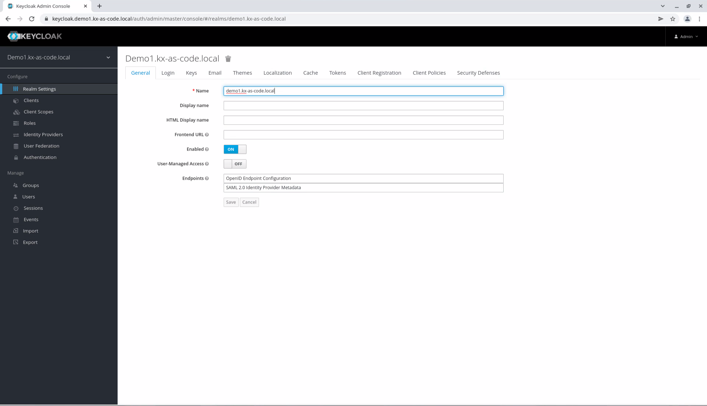
                    

                    

                        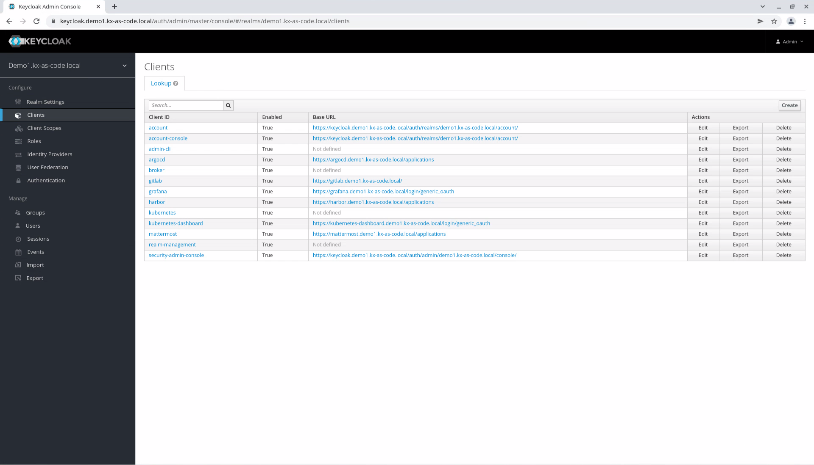
                    

                    

                        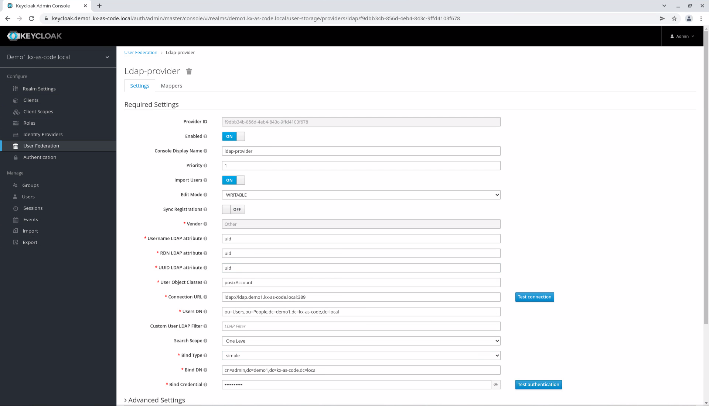
                    

                    

                        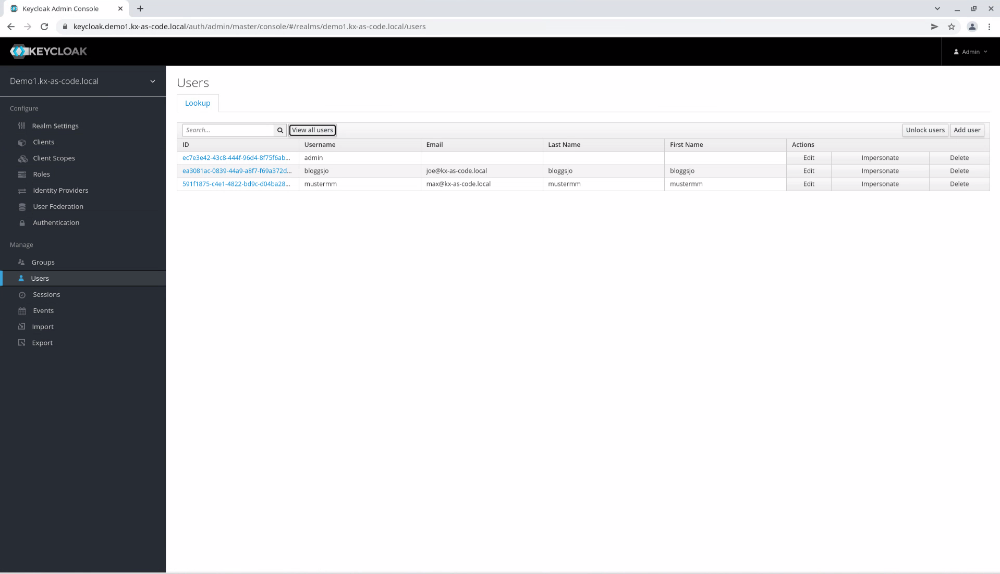
                    

                    <a class="prev" onclick="plusSlides(-1,'keycloak')">&#10094;</a>
                    <a class="next" onclick="plusSlides(1,'keycloak')">&#10095;</a>
                

                

                    
                    
                    
                    
                    
                    
                

            

        

    

### LDAP Account Manager
<a href="https://github.com/Accenture/kx.as.code/tree/main/auto-setup/core/openldap" target="_blank">Installation Files</a> | <a href="https://www.ldap-account-manager.org/lamcms/documentation" target="_blank">Application Documentation</a> | <a href="https://github.com/LDAPAccountManager/lam" target="_blank">Application Source Code</a>

<q><i>LDAP Account Manager (LAM) is a webfrontend for managing entries (e.g. users, groups, DHCP settings) stored in an LDAP directory. LAM was designed to make LDAP management as easy as possible for the user. It abstracts from the technical details of LDAP and allows persons without technical background to manage LDAP entries. If needed, power users may still directly edit LDAP entries via the integrated LDAP browser.
</i></q> - ldap-account-manager.org

    

        

            
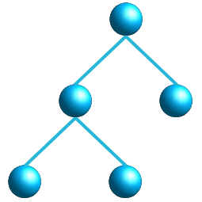

            
Core

            

                

                    

                        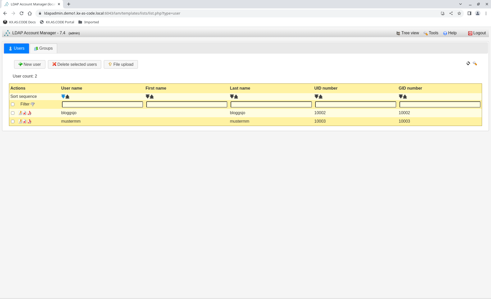
                    

                    

                        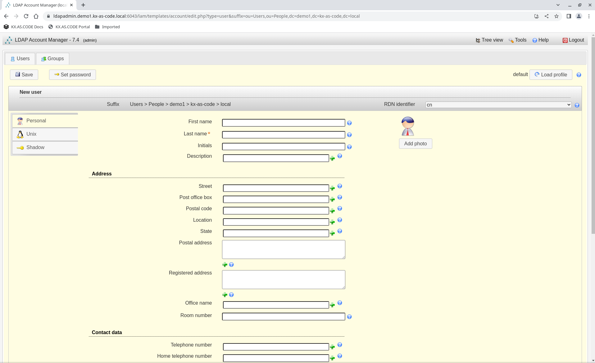
                    

                    

                        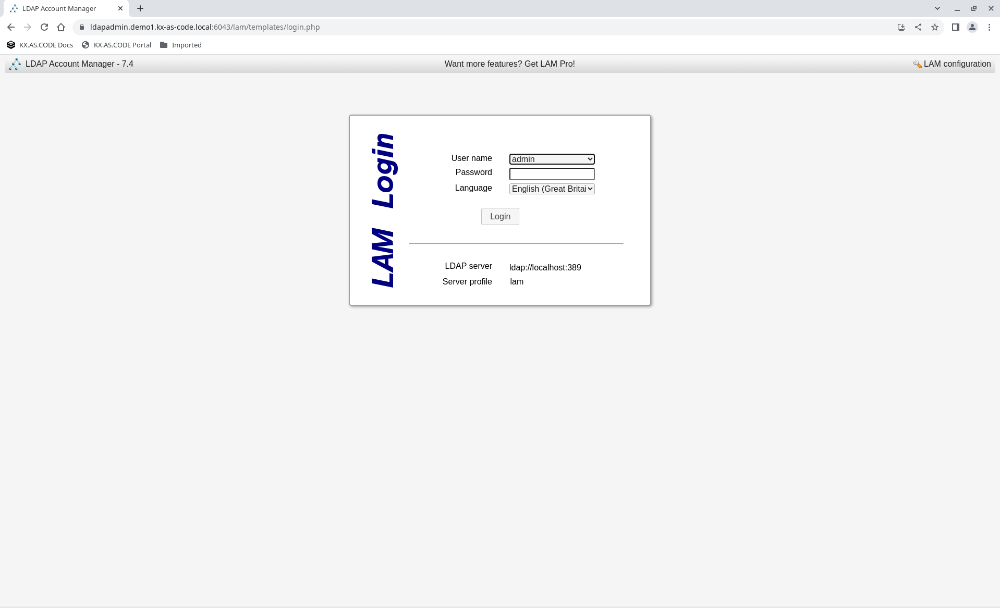
                    

                    <a class="prev" onclick="plusSlides(-1,'lam')">&#10094;</a>
                    <a class="next" onclick="plusSlides(1,'lam')">&#10095;</a>
                

                

                    
                    
                    
                

            

        

    

### Rabbitmq Server
<a href="http://localhost:8000/Development/Available-Functions/#rabbitmq-core-setup" target="_blank">Functions</a> | <a href="https://github.com/Accenture/kx.as.code/blob/main/base-vm/scripts/main-node/rabbitmq.sh" target="_blank">Installation Files</a> | <a href="https://www.rabbitmq.com/documentation.html" target="_blank">Application Documentation</a> | <a href="" target="_blank">Application Source Code</a>

<q><i>
RabbitMQ is an open-source message-broker software (sometimes called message-oriented middleware) that originally implemented the Advanced Message Queuing Protocol (AMQP) and has since been extended with a plug-in architecture to support Streaming Text Oriented Messaging Protocol (STOMP), MQ Telemetry Transport (MQTT), and other protocols.[1]
Written in Erlang, the RabbitMQ server is built on the Open Telecom Platform framework for clustering and failover. Client libraries to interface with the broker are available for all major programming languages. The source code is released under the Mozilla Public License.
</i></q> - Wikipedia

    

        

            

            
Core

            

                

                    

                        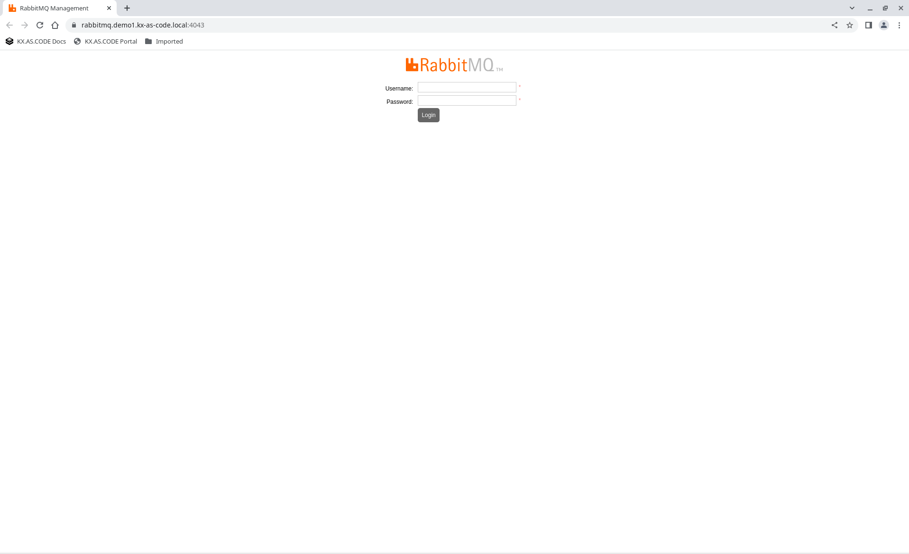
                    

                    

                        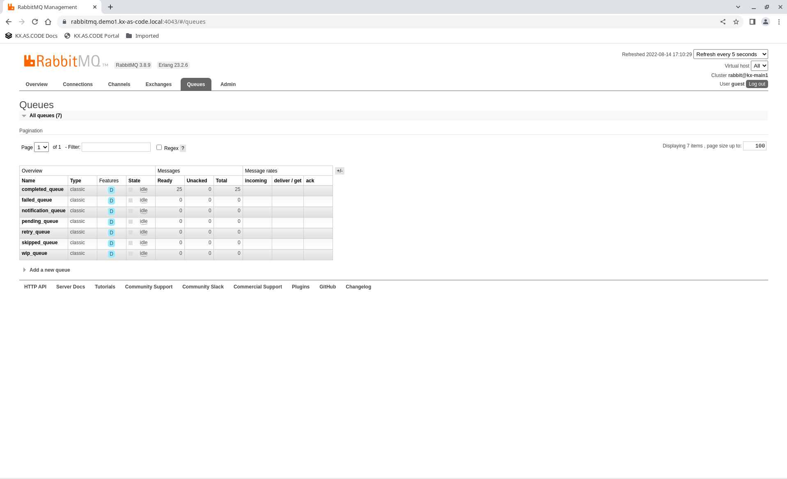
                    

                    

                        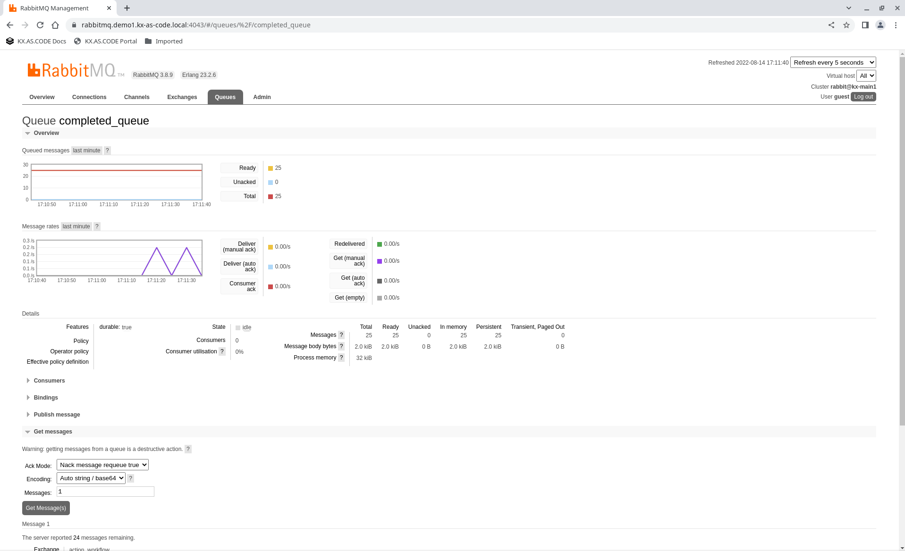
                    

                    <a class="prev" onclick="plusSlides(-1,'rabbitmq')">&#10094;</a>
                    <a class="next" onclick="plusSlides(1,'rabbitmq')">&#10095;</a>
                

                

                    
                    
                    
                

            

        

    

### Postgresql Manager
<a href="https://github.com/Accenture/kx.as.code/blob/main/auto-setup/core/remote-desktop/post_install_scripts/installPgAdmin.sh" target="_blank">Installation Files</a> | <a href="https://www.pgadmin.org/docs/pgadmin4/latest/index.html" target="_blank">Application Documentation</a> | <a href="https://github.com/postgres/pgadmin4" target="_blank">Application Source Code</a>

<q><i>
pgAdmin is a management tool for PostgreSQL and derivative relational databases such as EnterpriseDB's EDB Advanced Server. It may be run either as a web or desktop application.
</i></q> - pgadmin.org

    

        

            

            
Core

            

                

                    

                        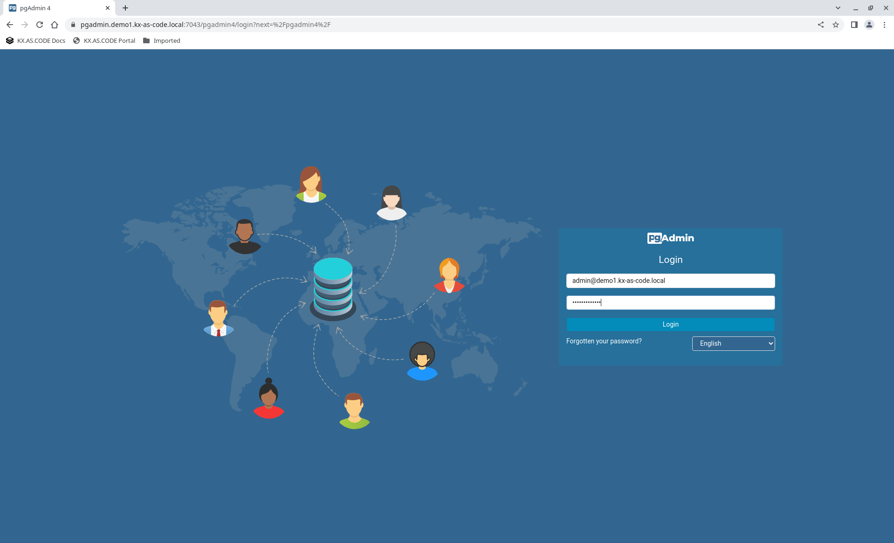
                    

                    <a class="prev" onclick="plusSlides(-1,'pgadmin')">&#10094;</a>
                    <a class="next" onclick="plusSlides(1,'pgadmin')">&#10095;</a>
                

                

                    
                

            

        

    

## CICD

### ArgoCD
<a href="https://github.com/Accenture/kx.as.code/tree/main/auto-setup/cicd/argocd" target="_blank">Installation Files</a> | <a href="https://argo-cd.readthedocs.io/en/stable/" target="_blank">Application Documentation</a> | <a href="https://github.com/argoproj/argo-cd/" target="_blank">Application Source Code</a>

<q><i>
Argo CD is a declarative, GitOps continuous delivery tool for Kubernetes.
</i></q> - argo-cd.readthedocs.io

    

        

            

            
GitOps

            

                

                    

                        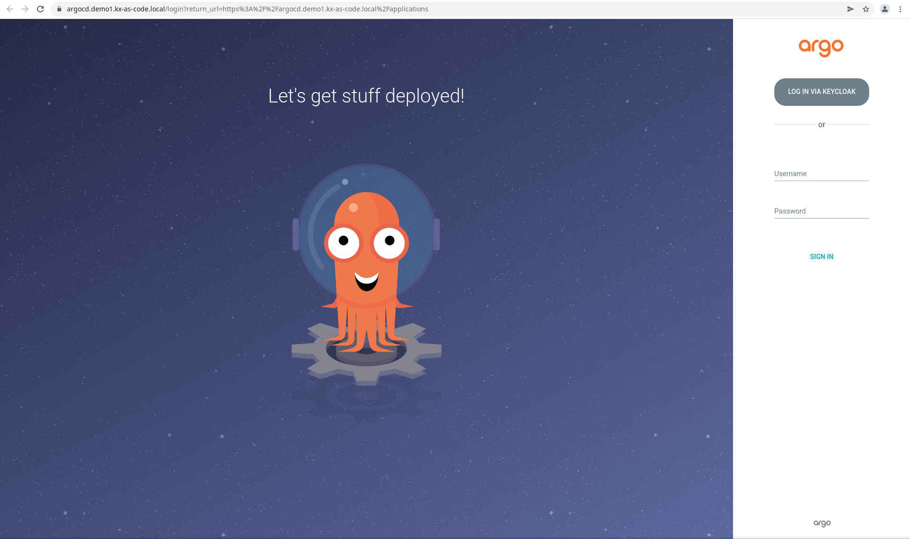
                    

                    

                        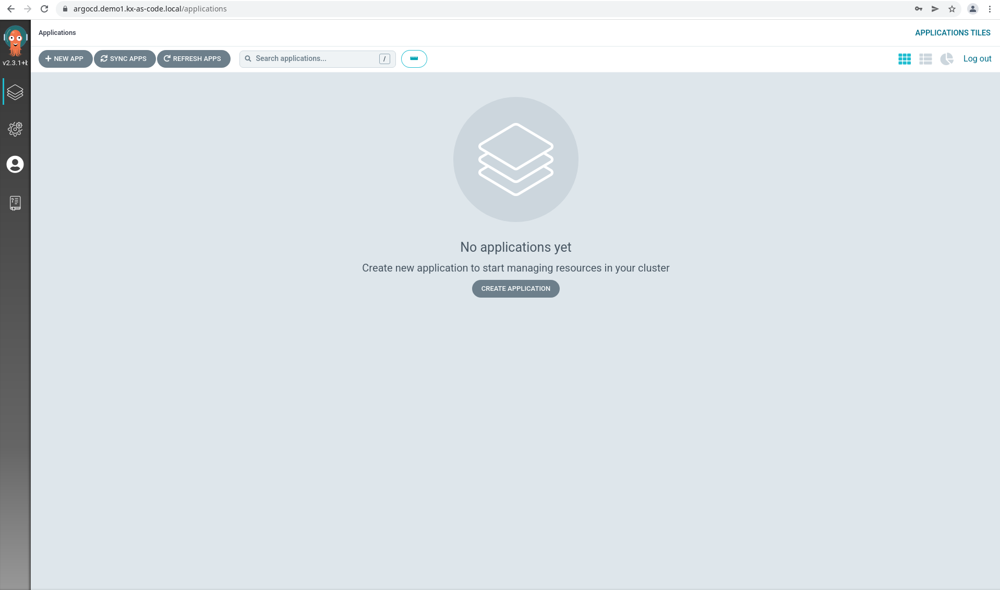
                    

                    

                        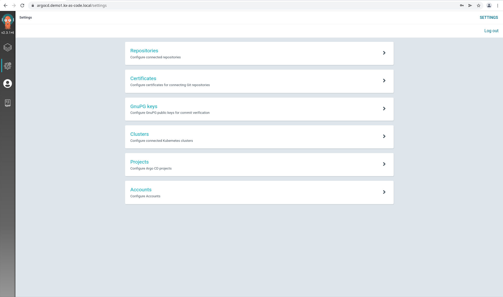
                    

                    <a class="prev" onclick="plusSlides(-1,'argocd')">&#10094;</a>
                    <a class="next" onclick="plusSlides(1,'argocd')">&#10095;</a>
                

                

                    
                    
                    
                

            

        

    

### Artifactory
<a href="https://github.com/Accenture/kx.as.code/tree/main/auto-setup/cicd/artifactory" target="_blank">Installation Files</a> | <a href="https://www.jfrog.com/confluence/display/JFROG/JFrog+Artifactory" target="_blank">Application Documentation</a> | <a href="https://releases.jfrog.io/artifactory/bintray-artifactory/org/artifactory/oss/jfrog-artifactory-oss/" target="_blank">Application Source Code</a>

<q><i>
JFrog Artifactory is a universal DevOps solution providing end-to-end automation and management of binaries and artifacts through the application delivery process that improves productivity across your development ecosystem. It enables freedom of choice supporting 25+ software build packages, all major CI/CD platforms, and DevOps tools you already use. Artifactory is Kubernetes ready supporting containers, Docker, Helm Charts, and is your Kubernetes and Docker registry and comes with full CLI and REST APIs customizable to your ecosystem.
</i></q> - jfrog.com

    

        

            

            
CICD

            

                

                    

                        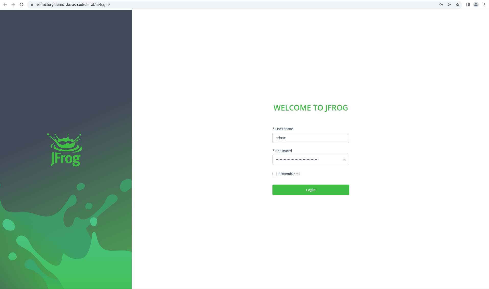
                    

                    

                        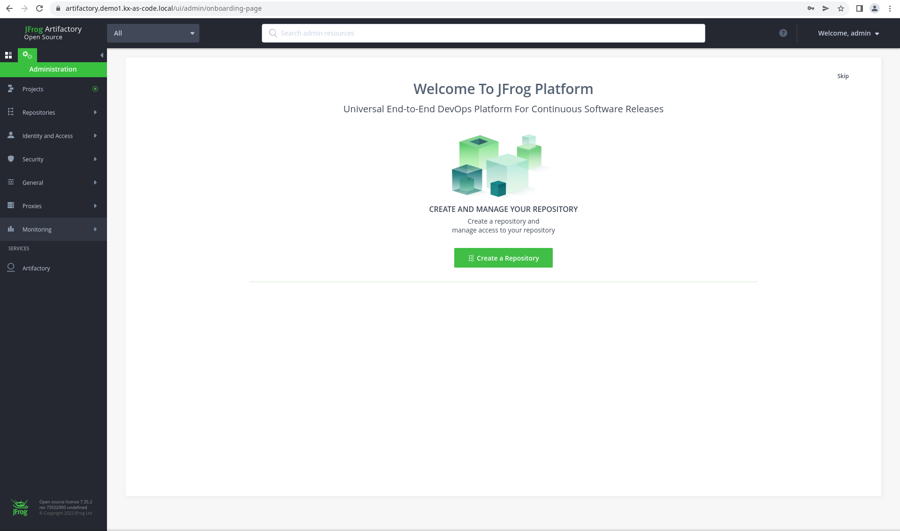
                    

                    

                        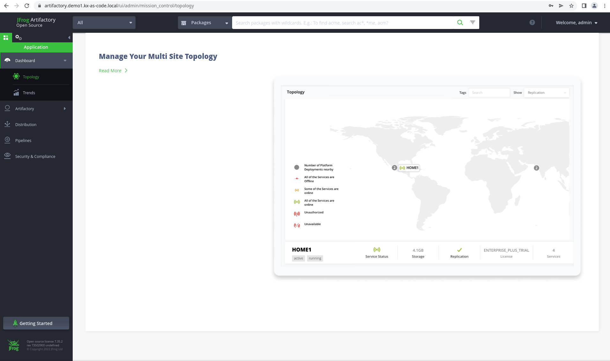
                    

                    

                        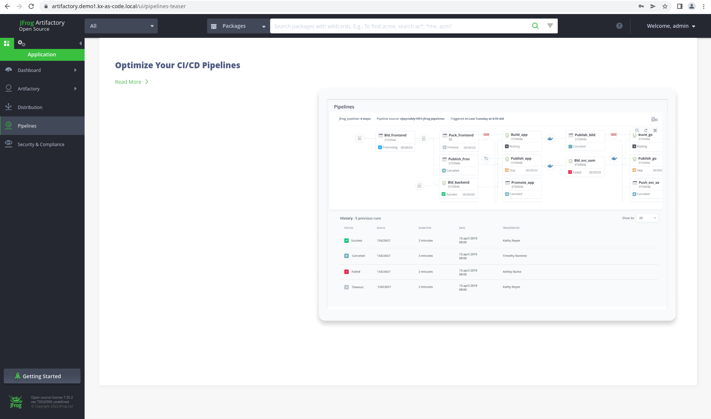
                    

                    

                        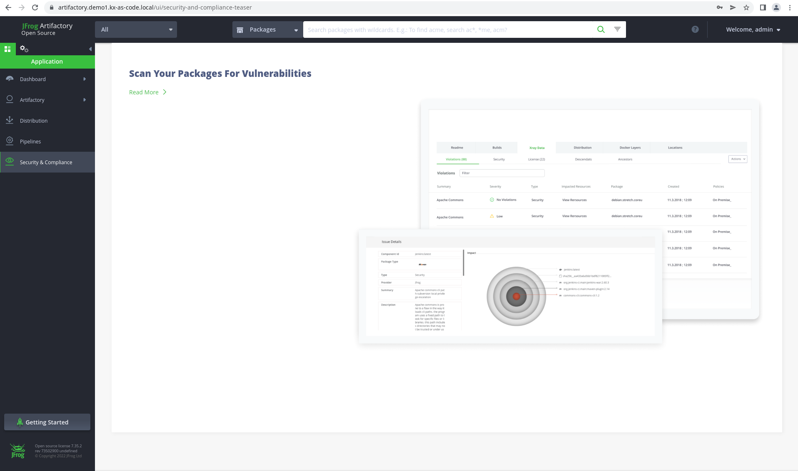
                    

                    

                        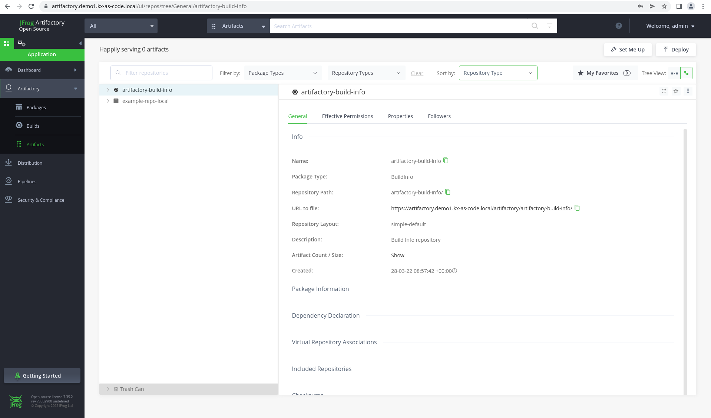
                    

                    <a class="prev" onclick="plusSlides(-1,'artifactory')">&#10094;</a>
                    <a class="next" onclick="plusSlides(1,'artifactory')">&#10095;</a>
                

                

                    
                    
                    
                    
                    
                    
                

            

        

    

### Consul
<a href="https://github.com/Accenture/kx.as.code/tree/main/auto-setup/cicd/consul" target="_blank">Installation Files</a> | <a href="https://www.consul.io/docs" target="_blank">Application Documentation</a> | <a href="https://github.com/hashicorp/consul" target="_blank">Application Source Code</a>

<q><i>
Consul is a distributed, highly available, and data center aware solution to connect and configure applications across dynamic, distributed infrastructure.
</i></q> - Elastic

    

        

            

            
CICD

            

                

                    

                        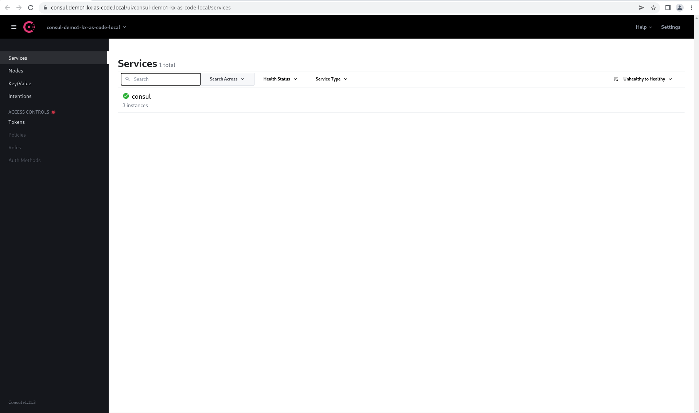
                    

                    

                        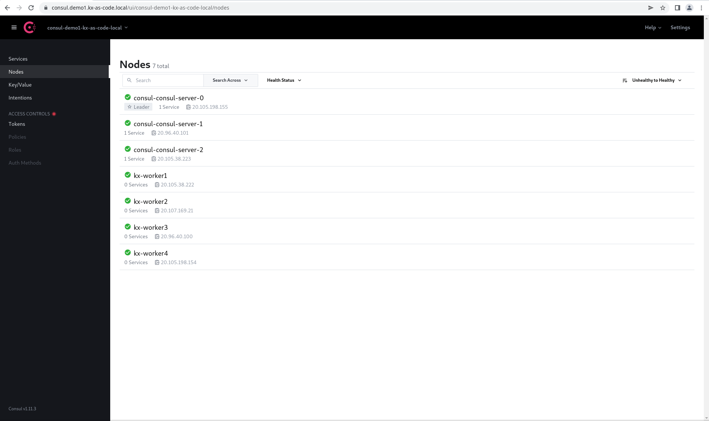
                    

                    <a class="prev" onclick="plusSlides(-1,'consul')">&#10094;</a>
                    <a class="next" onclick="plusSlides(1,'consul')">&#10095;</a>
                

                

                    
                    
                

            

        

    

### Gitea
<a href="https://github.com/Accenture/kx.as.code/tree/main/auto-setup/cicd/gitea" target="_blank">Installation Files</a> | <a href="https://docs.gitea.io/" target="_blank">Application Documentation</a> | <a href="https://github.com/go-gitea/gitea" target="_blank">Application Source Code</a>

<q><i>Gitea is a community managed lightweight code hosting solution written in Go. It is published under the MIT license.
</i></q> - Gitea

    

        

            

            
CICD

            

                

                    

                        
                    

                    

                        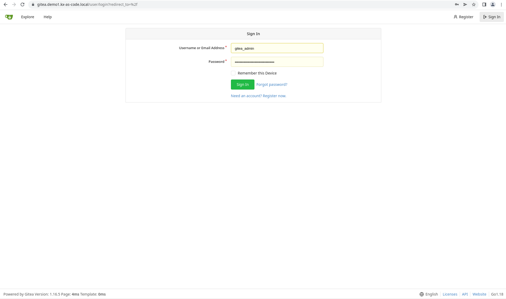
                    

                    

                        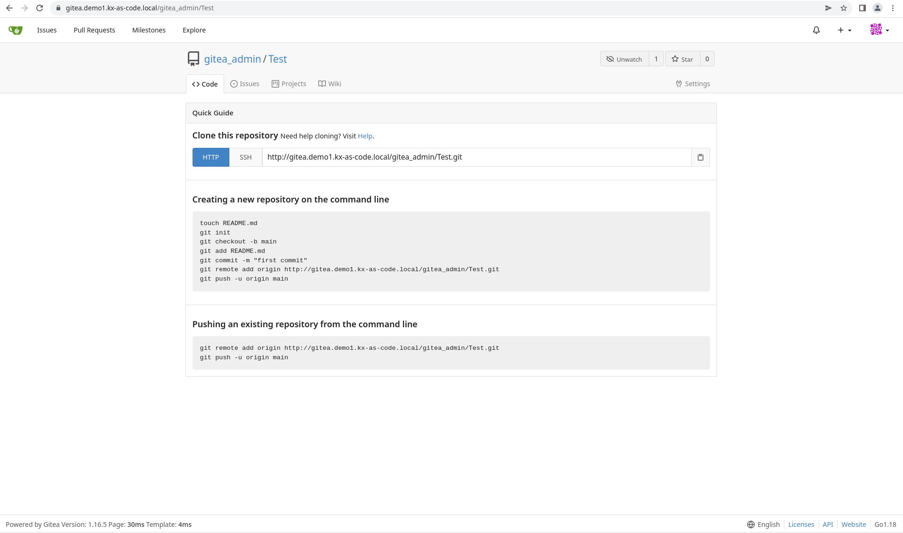
                    

                    <a class="prev" onclick="plusSlides(-1,'gitea')">&#10094;</a>
                    <a class="next" onclick="plusSlides(1,'gitea')">&#10095;</a>
                

                

                    
                    
                    
                

            

        

    

### Gitlab
<a href="https://github.com/Accenture/kx.as.code/tree/main/auto-setup/cicd/gitlab" target="_blank">Installation Files</a> | <a href="" target="_blank">Application Documentation</a> | <a href="https://gitlab.com/gitlab-org/gitlab" target="_blank">Application Source Code</a>

<q><i>
GitLab is an open source end-to-end software development platform with built-in version control, issue tracking, code review, CI/CD, and more.
</i></q> - gitlab.com/gitlab-org/gitlab

    

        

            

            
CICD

            

                

                    

                        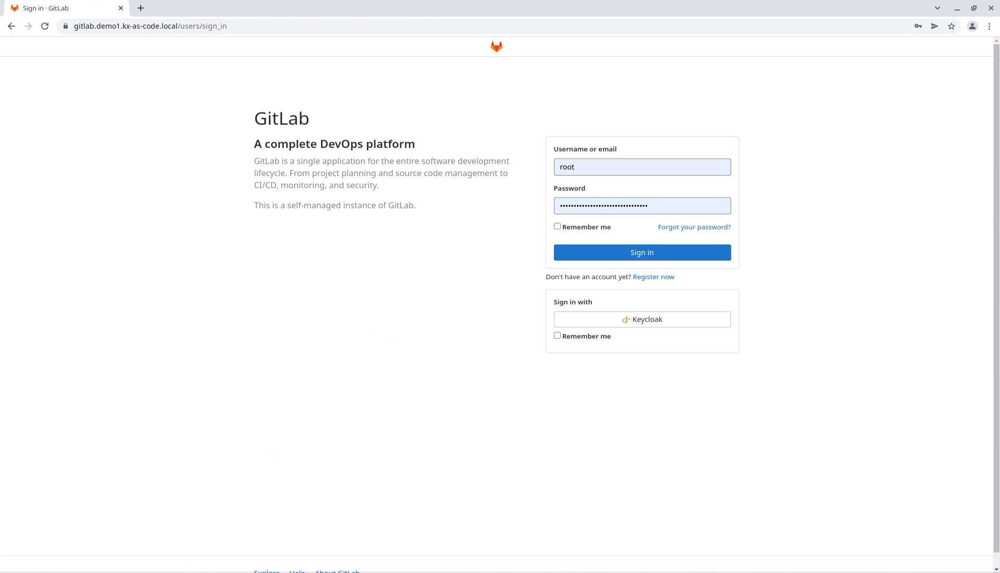
                    

                    

                        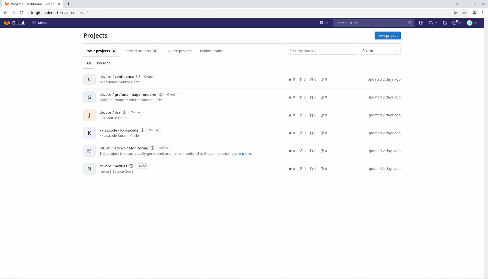
                    

                    

                        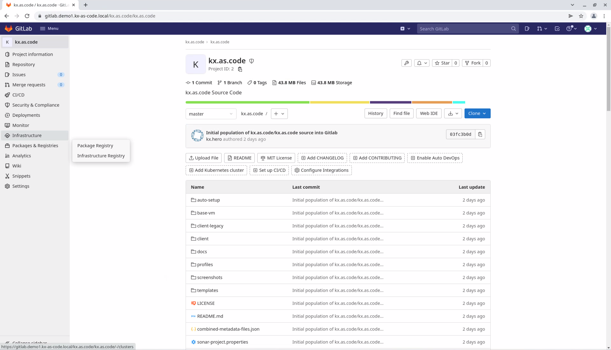
                    

                    <a class="prev" onclick="plusSlides(-1,'gitlab')">&#10094;</a>
                    <a class="next" onclick="plusSlides(1,'gitlab')">&#10095;</a>
                

                

                    
                    
                    
                

            

        

    

### Harbor
<a href="https://github.com/Accenture/kx.as.code/tree/main/auto-setup/cicd/harbor" target="_blank">Installation Files</a> | <a href="https://goharbor.io/docs/2.5.0" target="_blank">Application Documentation</a> | <a href="https://github.com/goharbor/harbor" target="_blank">Application Source Code</a>

<q><i>
Harbor is an open source registry that secures artifacts with policies and role-based access control, ensures images are scanned and free from vulnerabilities, and signs images as trusted. Harbor, a CNCF Graduated project, delivers compliance, performance, and interoperability to help you consistently and securely manage artifacts across cloud native compute platforms like Kubernetes and Docker.
</i></q> - https://goharbor.io/

    

        

            

            
CICD

            

                

                    

                        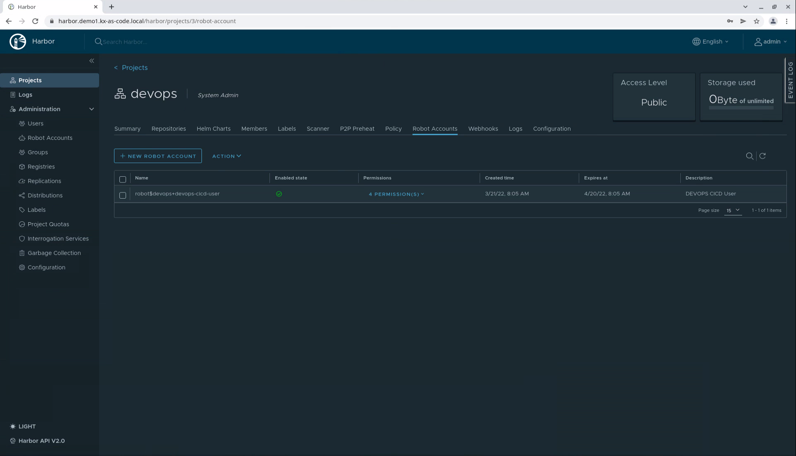
                    

                    <a class="prev" onclick="plusSlides(-1,'harbor')">&#10094;</a>
                    <a class="next" onclick="plusSlides(1,'harbor')">&#10095;</a>
                

                

                    
                

            

        

    

### Jenkins
<a href="https://github.com/Accenture/kx.as.code/tree/main/auto-setup/cicd/jenkins" target="_blank">Installation Files</a> | <a href="https://www.jenkins.io/doc/" target="_blank">Application Documentation</a> | <a href="https://github.com/jenkinsci/jenkins" target="_blank">Application Source Code</a>

<q><i>
The leading open source automation server, Jenkins provides hundreds of plugins to support building, deploying and automating any project.
</i></q> - jenkins.io

    

        

            

            
CICD

            

                

                    

                        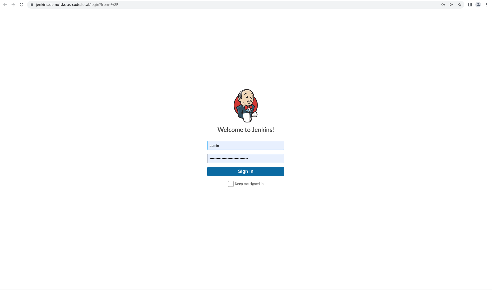
                    

                    

                        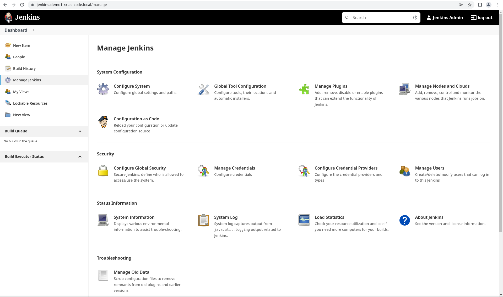
                    

                    <a class="prev" onclick="plusSlides(-1,'jenkins')">&#10094;</a>
                    <a class="next" onclick="plusSlides(1,'jenkins')">&#10095;</a>
                

                

                    
                    
                

            

        

    

### Nexus3
<a href="https://github.com/Accenture/kx.as.code/tree/main/auto-setup/cicd/nexus3" target="_blank">Installation Files</a> | <a href="https://help.sonatype.com/repomanager3" target="_blank">Application Documentation</a> | <a href="https://github.com/sonatype/nexus-public" target="_blank">Application Source Code</a>

<q><i>
Nexus3 manages binaries and build artifacts across your software supply chain.
</i></q> - sonatype.com

    

        

            

            
CICD

            

                

                    

                        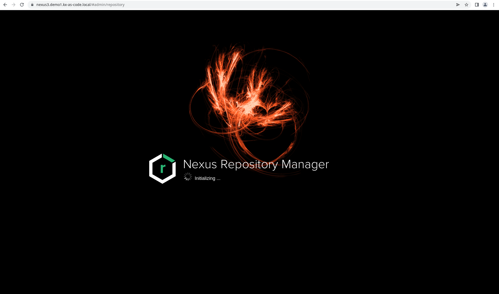
                    

                    

                        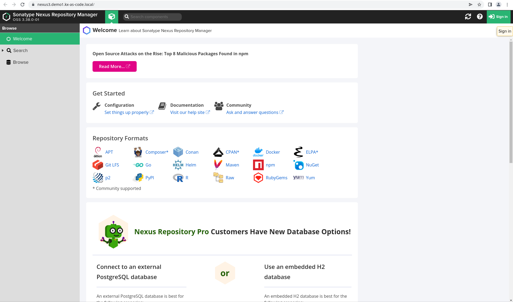
                    

                    

                        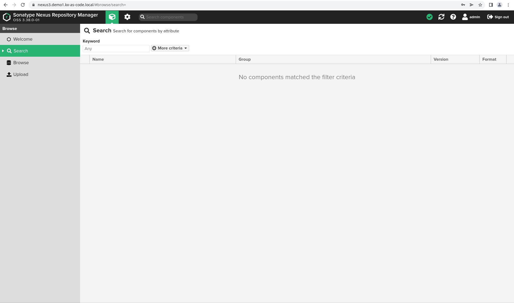
                    

                    

                        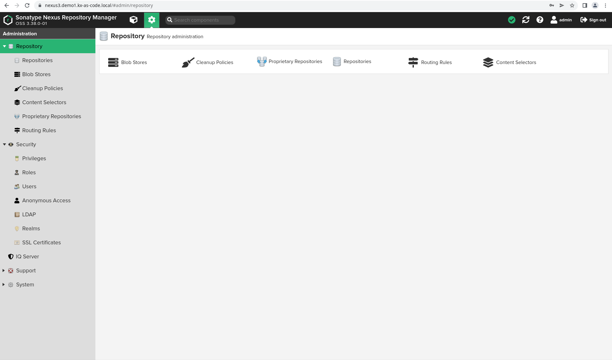
                    

                    <a class="prev" onclick="plusSlides(-1,'nexus3')">&#10094;</a>
                    <a class="next" onclick="plusSlides(1,'nexus3')">&#10095;</a>
                

                

                    
                    
                    
                    
                

            

        

    

### Teamcity
<a href="" target="_blank">Installation Files</a> | <a href="https://www.jetbrains.com/help/teamcity/teamcity-documentation.html" target="_blank">Application Documentation</a>

<q><i>
TeamCity is a continuous integration server that integrates with all major IDEs, version control and issue tracking systems, and can be used by teams of any size.
</i></q> - teamcity.com

    

        

            

            
CICD

            

                

                    

                        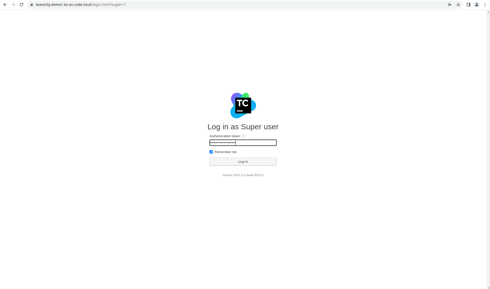
                    

                    

                        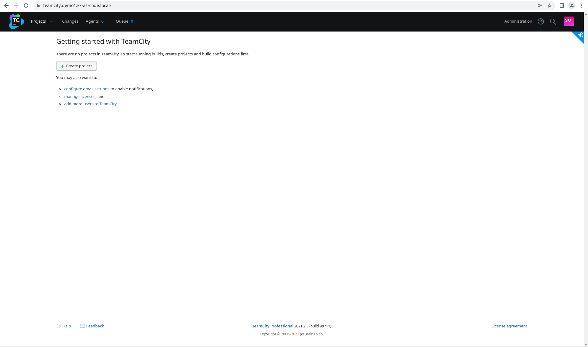
                    

                    

                        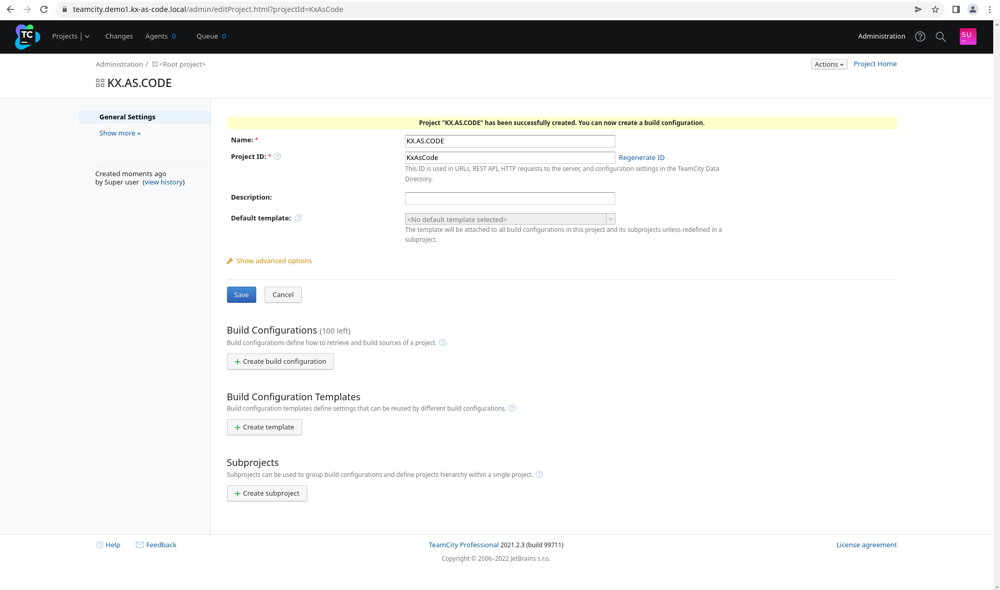
                    

                    <a class="prev" onclick="plusSlides(-1,'teamcity')">&#10094;</a>
                    <a class="next" onclick="plusSlides(1,'teamcity')">&#10095;</a>
                

                

                    
                    
                    
                

            

        

    

## Monitoring

### Elastic ElasticSearch
<a href="https://github.com/Accenture/kx.as.code/tree/main/auto-setup/monitoring/elastic-elasticsearch" target="_blank">Installation Files</a> | <a href="https://www.elastic.co/guide/en/elasticsearch/reference/current/index.html" target="_blank">Application Documentation</a> | <a href="https://github.com/elastic/elasticsearch" target="_blank">Application Source Code</a>

<q><i>
Elasticsearch is a distributed, RESTful search and analytics engine capable of addressing a growing number of use cases. As the heart of the Elastic Stack, it centrally stores your data for lightning fast search, fine‑tuned relevancy, and powerful analytics that scale with ease.
</i></q> - elastic.co

    

        

            

            
Monitoring

            

                

                    

                        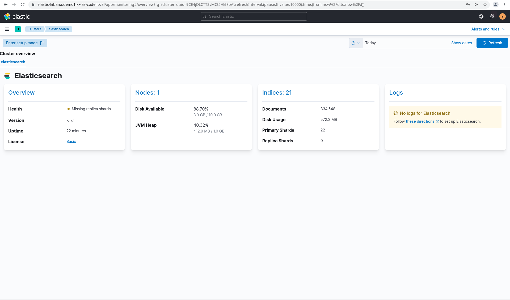
                    

                    

                        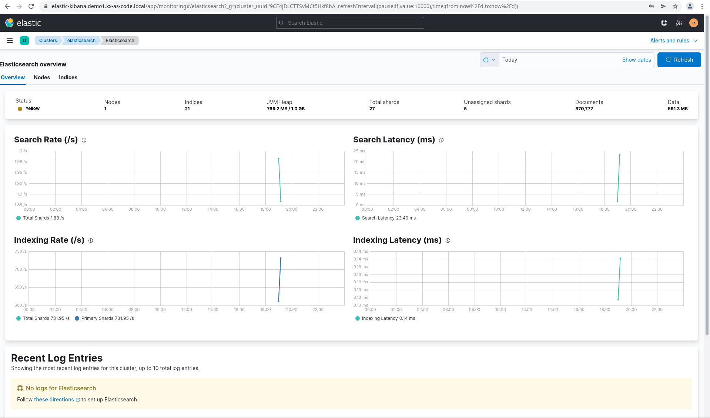
                    

                    

                        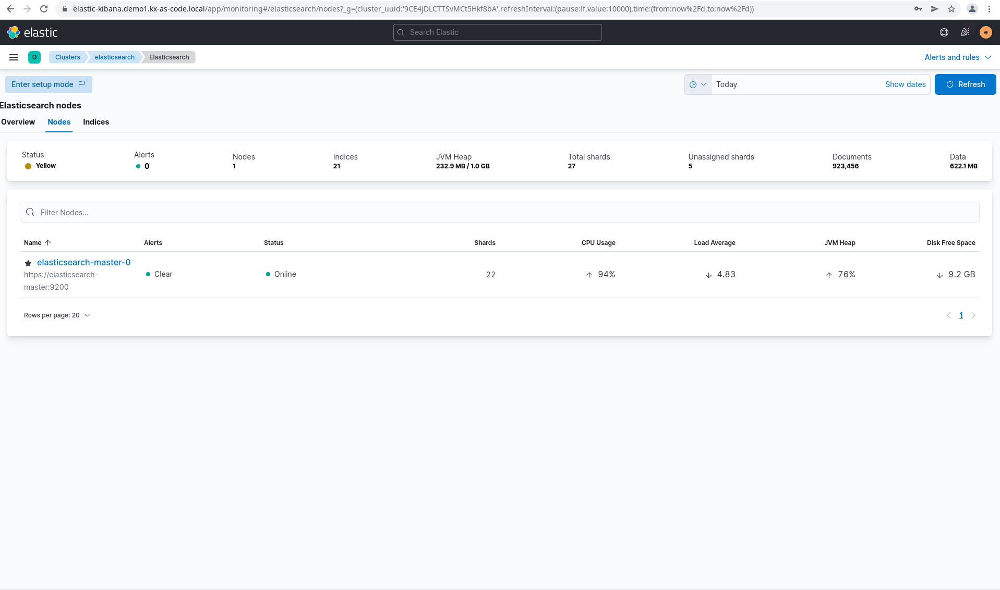
                    

                    

                        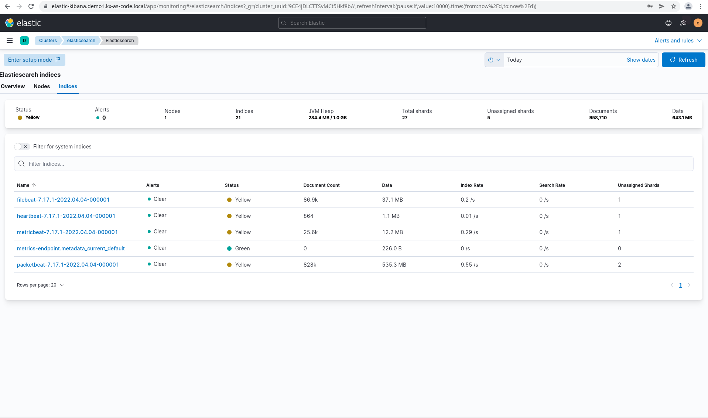
                    

                    <a class="prev" onclick="plusSlides(-1,'elasticsearch')">&#10094;</a>
                    <a class="next" onclick="plusSlides(1,'elasticsearch')">&#10095;</a>
                

                

                    
                    
                    
                    
                

            

        

    

### FileBeat
<a href="https://github.com/Accenture/kx.as.code/tree/main/auto-setup/monitoring/elastic-filebeat" target="_blank">Installation Files</a> | <a href="https://www.elastic.co/guide/en/beats/filebeat/current/index.html" target="_blank">Application Documentation</a> | <a href="https://github.com/elastic/beats" target="_blank">Application Source Code</a>

<q><i>
Lightweight shipper for logs. Filebeat is part of the Elastic Stack, meaning it works seamlessly with Logstash, Elasticsearch, and Kibana. Whether you want to transform or enrich your logs and files with Logstash, fiddle with some analytics in Elasticsearch, or build and share dashboards in Kibana, Filebeat makes it easy to ship your data to where it matters most.
</i></q> - elastic.co

    

        

            

            
Monitoring

            

                

                    

                        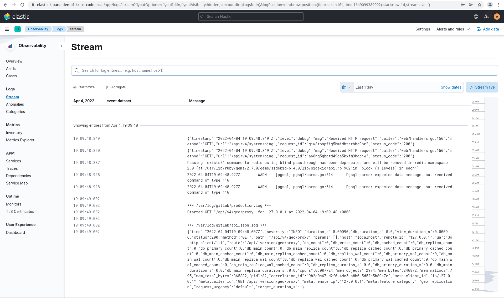
                    

                    

                        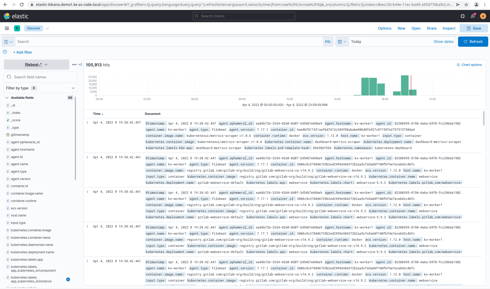
                    

                    

                        
                    

                    <a class="prev" onclick="plusSlides(-1,'filebeat')">&#10094;</a>
                    <a class="next" onclick="plusSlides(1,'filebeat')">&#10095;</a>
                

                

                    
                    
                    
                

            

        

    

### Elastic Heartbeat
<a href="https://github.com/Accenture/kx.as.code/tree/main/auto-setup/monitoring/elastic-heartbeat" target="_blank">Installation Files</a> | <a href="https://www.elastic.co/guide/en/beats/heartbeat/current/index.html" target="_blank">Application Documentation</a> | <a href="https://github.com/elastic/beats" target="_blank">Application Source Code</a>

<q><i>
Lightweight shipper for uptime monitoring. Monitor services for their availability with active probing. Given a list of URLs, Heartbeat asks the simple question: Are you alive? Heartbeat ships this information and response time to the rest of the Elastic Stack for further analysis.
</i></q> - elastic.co

    

        

            

            
Monitoring

            

                

                    

                        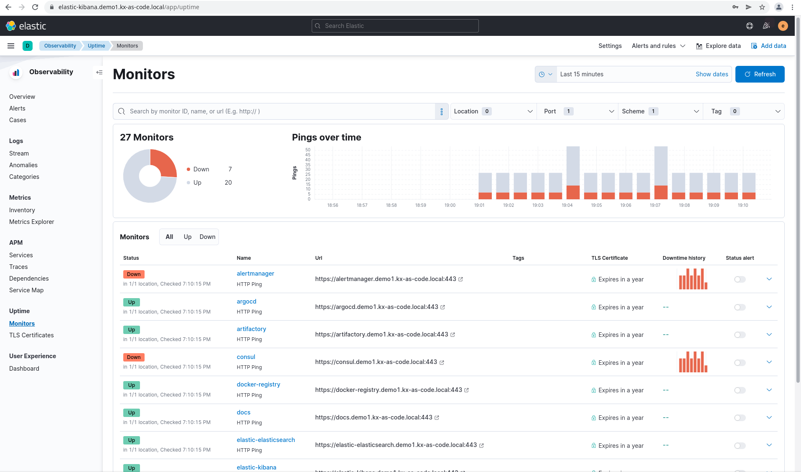
                    

                    

                        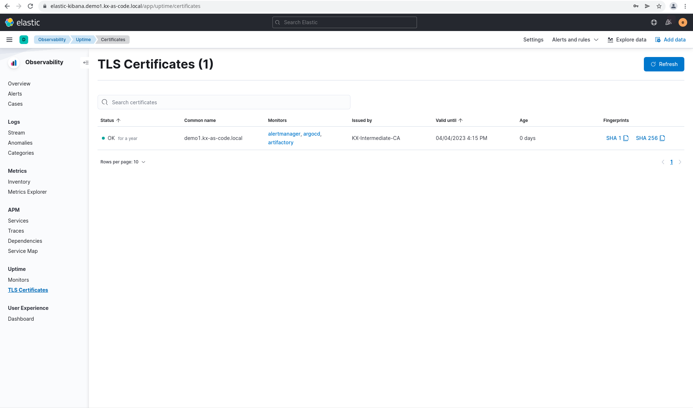
                    

                    <a class="prev" onclick="plusSlides(-1,'heartbeat')">&#10094;</a>
                    <a class="next" onclick="plusSlides(1,'heartbeat')">&#10095;</a>
                

                

                    
                    
                

            

        

    

### Elastic Kibana
<a href="https://github.com/Accenture/kx.as.code/tree/main/auto-setup/monitoring/elastic-kibana" target="_blank">Installation Files</a> | <a href="https://www.elastic.co/guide/en/kibana/current/index.html" target="_blank">Application Documentation</a> | <a href="" target="_blank">Application Source Code</a>

<q><i>
Kibana is a free and open user interface that lets you visualize your Elasticsearch data and navigate the Elastic Stack. Do anything from tracking query load to understanding the way requests flow through your apps.
</i></q> - elastic.co

    

        

            

            
Monitoring

            

                

                    

                        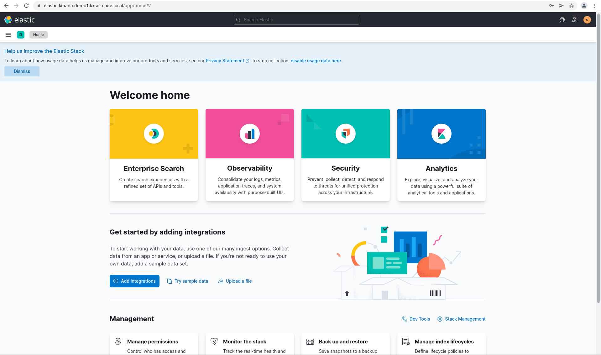
                    

                    

                        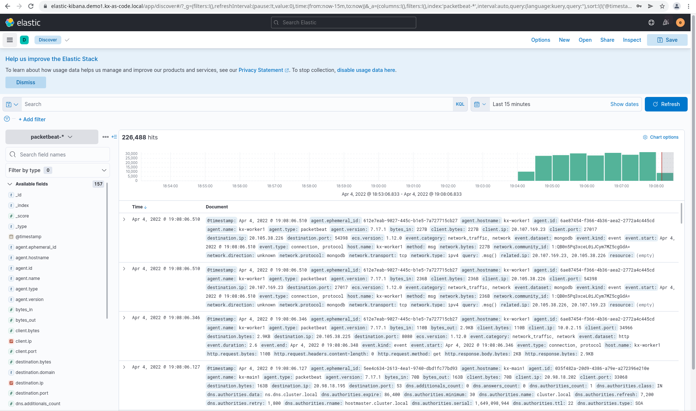
                    

                    

                        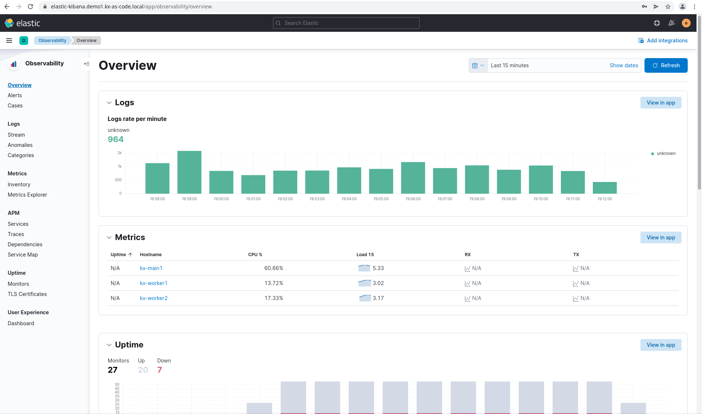
                    

                    

                        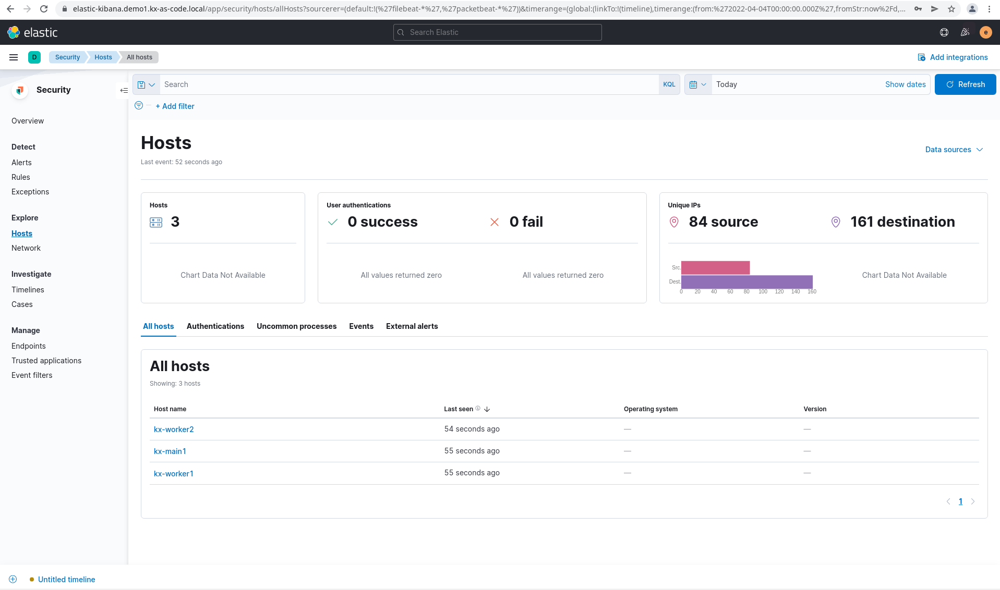
                    

                    <a class="prev" onclick="plusSlides(-1,'kibana')">&#10094;</a>
                    <a class="next" onclick="plusSlides(1,'kibana')">&#10095;</a>
                

                

                    
                    
                    
                    
                

            

        

    

### Elastic Metricbeat
<a href="https://github.com/Accenture/kx.as.code/tree/main/auto-setup/monitoring/elastic-metricbeat" target="_blank">Installation Files</a> | <a href="https://www.elastic.co/guide/en/beats/metricbeat/current/index.html" target="_blank">Application Documentation</a> | <a href="https://github.com/elastic/beats" target="_blank">Application Source Code</a>

<q><i>
Lightweight shipper for metrics. Collect metrics from your systems and services. From CPU to memory, Redis to NGINX, and much more, Metricbeat is a lightweight way to send system and service statistics.
</i></q> - elastic.co

    

        

            

            
Monitoring

            

                

                    

                        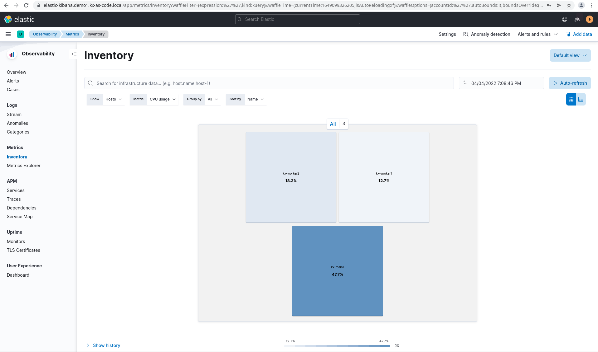
                    

                    <a class="prev" onclick="plusSlides(-1,'metricbeat')">&#10094;</a>
                    <a class="next" onclick="plusSlides(1,'metricbeat')">&#10095;</a>
                

                

                    
                

            

        

    

### Elastic Packetbeat
<a href="https://github.com/Accenture/kx.as.code/tree/main/auto-setup/monitoring/elastic-packetbeat" target="_blank">Installation Files</a> | <a href="https://www.elastic.co/guide/en/beats/packetbeat/current/index.html" target="_blank">Application Documentation</a> | <a href="https://github.com/elastic/beats" target="_blank">Application Source Code</a>

<q><i>
Lightweight shipper for network data. Monitoring your network traffic is critical to gaining observability and securing your environment — ensuring high levels of performance and security. Packetbeat is a lightweight network packet analyzer that sends data from your hosts and containers to Logstash or Elasticsearch.
</i></q> - elastic.co

    

        

            

            
Monitoring

            

                

                    

                        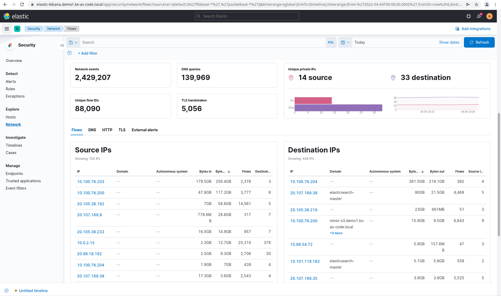
                    

                    <a class="prev" onclick="plusSlides(-1,'packetbeat')">&#10094;</a>
                    <a class="next" onclick="plusSlides(1,'packetbeat')">&#10095;</a>
                

                

                    
                

            

        

    

### Grafana
<a href="https://github.com/Accenture/kx.as.code/tree/main/auto-setup/monitoring/grafana" target="_blank">Installation Files</a> | <a href="https://grafana.com/docs/" target="_blank">Application Documentation</a> | <a href="https://github.com/grafana/grafana" target="_blank">Application Source Code</a>

<q><i>
Query, visualize, alert on, and understand your data no matter where it’s stored. With Grafana you can create, explore and share all of your data through beautiful, flexible dashboards.
</i></q> - grafana.com/grafana/

    

        

            

            
Monitoring

            

                

                    

                        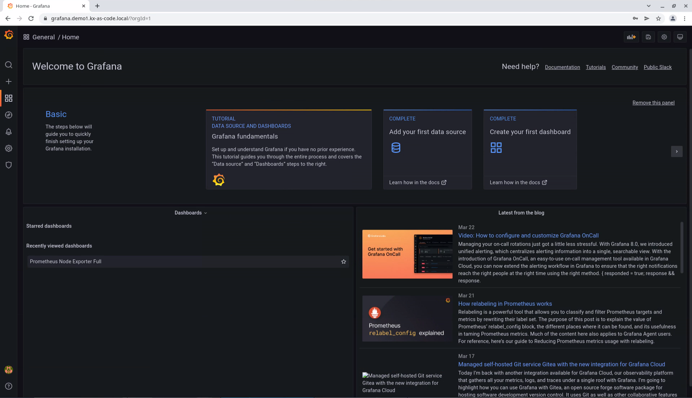
                    

                    

                        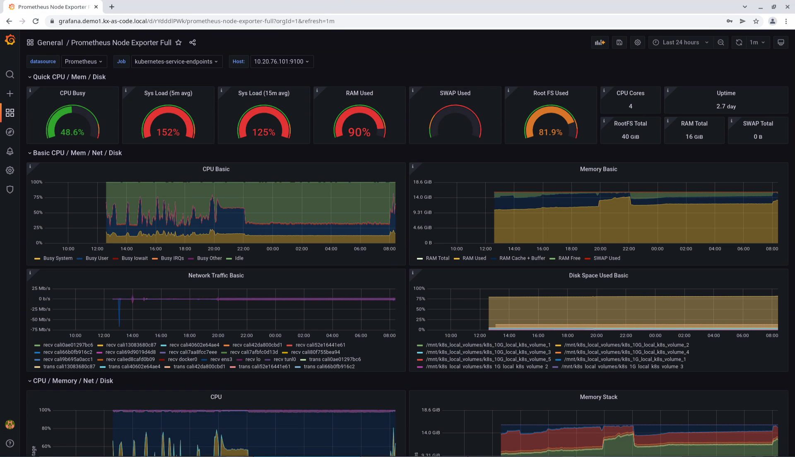
                    

                    

                        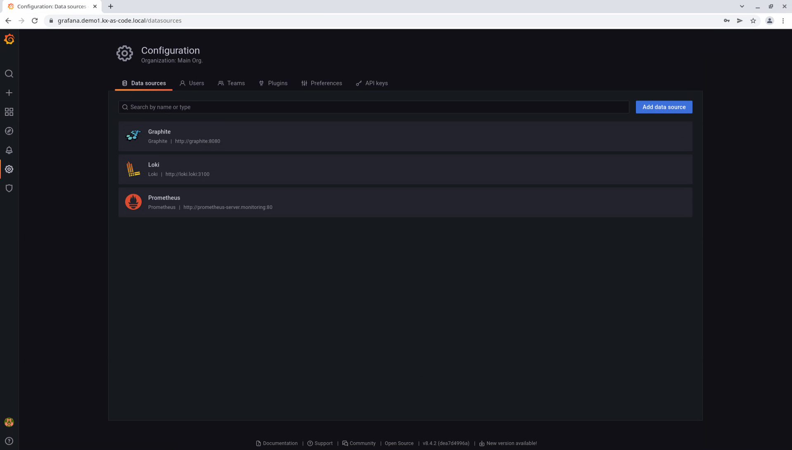
                    

                    

                        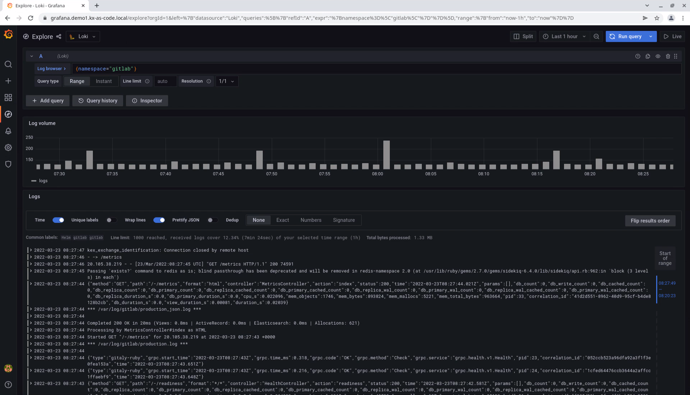
                    

                    <a class="prev" onclick="plusSlides(-1,'grafana')">&#10094;</a>
                    <a class="next" onclick="plusSlides(1,'grafana')">&#10095;</a>
                

                

                    
                    
                    
                    
                

            

        

    

### Grafana-loki
<a href="https://github.com/Accenture/kx.as.code/tree/main/auto-setup/monitoring/loki" target="_blank">Installation Files</a> | <a href="https://grafana.com/docs/loki/latest/" target="_blank">Application Documentation</a> | <a href="https://github.com/grafana/loki" target="_blank">Application Source Code</a>

<q><i>
Loki is a horizontally scalable, highly available, multi-tenant log aggregation system inspired by Prometheus. It is designed to be very cost effective and easy to operate. It does not index the contents of the logs, but rather a set of labels for each log stream.
</i></q> - grafana.com/oss/loki/

    

        

            

            
Monitoring

            

                

                    

                        
                    

                    <a class="prev" onclick="plusSlides(-1,'grafana-loki')">&#10094;</a>
                    <a class="next" onclick="plusSlides(1,'grafana-loki')">&#10095;</a>
                

                

                    
                

            

        

    

### Graphite
<a href="https://github.com/Accenture/kx.as.code/tree/main/auto-setup/monitoring/graphite" target="_blank">Installation Files</a> | <a href="https://graphite.readthedocs.io/en/latest/" target="_blank">Application Documentation</a> | <a href="https://github.com/graphite-project/graphite-web" target="_blank">Application Source Code</a>

<q><i>
Graphite is an enterprise-ready monitoring tool that runs equally well on cheap hardware or Cloud infrastructure. Teams use Graphite to track the performance of their websites, applications, business services, and networked servers. It marked the start of a new generation of monitoring tools, making it easier than ever to store, retrieve, share, and visualize time-series data.
</i></q> - graphiteapp.org

    

        

            

            
Monitoring

            

                

                    

                        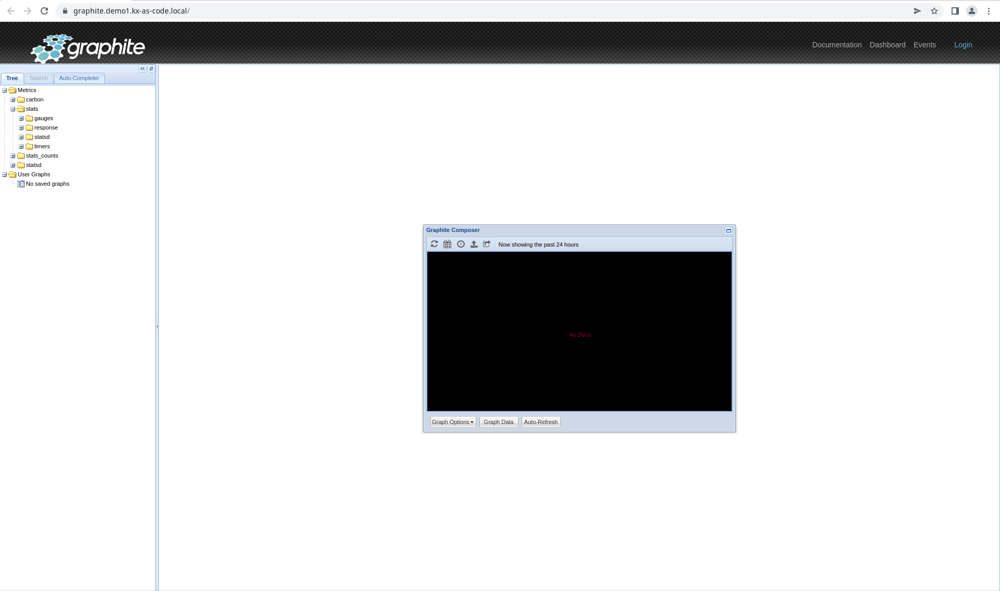
                    

                    <a class="prev" onclick="plusSlides(-1,'graphite')">&#10094;</a>
                    <a class="next" onclick="plusSlides(1,'graphite')">&#10095;</a>
                

                

                    
                

            

        

    

### Influxdata Influxdb2
<a href="https://github.com/Accenture/kx.as.code/tree/main/auto-setup/monitoring/influxdata-influxdb2" target="_blank">Installation Files</a> | <a href="https://docs.influxdata.com/influxdb/v2.3/" target="_blank">Application Documentation</a> | <a href="https://github.com/influxdata/influxdb" target="_blank">Application Source Code</a>

<q><i>
InfluxDB is an open-source time series database developed by the company InfluxData. It is written in the Go programming language for storage and retrieval of time series data in fields such as operations monitoring, application metrics, Internet of Things sensor data, and real-time analytics.
</i></q> 
- Wikipedia

    

        

            

            
Monitoring

            

                

                    

                        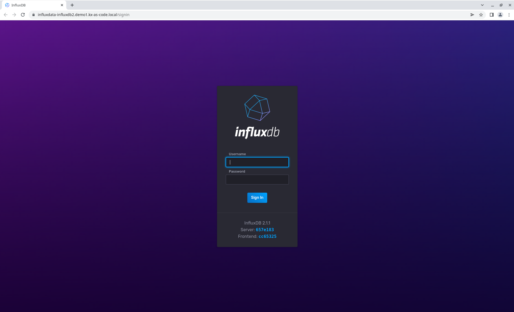
                    

                    

                        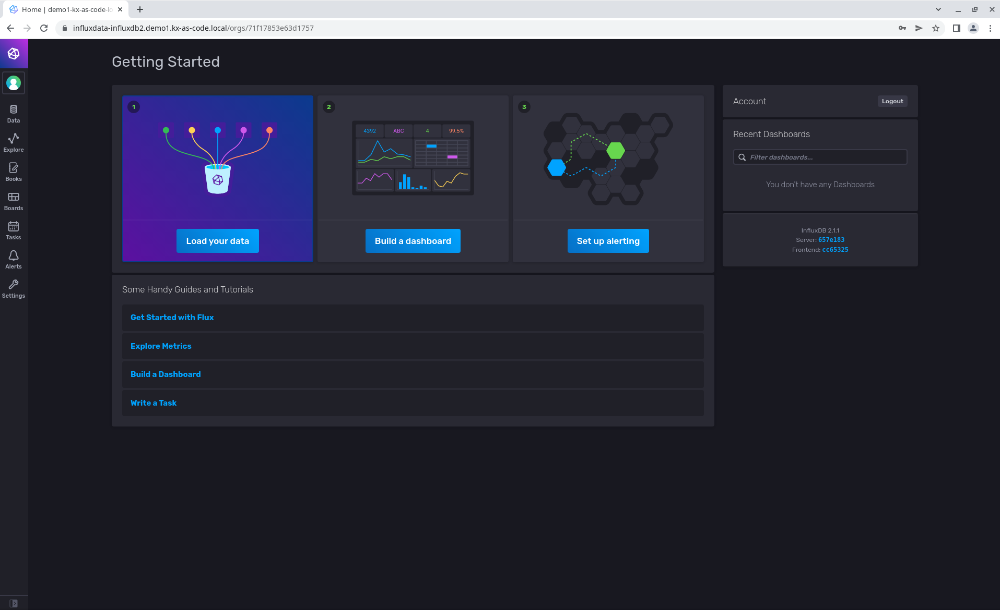
                    

                    

                        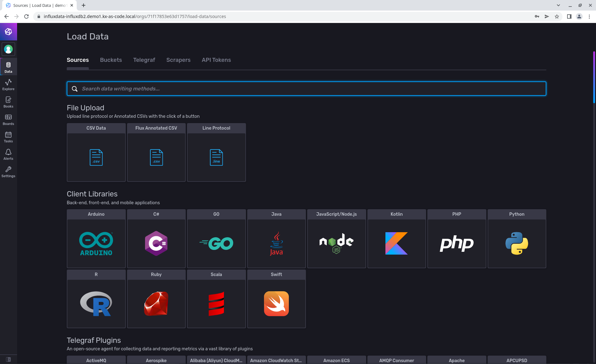
                    

                    

                        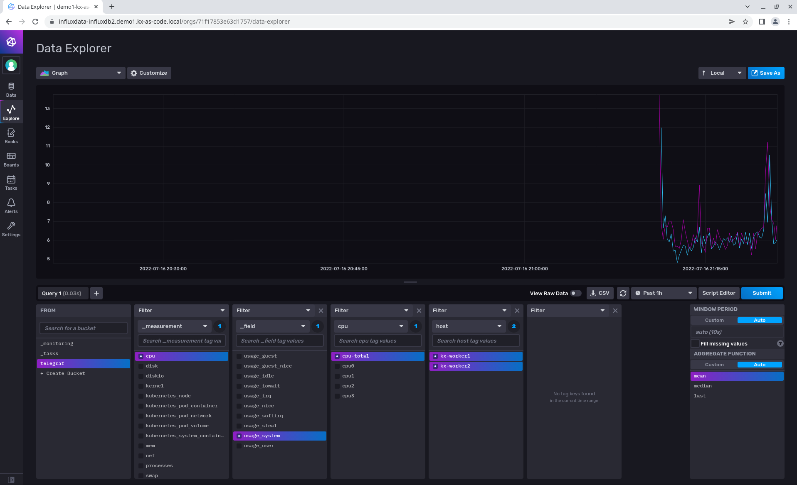
                    

                    

                        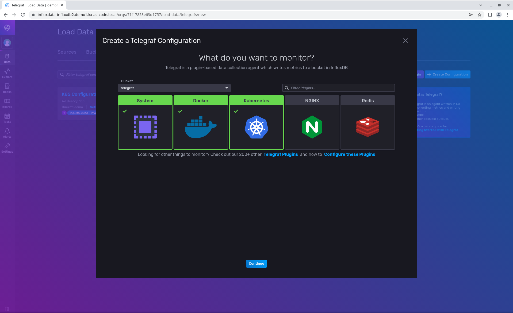
                    

                    

                        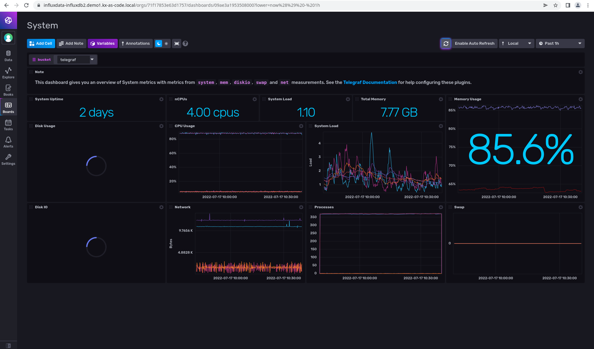
                    

                    

                        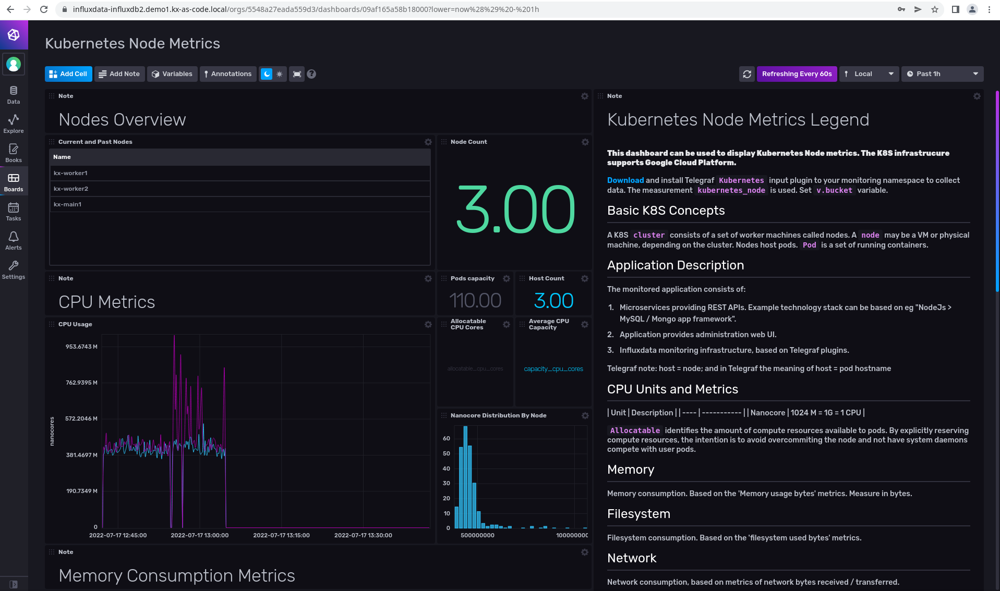
                    

                    

                        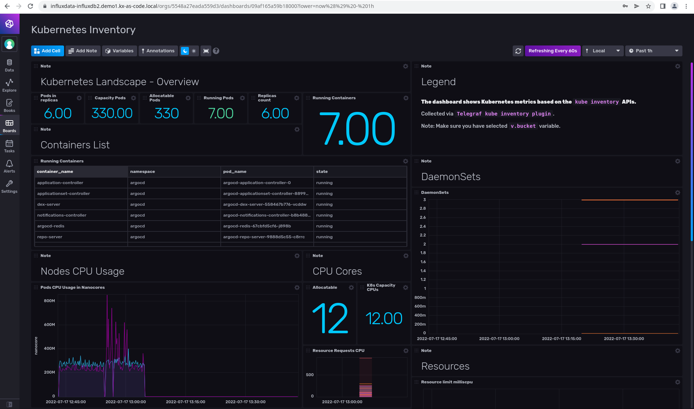
                    

                    <a class="prev" onclick="plusSlides(-1,'influxdb2')">&#10094;</a>
                    <a class="next" onclick="plusSlides(1,'influxdb2')">&#10095;</a>
                

                

                    
                    
                    
                    
                    
                    
                    
                    
                

            

        

    

### Influxdata Telegraf
<a href="https://github.com/Accenture/kx.as.code/tree/main/auto-setup/monitoring/influxdata-telegraf" target="_blank">Installation Files</a> | <a href="https://docs.influxdata.com/telegraf/v1.23/" target="_blank">Application Documentation</a> | <a href="https://github.com/influxdata/telegraf" target="_blank">Application Source Code</a>

<q><i>
Telegraf is a server-based agent for collecting and sending all metrics and events from databases, systems, and IoT sensors. Written in Go, it compiles into a single binary with no external dependencies, and requires a minimal memory footprint.
</i></q> - influxdata.com/time-series-platform/telegraf/

    

        

            

            
Monitoring

            

                

                    

                        
                    

                    <a class="prev" onclick="plusSlides(-1,'telegraf')">&#10094;</a>
                    <a class="next" onclick="plusSlides(1,'telegraf')">&#10095;</a>
                

                

                    
                

            

        

    

### Influxdata Telegraf-ds
<a href="https://github.com/Accenture/kx.as.code/tree/main/auto-setup/monitoring/influxdata-telegraf-ds" target="_blank">Installation Files</a> | <a href="https://docs.influxdata.com/telegraf/v1.23/" target="_blank">Application Documentation</a> | <a href="https://github.com/influxdata/telegraf" target="_blank">Application Source Code</a>

<q><i>
Telegraf is a server-based agent for collecting and sending all metrics and events from databases, systems, and IoT sensors. Written in Go, it compiles into a single binary with no external dependencies, and requires a minimal memory footprint.
</i></q> - influxdata.com/time-series-platform/telegraf/

    

        

            

            
Monitoring

            

                

                    

                        
                    

                    

                        
                    

                    <a class="prev" onclick="plusSlides(-1,'telegraf-ds')">&#10094;</a>
                    <a class="next" onclick="plusSlides(1,'telegraf-ds')">&#10095;</a>
                

                

                    
                    
                

            

        

    

### Prometheus
<a href="https://github.com/Accenture/kx.as.code/tree/main/auto-setup/monitoring/prometheus" target="_blank">Installation Files</a> | <a href="https://prometheus.io/docs/introduction/overview/" target="_blank">Application Documentation</a> | <a href="https://github.com/prometheus/prometheus" target="_blank">Application Source Code</a>

<q><i>
Prometheus collects and stores its metrics as time series data, i.e. metrics information is stored with the timestamp at which it was recorded, alongside optional key-value pairs called labels.
</i></q> - prometheus.io

    

        

            

            
Monitoring

            

                

                    

                        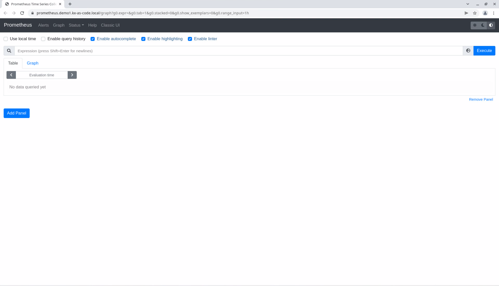
                    

                    

                        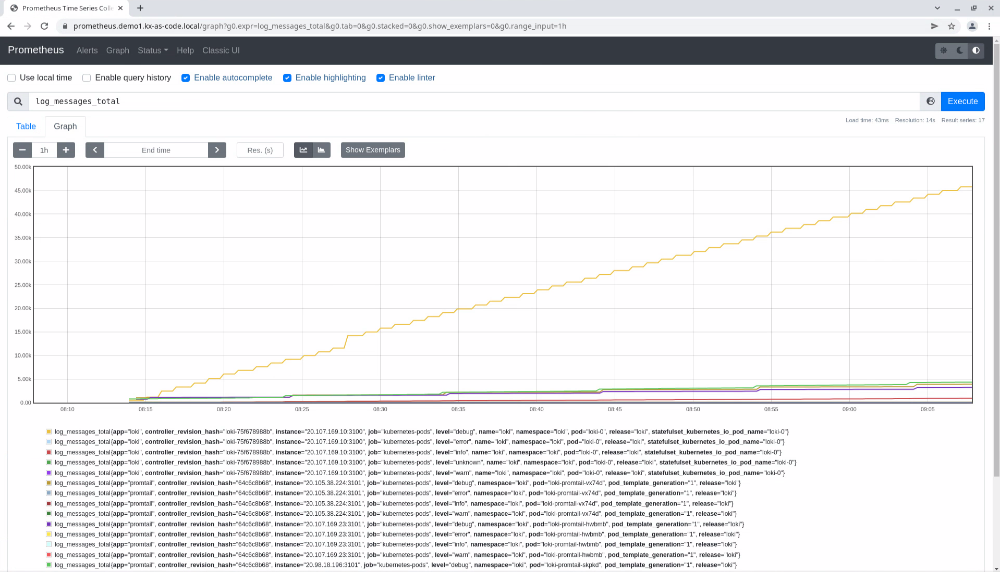
                    

                    <a class="prev" onclick="plusSlides(-1,'prometheus')">&#10094;</a>
                    <a class="next" onclick="plusSlides(1,'prometheus')">&#10095;</a>
                

                

                    
                    
                

            

        

    

## Security
### Neuvector
<a href="https://github.com/Accenture/kx.as.code/tree/main/auto-setup/security/neuvector" target="_blank">Installation Files</a> | <a href="https://open-docs.neuvector.com/" target="_blank">Application Documentation</a> | <a href="https://github.com/neuvector/neuvector" target="_blank">Application Source Code</a>

<q><i>
NeuVector delivers Full Lifecycle Container Security with the only cloud-native, Kubernetes security platform providing end-to-end vulnerability management, automated CI/CD pipeline security, and complete run-time security including the industry’s only container firewall to protect your infrastructure from zero days and insider threats.
</i></q> - neuvector.com/products/container-security/

    

        

            

            
Security

            

                

                    

                        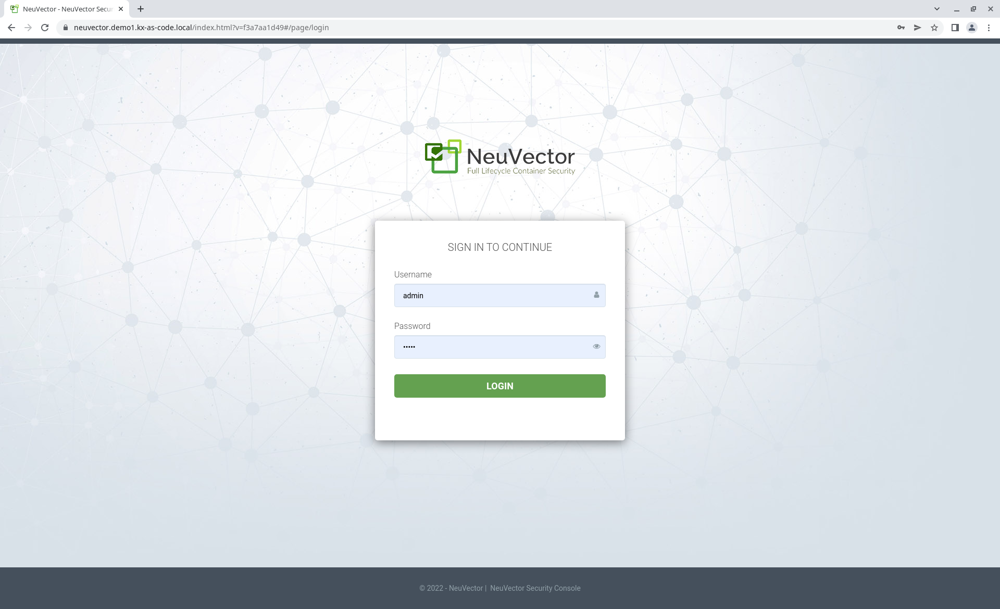
                    

                    

                        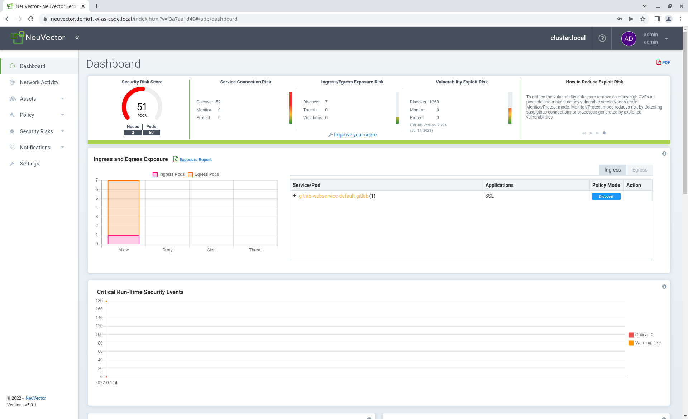
                    

                    

                        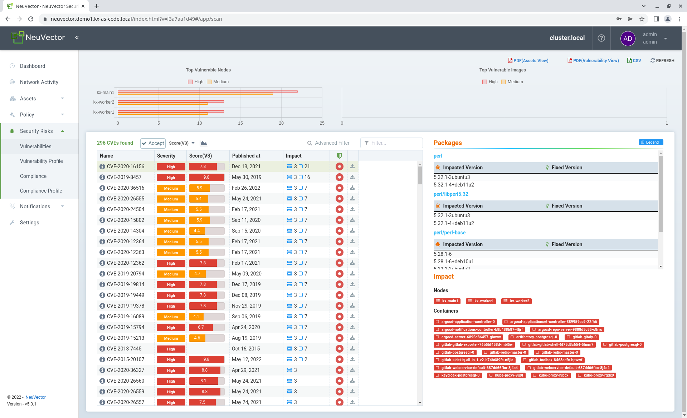
                    

                    

                        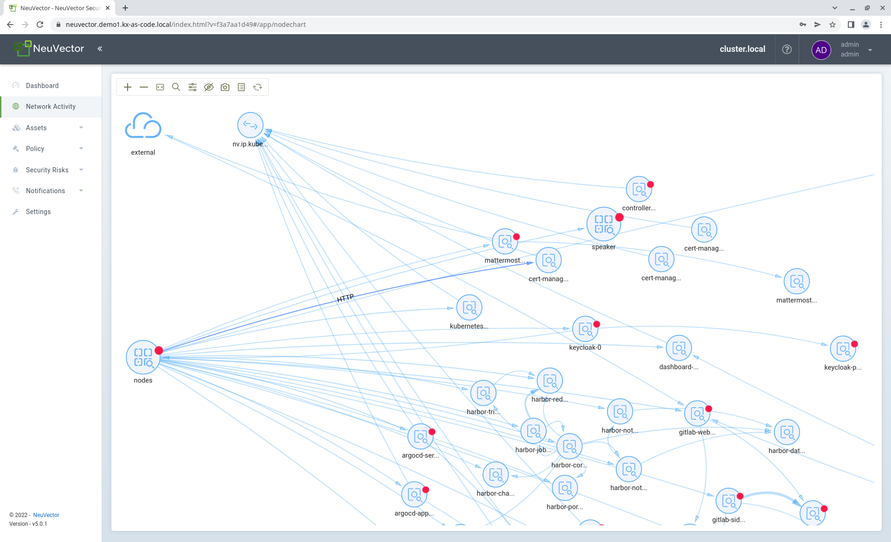
                    

                    

                        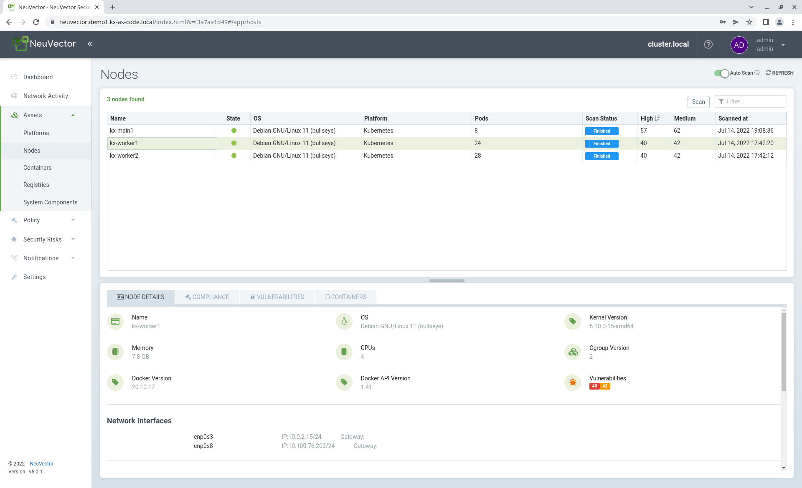
                    

                    

                        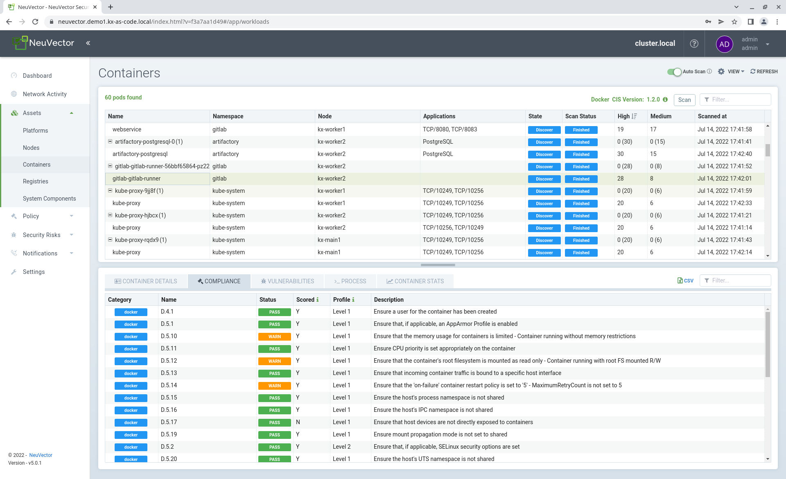
                    

                    

                        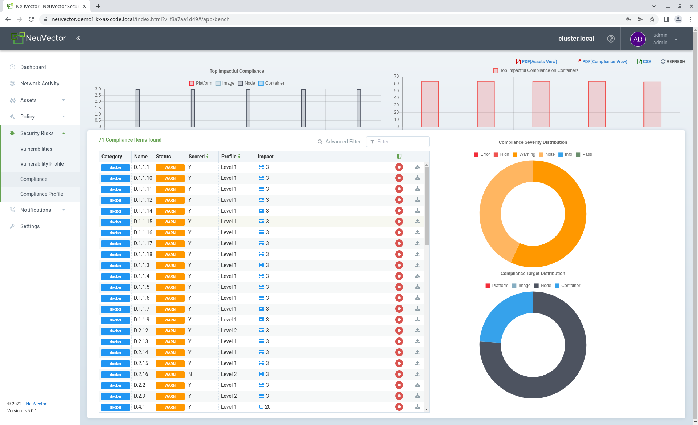
                    

                    <a class="prev" onclick="plusSlides(-1,'neuvector')">&#10094;</a>
                    <a class="next" onclick="plusSlides(1,'neuvector')">&#10095;</a>
                

                

                    
                    
                    
                    
                    
                    
                    
                

            

        

    

### Sysdig-falco
<a href="https://github.com/Accenture/kx.as.code/tree/main/auto-setup/security/sysdig-falco" target="_blank">Installation Files</a> | <a href="https://falco.org/docs/" target="_blank">Application Documentation</a> | <a href="https://github.com/falcosecurity/falco" target="_blank">Application Source Code</a>

<q><i>
Falco is the open source standard tool for continuous risk and threat detection across Kubernetes, containers and cloud. Falco acts as your security camera, continuously detecting unexpected behavior, configuration changes, intrusions, and data theft in real time.
</i></q> - sysdig.com/opensource/falco/

    

        

            

            
Security

            

                

                    

                        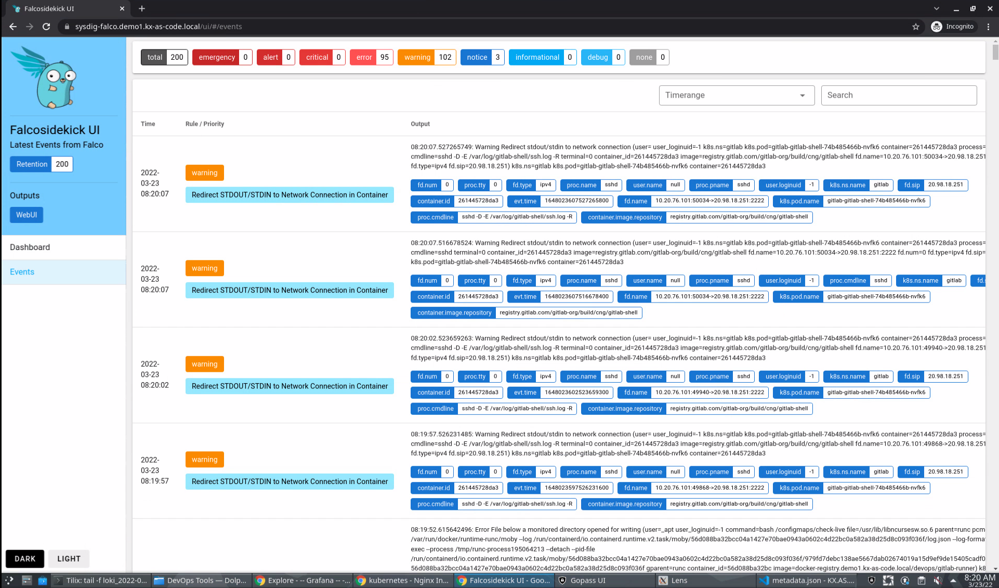
                    

                    

                        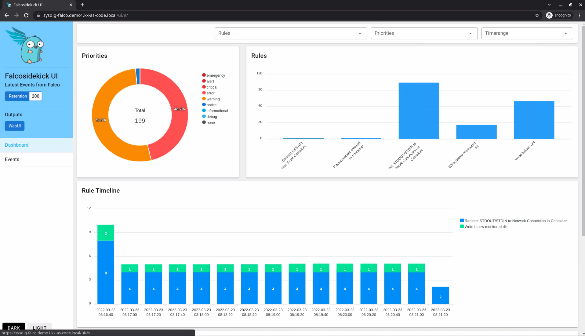
                    

                    <a class="prev" onclick="plusSlides(-1,'sysdig-falco')">&#10094;</a>
                    <a class="next" onclick="plusSlides(1,'sysdig-falco')">&#10095;</a>
                

                

                    
                    
                

            

        

    

### Vault
<a href="https://github.com/Accenture/kx.as.code/tree/main/auto-setup/security/vault" target="_blank">Installation Files</a> | <a href="https://www.vaultproject.io/docs" target="_blank">Application Documentation</a> | <a href="https://github.com/hashicorp/vault" target="_blank">Application Source Code</a>

<q><i>
Secure, store and tightly control access to tokens, passwords, certificates, encryption keys for protecting secrets and other sensitive data using a UI, CLI, or HTTP API.
</i></q> - vaultproject.io

    

        

            

            
Security

            

                

                    

                        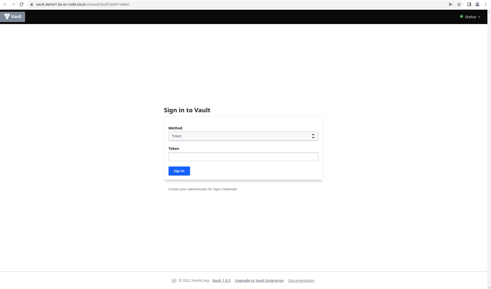
                    

                    

                        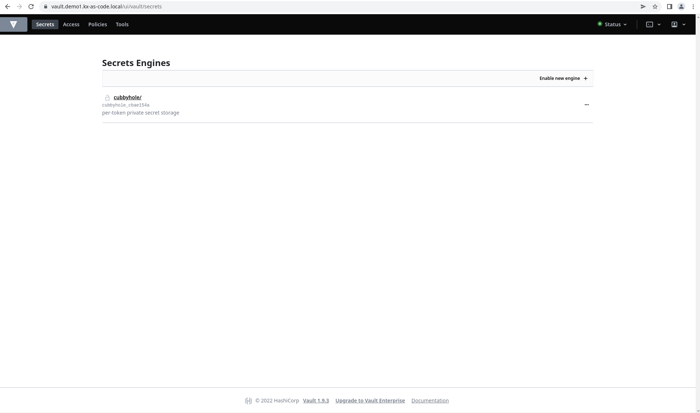
                    

                    

                        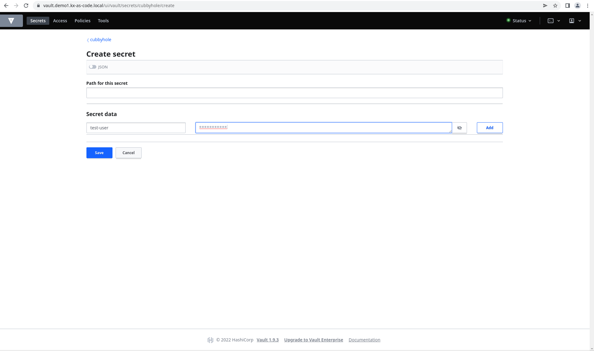
                    

                    <a class="prev" onclick="plusSlides(-1,'vault')">&#10094;</a>
                    <a class="next" onclick="plusSlides(1,'vault')">&#10095;</a>
                

                

                    
                    
                    
                

            

        

    

## Collaboration
### Mattermost
<a href="https://github.com/Accenture/kx.as.code/tree/main/auto-setup/collaboration/mattermost" target="_blank">Installation Files</a> | <a href="https://docs.mattermost.com/" target="_blank">Application Documentation</a> | <a href="https://github.com/mattermost/mattermost-server" target="_blank">Application Source Code</a>

<q><i>
Mattermost is an open source platform for secure collaboration across the entire software development lifecycle.
</i></q> - github.com/mattermost/mattermost-server

    

        

            

            
CICD

            

                

                    

                        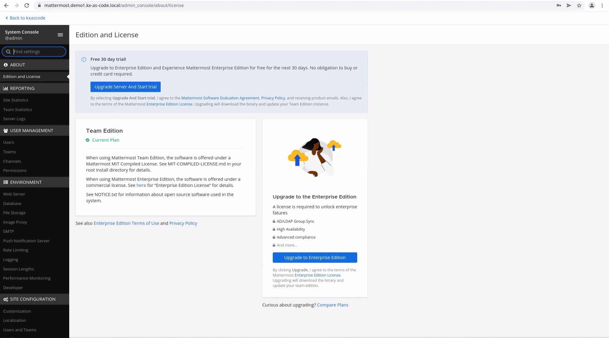
                    

                    

                        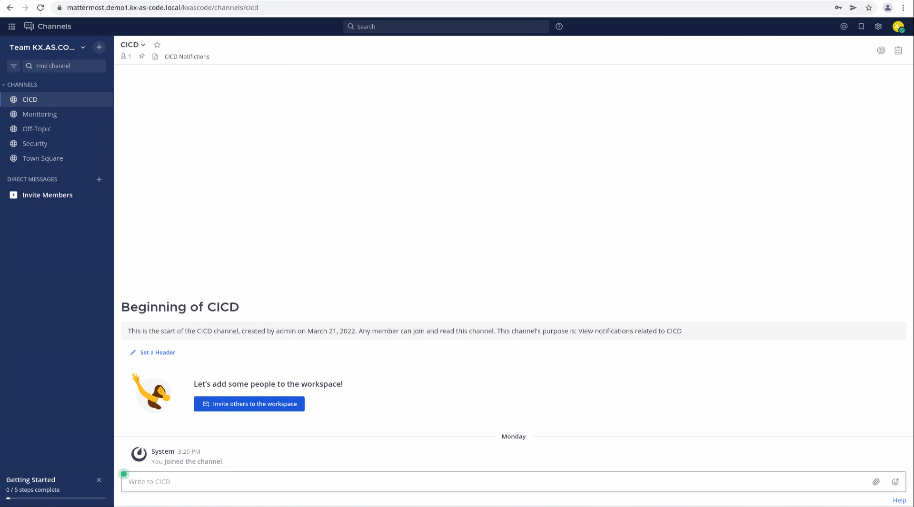
                    

                    <a class="prev" onclick="plusSlides(-1,'mattermost')">&#10094;</a>
                    <a class="next" onclick="plusSlides(1,'mattermost')">&#10095;</a>
                

                

                    
                    
                

            

        

    

### RocketChat
<a href="https://github.com/Accenture/kx.as.code/tree/main/auto-setup/collaboration/rocketchat" target="_blank">Installation Files</a> | <a href="https://docs.rocket.chat/" target="_blank">Application Documentation</a> | <a href="https://github.com/RocketChat/Rocket.Chat" target="_blank">Application Source Code</a>

<q><i>
Rocket.Chat is an open-source fully customizable communications platform developed in JavaScript for organizations with high standards of data protection.
</i></q> - Elastic

    

        

            

            
Collaboration

            

                

                    

                        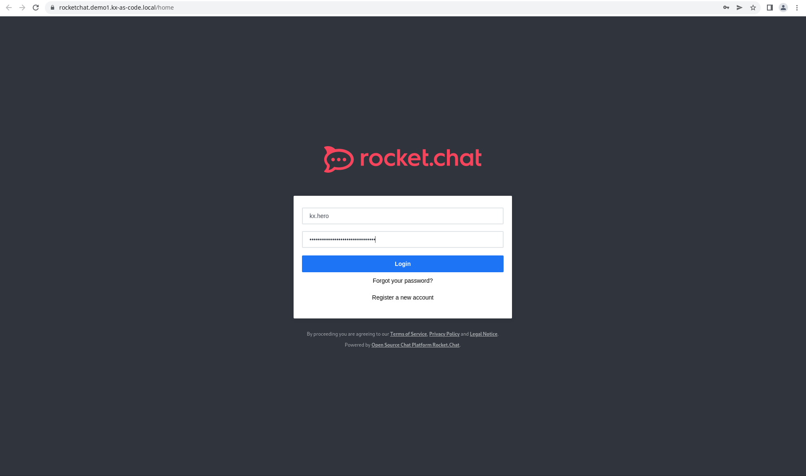
                    

                    

                        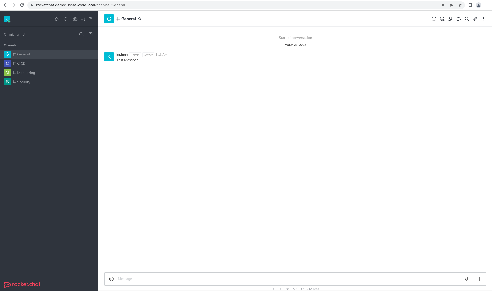
                    

                    <a class="prev" onclick="plusSlides(-1,'rocketchat')">&#10094;</a>
                    <a class="next" onclick="plusSlides(1,'rocketchat')">&#10095;</a>
                

                

                    
                    
                

            

        

    

## Cloud Storage
### Minio-S3
<a href="https://github.com/Accenture/kx.as.code/tree/main/auto-setup/storage/minio-operator" target="_blank">Installation Files</a> | <a href="https://docs.min.io/minio/baremetal/reference/minio-server/minio-server.html" target="_blank">Application Documentation</a> | <a href="https://github.com/minio/minio" target="_blank">Application Source Code</a>

<q><i>MinIO offers high-performance, S3 compatible object storage. Native to Kubernetes, MinIO is the only object storage suite available on every public cloud, every Kubernetes distribution, the private cloud and the edge. MinIO is software-defined and is 100% open source under GNU AGPL v3.
</i></q> - min.io

    

        

            

            
Storage

            

                

                    

                        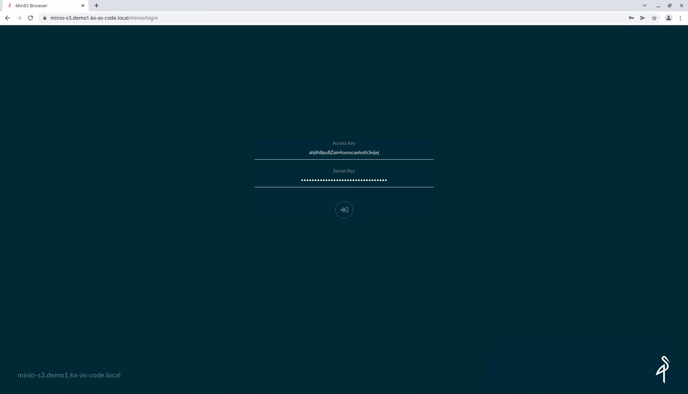
                    

                    

                        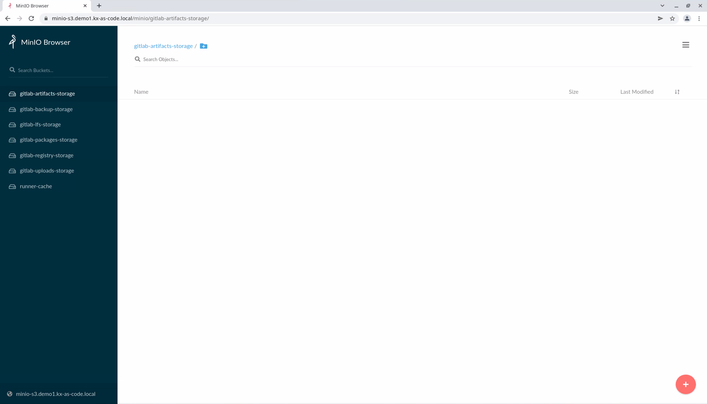
                    

                    <a class="prev" onclick="plusSlides(-1,'minio-s3')">&#10094;</a>
                    <a class="next" onclick="plusSlides(1,'minio-s3')">&#10095;</a>
                

                

                    
                    
                

            

        

    

### Nextcloud
<a href="https://github.com/Accenture/kx.as.code/tree/main/auto-setup/storage/nextcloud" target="_blank">Installation Files</a> | <a href="https://nextcloud.com/support/" target="_blank">Application Documentation</a> | <a href="https://github.com/nextcloud/server" target="_blank">Application Source Code</a>

<q><i>
Nextcloud is a suite of client-server software for creating and using file hosting services. It is enterprise-ready with comprehensive support options. Being free and open-source software, anyone is allowed to install and operate it on their own private server devices.
</i></q> - Wikipedia

    

        

            

            
Storage

            

                

                    

                        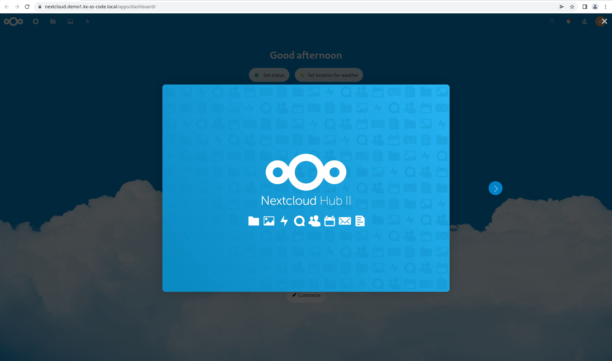
                    

                    

                        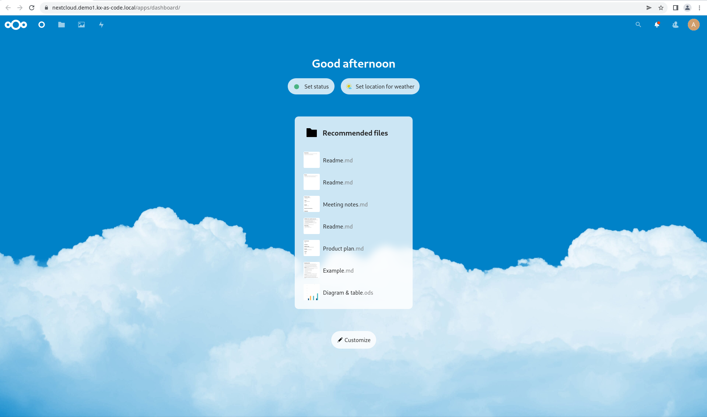
                    

                    

                        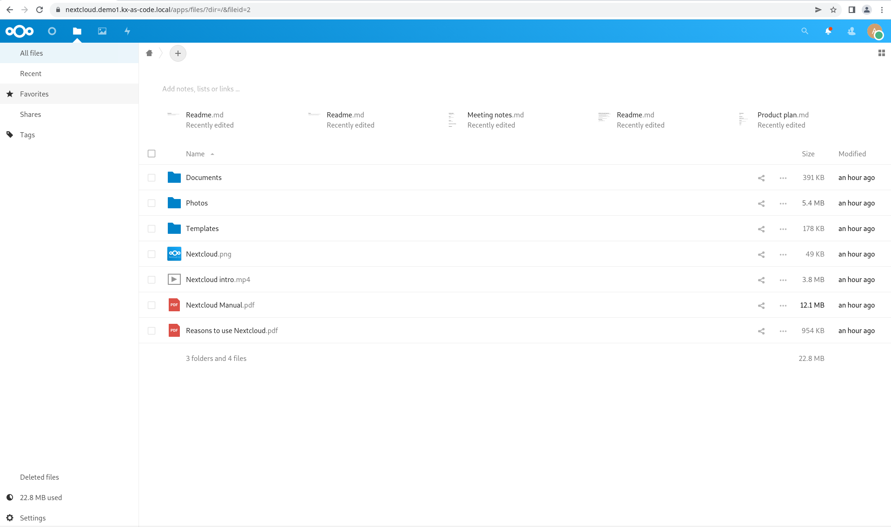
                    

                    

                        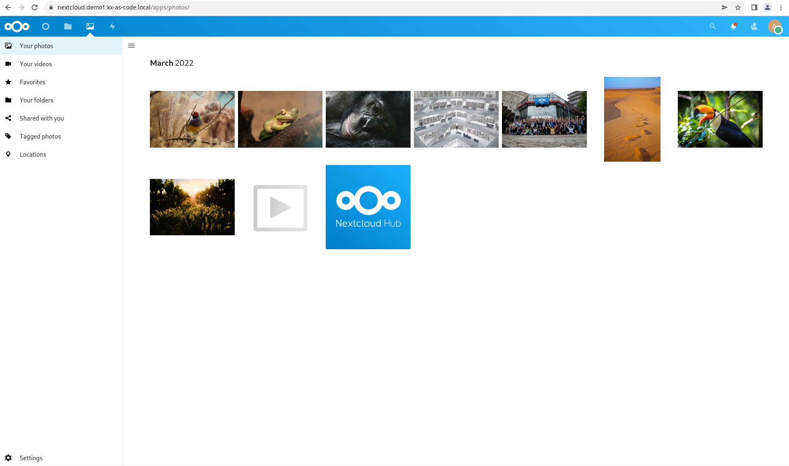
                    

                    <a class="prev" onclick="plusSlides(-1,'nextcloud')">&#10094;</a>
                    <a class="next" onclick="plusSlides(1,'nextcloud')">&#10095;</a>
                

                

                    
                    
                    
                    
                

            

        

    

## Quality Assurance
### Selenium4
<a href="https://github.com/Accenture/kx.as.code/tree/main/auto-setup/quality_assurance/selenium4" target="_blank">Installation Files</a> | <a href="https://www.selenium.dev/documentation/" target="_blank">Application Documentation</a> | <a href="https://github.com/SeleniumHQ/selenium" target="_blank">Application Source Code</a>

<q><i>
Selenium Grid allows the execution of WebDriver scripts on remote machines (virtual or real) by routing commands sent by the client to remote browser instances. It aims to provide an easy way to run tests in parallel on multiple machines.
</i></q> - elenium.dev/documentation/grid/

    

        

            

            
Monitoring

            

                

                    

                        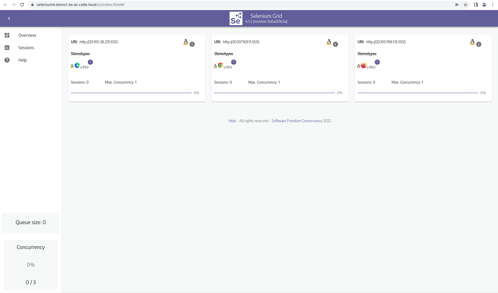
                    

                    <a class="prev" onclick="plusSlides(-1,'selenium4')">&#10094;</a>
                    <a class="next" onclick="plusSlides(1,'selenium4')">&#10095;</a>
                

                

                    
                

            

        

    

### Sonarqube
<a href="https://github.com/Accenture/kx.as.code/tree/main/auto-setup/quality_assurance/sonarqube" target="_blank">Installation Files</a> | <a href="https://docs.sonarqube.org/latest/" target="_blank">Application Documentation</a> | <a href="https://github.com/SonarSource/sonarqube" target="_blank">Application Source Code</a>

<q><i>
SonarQube (formerly Sonar) is an open-source platform developed by SonarSource for continuous inspection of code quality to perform automatic reviews with static analysis of code to detect bugs, code smells on 17 programming languages. SonarQube offers reports on duplicated code, coding standards, unit tests, code coverage, code complexity, comments, bugs, and security recommendations.
</i></q> - en.wikipedia.org/wiki/SonarQube

    

        

            

            
Quality Assurance

            

                

                    

                        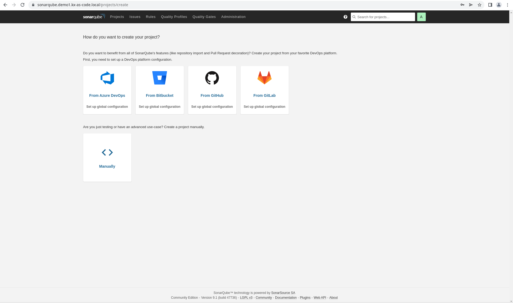
                    

                    

                        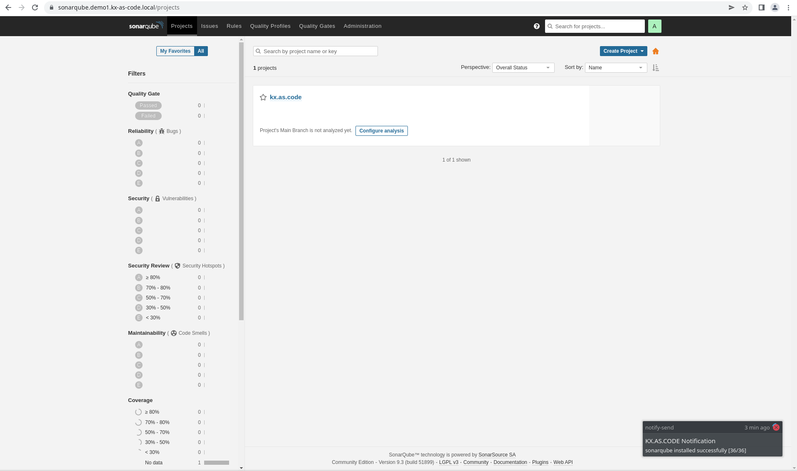
                    

                    

                        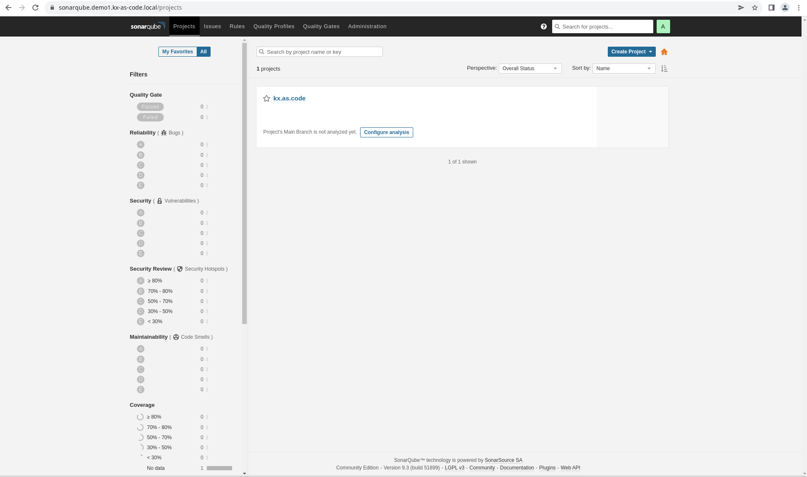
                    

                    <a class="prev" onclick="plusSlides(-1,'sonarqube')">&#10094;</a>
                    <a class="next" onclick="plusSlides(1,'sonarqube')">&#10095;</a>
                

                

                    
                    
                    
                

            

        

    

