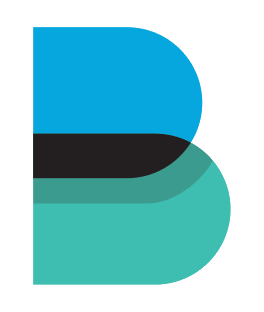
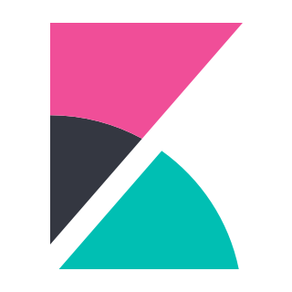

All the tools below are installable either from the [Jenkins based launcher](/Quick-Start-Guide/), the KX-Portal, or via the [command line](/Deployment/Manual-Provisioning/).

## CICD

### ArgoCD

<q><i>Argo CD is a declarative, GitOps continuous delivery tool for Kubernetes.</i></q> - ArgoCD

    

        

            

            
GitOps

            

                

                    

                        
                    

                    

                        
                    

                    

                        
                    

                    <a class="prev" onclick="plusSlides(-1,'argocd')">&#10094;</a>
                    <a class="next" onclick="plusSlides(1,'argocd')">&#10095;</a>
                

                

                    
                    
                    
                

            

        

    

### Artifactory

<q><i>Artifactory is a free and open user interface that lets you visualize your Elasticsearch data and navigate the Elastic Stack. Do anything from tracking query load to understanding the way requests flow through your apps.</i></q> - Elastic

    

        

            

            
CICD

            

                

                    

                        
                    

                    

                        
                    

                    

                        
                    

                    

                        
                    

                    

                        
                    

                    

                        
                    

                    <a class="prev" onclick="plusSlides(-1,'artifactory')">&#10094;</a>
                    <a class="next" onclick="plusSlides(1,'artifactory')">&#10095;</a>
                

                

                    
                    
                    
                    
                    
                    
                

            

        

    

### Consul

<q><i>Consul is a free and open user interface that lets you visualize your Elasticsearch data and navigate the Elastic Stack. Do anything from tracking query load to understanding the way requests flow through your apps.</i></q> - Elastic

    

        

            

            
CICD

            

                

                    

                        
                    

                    

                        
                    

                    <a class="prev" onclick="plusSlides(-1,'consul')">&#10094;</a>
                    <a class="next" onclick="plusSlides(1,'consul')">&#10095;</a>
                

                

                    
                    
                

            

        

    

### Gitea

<q><i>Gitea is a community managed lightweight code hosting solution written in Go. It is published under the MIT license.
</i></q> - Gitea

    

        

            

            
CICD

            

                

                    

                        
                    

                    

                        
                    

                    

                        
                    

                    <a class="prev" onclick="plusSlides(-1,'gitea')">&#10094;</a>
                    <a class="next" onclick="plusSlides(1,'gitea')">&#10095;</a>
                

                

                    
                    
                    
                

            

        

    

### Gitlab

<q><i>GitLab's application offers functionality to collaboratively plan, build, secure, and deploy software as a complete DevOps Platform. GitLab is scalable and can be hosted on-premises or on cloud storage. It also includes a wiki, issue-tracking, IDE, and CI/CD pipeline features.</i></q> - Wikipedia

    

        

            

            
CICD

            

                

                    

                        
                    

                    

                        
                    

                    

                        
                    

                    <a class="prev" onclick="plusSlides(-1,'gitlab')">&#10094;</a>
                    <a class="next" onclick="plusSlides(1,'gitlab')">&#10095;</a>
                

                

                    
                    
                    
                

            

        

    

### Harbor

<q><i>Harbor is a free and open user interface that lets you visualize your Elasticsearch data and navigate the Elastic Stack. Do anything from tracking query load to understanding the way requests flow through your apps.</i></q> - Elastic

    

        

            

            
CICD

            

                

                    

                        
                    

                    <a class="prev" onclick="plusSlides(-1,'harbor')">&#10094;</a>
                    <a class="next" onclick="plusSlides(1,'harbor')">&#10095;</a>
                

                

                    
                

            

        

    

### Jenkins

<q><i>Jenkins is a free and open user interface that lets you visualize your Elasticsearch data and navigate the Elastic Stack. Do anything from tracking query load to understanding the way requests flow through your apps.</i></q> - Elastic

    

        

            

            
CICD

            

                

                    

                        
                    

                    

                        
                    

                    <a class="prev" onclick="plusSlides(-1,'jenkins')">&#10094;</a>
                    <a class="next" onclick="plusSlides(1,'jenkins')">&#10095;</a>
                

                

                    
                    
                

            

        

    

### Nexus3

<q><i>Nexus3 is a free and open user interface that lets you visualize your Elasticsearch data and navigate the Elastic Stack. Do anything from tracking query load to understanding the way requests flow through your apps.</i></q> - Elastic

    

        

            

            
CICD

            

                

                    

                        
                    

                    

                        
                    

                    

                        
                    

                    

                        
                    

                    <a class="prev" onclick="plusSlides(-1,'nexus3')">&#10094;</a>
                    <a class="next" onclick="plusSlides(1,'nexus3')">&#10095;</a>
                

                

                    
                    
                    
                    
                

            

        

    

### Teamcity

<q><i>Teamcity is a free and open user interface that lets you visualize your Elasticsearch data and navigate the Elastic Stack. Do anything from tracking query load to understanding the way requests flow through your apps.</i></q> - Elastic

    

        

            

            
CICD

            

                

                    

                        
                    

                    

                        
                    

                    

                        
                    

                    <a class="prev" onclick="plusSlides(-1,'teamcity')">&#10094;</a>
                    <a class="next" onclick="plusSlides(1,'teamcity')">&#10095;</a>
                

                

                    
                    
                    
                

            

        

    

## Monitoring

### Elastic ElasticSearch

<q><i>Elasticsearch is a distributed, RESTful search and analytics engine capable of addressing a growing number of use cases. As the heart of the Elastic Stack, it centrally stores your data for lightning fast search, fine‑tuned relevancy, and powerful analytics that scale with ease.</i></q> - Elastic

    

        

            

            
Monitoring

            

                

                    

                        
                    

                    

                        
                    

                    

                        
                    

                    

                        
                    

                    <a class="prev" onclick="plusSlides(-1,'elasticsearch')">&#10094;</a>
                    <a class="next" onclick="plusSlides(1,'elasticsearch')">&#10095;</a>
                

                

                    
                    
                    
                    
                

            

        

    

### FileBeat

<q><i>Lightweight shipper for logs. Filebeat is part of the Elastic Stack, meaning it works seamlessly with Logstash, Elasticsearch, and Kibana. Whether you want to transform or enrich your logs and files with Logstash, fiddle with some analytics in Elasticsearch, or build and share dashboards in Kibana, Filebeat makes it easy to ship your data to where it matters most.</i></q> - Elastic

    

        

            

            
Monitoring

            

                

                    

                        
                    

                    

                        
                    

                    

                        
                    

                    <a class="prev" onclick="plusSlides(-1,'filebeat')">&#10094;</a>
                    <a class="next" onclick="plusSlides(1,'filebeat')">&#10095;</a>
                

                

                    
                    
                    
                

            

        

    

### Elastic Heartbeat

<q><i>Lightweight shipper for logs. Heartbeat is part of the Elastic Stack, meaning it works seamlessly with Logstash, Elasticsearch, and Kibana. Whether you want to transform or enrich your logs and files with Logstash, fiddle with some analytics in Elasticsearch, or build and share dashboards in Kibana, Heartbeat makes it easy to ship your data to where it matters most.</i></q> - Elastic

    

        

            

            
Monitoring

            

                

                    

                        
                    

                    

                        
                    

                    <a class="prev" onclick="plusSlides(-1,'heartbeat')">&#10094;</a>
                    <a class="next" onclick="plusSlides(1,'heartbeat')">&#10095;</a>
                

                

                    
                    
                

            

        

    

### Elastic Kibana

<q><i>Kibana is a free and open user interface that lets you visualize your Elasticsearch data and navigate the Elastic Stack. Do anything from tracking query load to understanding the way requests flow through your apps.</i></q> - Elastic

    

        

            

            
Monitoring

            

                

                    

                        
                    

                    

                        
                    

                    

                        
                    

                    

                        
                    

                    <a class="prev" onclick="plusSlides(-1,'kibana')">&#10094;</a>
                    <a class="next" onclick="plusSlides(1,'kibana')">&#10095;</a>
                

                

                    
                    
                    
                    
                

            

        

    

### Elastic Metricbeat

<q><i>Metricbeat is a free and open user interface that lets you visualize your Elasticsearch data and navigate the Elastic Stack. Do anything from tracking query load to understanding the way requests flow through your apps.</i></q> - Elastic

    

        

            

            
Monitoring

            

                

                    

                        
                    

                    <a class="prev" onclick="plusSlides(-1,'metricbeat')">&#10094;</a>
                    <a class="next" onclick="plusSlides(1,'metricbeat')">&#10095;</a>
                

                

                    
                

            

        

    

### Elastic Packetbeat

<q><i>Lightweight shipper for logs. Packetbeat is part of the Elastic Stack, meaning it works seamlessly with Logstash, Elasticsearch, and Kibana. Whether you want to transform or enrich your logs and files with Logstash, fiddle with some analytics in Elasticsearch, or build and share dashboards in Kibana, Packetbeat makes it easy to ship your data to where it matters most.</i></q> - Elastic

    

        

            

            
Monitoring

            

                

                    

                        
                    

                    <a class="prev" onclick="plusSlides(-1,'packetbeat')">&#10094;</a>
                    <a class="next" onclick="plusSlides(1,'packetbeat')">&#10095;</a>
                

                

                    
                

            

        

    

### Grafana

<q><i>Grafana is a free and open user interface that lets you visualize your Elasticsearch data and navigate the Elastic Stack. Do anything from tracking query load to understanding the way requests flow through your apps.</i></q> - Elastic

    

        

            

            
Monitoring

            

                

                    

                        
                    

                    

                        
                    

                    

                        
                    

                    

                        
                    

                    <a class="prev" onclick="plusSlides(-1,'grafana')">&#10094;</a>
                    <a class="next" onclick="plusSlides(1,'grafana')">&#10095;</a>
                

                

                    
                    
                    
                    
                

            

        

    

### Grafana-loki

<q><i>Grafana-loki is a free and open user interface that lets you visualize your Elasticsearch data and navigate the Elastic Stack. Do anything from tracking query load to understanding the way requests flow through your apps.</i></q> - Elastic

    

        

            

            
Monitoring

            

                

                    

                        
                    

                    <a class="prev" onclick="plusSlides(-1,'grafana-loki')">&#10094;</a>
                    <a class="next" onclick="plusSlides(1,'grafana-loki')">&#10095;</a>
                

                

                    
                

            

        

    

### Graphite

<q><i>Graphite is a free and open user interface that lets you visualize your Elasticsearch data and navigate the Elastic Stack. Do anything from tracking query load to understanding the way requests flow through your apps.</i></q> - Elastic

    

        

            

            
Monitoring

            

                

                    

                        
                    

                    <a class="prev" onclick="plusSlides(-1,'graphite')">&#10094;</a>
                    <a class="next" onclick="plusSlides(1,'graphite')">&#10095;</a>
                

                

                    
                

            

        

    

### Prometheus

<q><i>Prometheus is a free and open user interface that lets you visualize your Elasticsearch data and navigate the Elastic Stack. Do anything from tracking query load to understanding the way requests flow through your apps.</i></q> - Elastic

    

        

            

            
Monitoring

            

                

                    

                        
                    

                    

                        
                    

                    <a class="prev" onclick="plusSlides(-1,'prometheus')">&#10094;</a>
                    <a class="next" onclick="plusSlides(1,'prometheus')">&#10095;</a>
                

                

                    
                    
                

            

        

    

## Security
### Neuvector

<q><i>Neuvector is a free and open user interface that lets you visualize your Elasticsearch data and navigate the Elastic Stack. Do anything from tracking query load to understanding the way requests flow through your apps.</i></q> - Elastic

    

        

            

            
Security

            

                

                    

                        
                    

                    

                        
                    

                    

                        
                    

                    

                        
                    

                    

                        
                    

                    

                        
                    

                    

                        
                    

                    <a class="prev" onclick="plusSlides(-1,'neuvector')">&#10094;</a>
                    <a class="next" onclick="plusSlides(1,'neuvector')">&#10095;</a>
                

                

                    
                    
                    
                    
                    
                    
                    
                

            

        

    

### Sysdig-falco

<q><i>Sysdig-falco is a free and open user interface that lets you visualize your Elasticsearch data and navigate the Elastic Stack. Do anything from tracking query load to understanding the way requests flow through your apps.</i></q> - Elastic

    

        

            

            
Security

            

                

                    

                        
                    

                    

                        
                    

                    <a class="prev" onclick="plusSlides(-1,'sysdig-falco')">&#10094;</a>
                    <a class="next" onclick="plusSlides(1,'sysdig-falco')">&#10095;</a>
                

                

                    
                    
                

            

        

    

### Vault

<q><i>Vault is a free and open user interface that lets you visualize your Elasticsearch data and navigate the Elastic Stack. Do anything from tracking query load to understanding the way requests flow through your apps.</i></q> - Elastic

    

        

            

            
Security

            

                

                    

                        
                    

                    

                        
                    

                    

                        
                    

                    <a class="prev" onclick="plusSlides(-1,'vault')">&#10094;</a>
                    <a class="next" onclick="plusSlides(1,'vault')">&#10095;</a>
                

                

                    
                    
                    
                

            

        

    

## Collaboration
### Mattermost

<q><i>Mattermost is a free and open user interface that lets you visualize your Elasticsearch data and navigate the Elastic Stack. Do anything from tracking query load to understanding the way requests flow through your apps.</i></q> - Elastic

    

        

            

            
CICD

            

                

                    

                        
                    

                    

                        
                    

                    <a class="prev" onclick="plusSlides(-1,'mattermost')">&#10094;</a>
                    <a class="next" onclick="plusSlides(1,'mattermost')">&#10095;</a>
                

                

                    
                    
                

            

        

    

### RocketChat

<q><i>RocketChat is a free and open user interface that lets you visualize your Elasticsearch data and navigate the Elastic Stack. Do anything from tracking query load to understanding the way requests flow through your apps.</i></q> - Elastic

    

        

            

            
Collaboration

            

                

                    

                        
                    

                    

                        
                    

                    <a class="prev" onclick="plusSlides(-1,'rocketchat')">&#10094;</a>
                    <a class="next" onclick="plusSlides(1,'rocketchat')">&#10095;</a>
                

                

                    
                    
                

            

        

    

## Cloud Storage
### Minio-s3

<q><i>Minio-s3 is a free and open user interface that lets you visualize your Elasticsearch data and navigate the Elastic Stack. Do anything from tracking query load to understanding the way requests flow through your apps.</i></q> - Elastic

    

        

            

            
Storage

            

                

                    

                        
                    

                    

                        
                    

                    <a class="prev" onclick="plusSlides(-1,'minio-s3')">&#10094;</a>
                    <a class="next" onclick="plusSlides(1,'minio-s3')">&#10095;</a>
                

                

                    
                    
                

            

        

    

### Nextcloud

<q><i>Nextcloud is a free and open user interface that lets you visualize your Elasticsearch data and navigate the Elastic Stack. Do anything from tracking query load to understanding the way requests flow through your apps.</i></q> - Elastic

    

        

            

            
Storage

            

                

                    

                        
                    

                    

                        
                    

                    

                        
                    

                    

                        
                    

                    <a class="prev" onclick="plusSlides(-1,'nextcloud')">&#10094;</a>
                    <a class="next" onclick="plusSlides(1,'nextcloud')">&#10095;</a>
                

                

                    
                    
                    
                    
                

            

        

    

## Quality Assurance
### Selenium4

<q><i>Selenium4 is a free and open user interface that lets you visualize your Elasticsearch data and navigate the Elastic Stack. Do anything from tracking query load to understanding the way requests flow through your apps.</i></q> - Elastic

    

        

            

            
Monitoring

            

                

                    

                        
                    

                    <a class="prev" onclick="plusSlides(-1,'selenium4')">&#10094;</a>
                    <a class="next" onclick="plusSlides(1,'selenium4')">&#10095;</a>
                

                

                    
                

            

        

    

### Sonarqube

<q><i>Sonarqube is a free and open user interface that lets you visualize your Elasticsearch data and navigate the Elastic Stack. Do anything from tracking query load to understanding the way requests flow through your apps.</i></q> - Elastic

    

        

            

            
Quality Assurance

            

                

                    

                        
                    

                    

                        
                    

                    

                        
                    

                    <a class="prev" onclick="plusSlides(-1,'sonarqube')">&#10094;</a>
                    <a class="next" onclick="plusSlides(1,'sonarqube')">&#10095;</a>
                

                

                    
                    
                    
                

            

        

    

