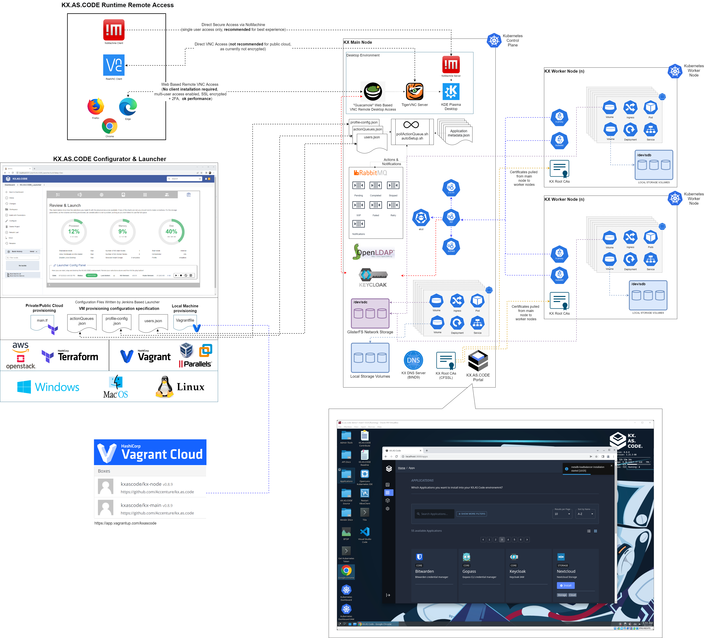

# Architecture

Below is a high level depiction of the KX.AS.CODE architecture.

### Changelog

- AWS and OpenStack enablement was completed
- DNSMASQ was switched to Bind9 for DNS replication
- XFCE desktop was changed to KDE Plasma
- Kubernetes was upgraded to v1.24, so Docker is not part of the runtime anymore
- A new skipped queue was added to RabbitMQ, to allow overall processing to continue, if a non-critical component fails to install successfully

### Diagram

{:target="_blank"}
