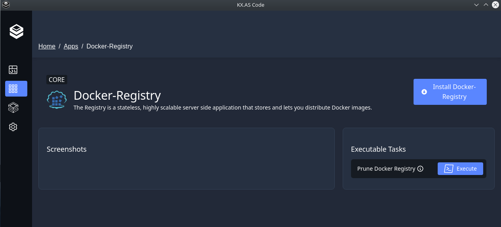

# Task Executions

With release [v0.8.11](https://github.com/Accenture/kx.as.code/releases/tag/v0.8.11){:target="_blank"} came the ability to execute `tasks`.
The purpose of tasks is to provide the user or administrator a means of executing repetitive tasks, such as clearing a web server's cache, or re-compiling/re-deploying custom code, and so on.

Here is an example metadata.json for defining `tasks`.

```json hl_lines="72-87"
{
  "name": "hipster-shop",
  "namespace": "shop-example",
  "installation_type": "script",
  "installation_group_folder": "examples",
  "installation_input_arguments": [
    {
      "argumentKey": "branch",
      "argumentDefaultValue": "main",
      "fieldType": "alphaNumeric",
      "mandatory": false
    },
    {
      "argumentKey": "replicas",
      "argumentDefaultValue": 1,
      "minValue": 1,
      "maxValue": 10,
      "fieldType": "numeric",
      "mandatory": false
    }
  ],
  "environment_variables": {
    "branch": ""
  },
  "categories": [
    "content",
    "hipster",
    "shop",
    "frontend",
    "micro-services"
  ],
  "urls": [
    {
      "url": "https://{{componentName}}.{{baseDomain}}/",
      "healthchecks": {
        "liveliness": {
          "http_path": "/",
          "http_auth_required": false,
          "expected_http_response_code": "200",
          "expected_http_response_string": "",
          "expected_json_response": {
            "json_path": "",
            "json_value": ""
          },
          "health_shell_check_command": "",
          "expected_shell_check_command_response": ""
        },
        "readiness": {
          "http_path": "/",
          "http_auth_required": false,
          "expected_http_response_code": "200",
          "expected_http_response_string": "",
          "expected_json_response": {
            "json_path": "",
            "json_value": ""
          },
          "health_shell_check_command": "",
          "expected_shell_check_command_response": ""
        }
      }
    }
  ],
  "retry": "true",
  "Description": "Google&apos;s Hipster Shop micro-services example",
  "shortcut_text": "Hipster Shop",
  "shortcut_icon": "hipster-shop.png",
  "pre_install_scripts": [],
  "install_scripts": [
    "deployHipsterShop.sh"
  ],
  "post_install_scripts": [],
  "available_tasks": [
    {
      "name": "restartFrontend",
      "title": "Restart frontend",
      "description": "Restart the frontend microservice",
      "script": "restartFrontend.sh",
      "inputs": [
        {
          "branch": {
            "default": "develop",
            "mandatory": false
          }
        }
      ]
    }
  ]
}
```

A shell script must be defined for each executable task and placed in a component's `availableTasks` folder.

[Here](https://github.com/Accenture/kx.as.code/tree/main/auto-setup/examples/hipster-shop){:target="_blank"} an example from the example shop component.

The tasks appear as follows in the KX-Portal and can be executed by clicking on the `Execute` button.


