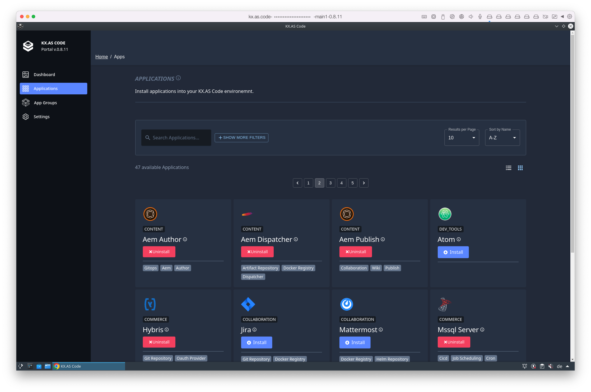
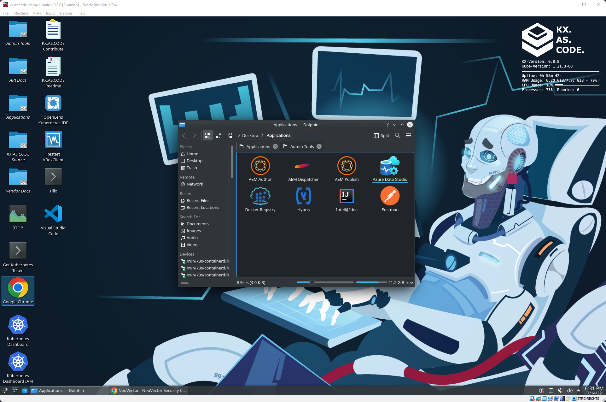
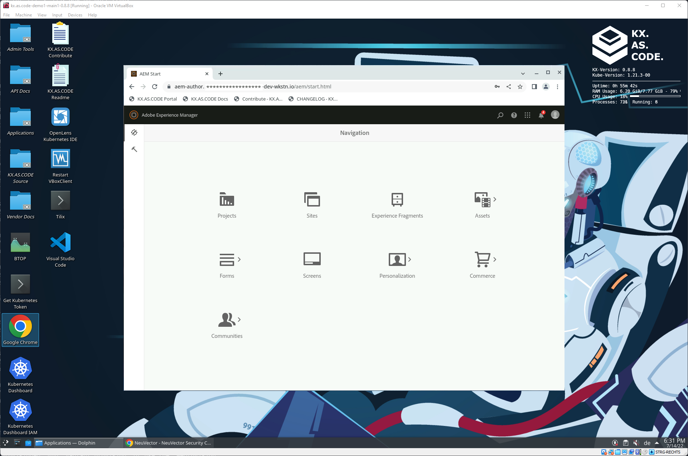
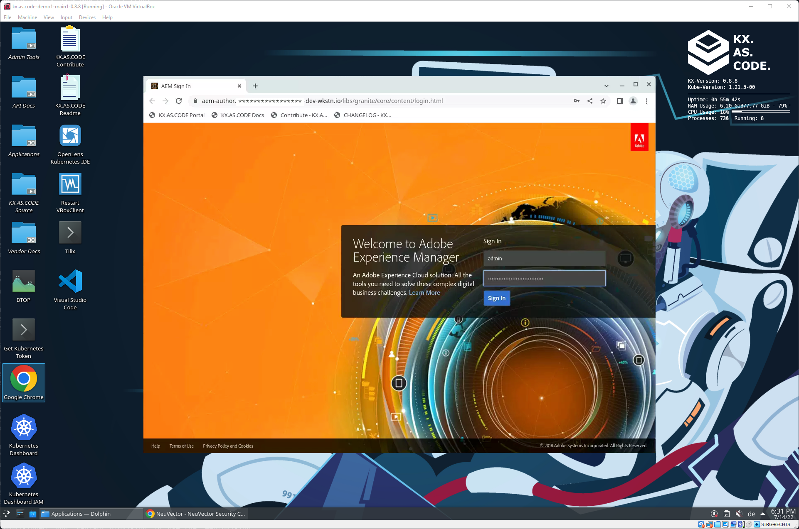
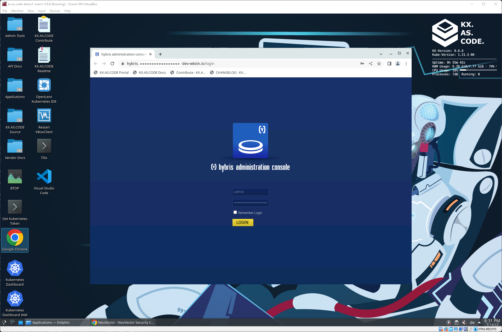
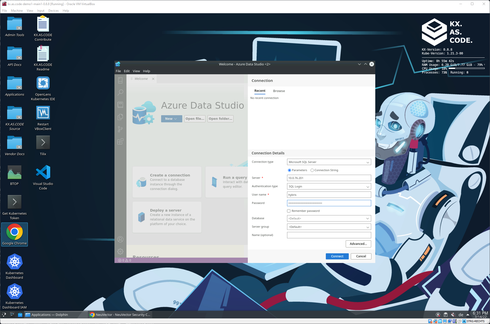

# Use Case Example

There are many use cases for KX.AS.CODE, as outlined on the docs entry page. Here an example of a use case we currently have deployed at a major enterprise.

### Use Case

The idea was to enable two things.

1. Enable developers and testers to validate changes end to end before merging feature branches to long running branches, by giving them a full environment that they can start locally on their laptop
2. Enable the provisioning of on-demand environments on AWS for nightly extended regression tests for specific feature branches, again, with the aim to prove quality before merging the feature to the long running branches

The customization for the enterprise user added the following components:

### Server Side Components

- Microsoft SQL Server 2019 (for SAP Hybris backend database)
- SAP Hybris
- Adobe AEM Author, Publish and Dispatcher

The server side components are not available in the public version of KX.AS.CODE.

### Developer Tools

- Azure Data Studio
- Postman
- IntelliJ IDEA

