# Quick Start Guide

The easiest way to configure and start KX.AS.CODE is via the Jenkins based configurator.

That said, editing the JSON directly is also not so difficult, but comes without the additional help and validations.

As this is a quick start guide, we will concentrate on the Jenkins approach here, and cover the manual start-up and more advanced options in another guide.

!!! info 
    PRE-REQUISITES: Although most things are checked automatically by various validation, you should have 2 things in place before launching KX.AS.CODE.
    - VirtualBox - https://www.virtualbox.org/wiki/Downloads
    - Vagrant - https://www.vagrantup.com/downloads

!!! note 
    For your convenience, pre-built KX.AS.CODE images have been uploaded to the Vagrant Cloud. You can find them under the following links:
    - KX-Main - https://app.vagrantup.com/kxascode/boxes/kx-main
    - KX-Node - https://app.vagrantup.com/kxascode/boxes/kx-node
    
    There is no need to download the boxes manually. Vagrant will take care of that automatically when starting KX.AS.CODE.

First you need to clone the KX.AS.CODE GitHub repository:

```
git clone https://github.com/Accenture/kx.as.code.git
```

Once cloned, change into the `kx.as.code` directory and navigate to the following path:
`base-vm/build/jenkins`

Before launching anything, create a copy of the `jenkins.env_template` file in the same directory, calling it `jenkins.env`.
Optionally, edit this file and amend as required the lines at the top - if for example, you already have something running on port 8080, you might want to change the default port here.
```
jenkins_listen_address = "127.0.0.1"  ## Set to localhost for security reasons
jenkins_server_port = "8081"
```

!!! info
    If you are also intending to build KX.AS.CODE images, and not just launch existing public ones in the Vagrant Cloud, then you may need to add your GitHub.com credentials, if the repository is private. As the main KX.AS.CODE repository is public, this is not needed and the properties can be left blank.
    ```
    git_source_username = "change-me"
    git_source_password = "change-me"
    ```

Everything else in the file goes beyond the Quick Start guide, and will be described on other pages.

!!! note
    Once the jenkins.env is ready, execute the launch script in order to start the Jenkins KX-Launcher job:
    ```
    # Mac/Linux
    ./launchLocalBuildEnvironment.sh
    ```
    ```
    # Windows
    .\launchLocalBuildEnvironment.ps1
    ```

!!! danger "MacOSX incompatibilities"
    MacOSX contains old packages for `screen` and `openssl`, compared to Linux and Windows. Please upgrade these packages. The easiest way to do this is with [Homebrew](https://brew.sh/){:target="\_blank"}."
    ```
    # Upgrade incompatible packages on MacOSX
    brew install openssl screen
    ```

Once you receive the confirmation that Jenkins is up, you will receive the URL for accessing the launcher. Open it in your browser of choice.
!!! info
    The URL will look something like this:
    `http://localhost:8081/job/KX.AS.CODE_Launcher/build?delay=0sec`
    Port and IP may be different depending on changes you made in `jenkins.env`.

On first load of Jenkins, you will see KX.AS.CODE configuration panel. The tabs are all described below.

!!! warning 
    Do not click the tabs in the configuration panel too quickly. This can cause a display error, as jenkins is still processing. We will manage this better in future, but for now just try to wait a couple of seconds before switching to the next tab. If you do hit the display snag, just refresh the browser and all will be good again.

!!! note 
    You can ignore the Builder Config Panel at the bottom of the first tab, as the latest images are already available on the Vagrant Cloud and will be downloaded automatically.

When the configurator first loads, it will check all the system pre-requisites. If any of them show a warning, then you will need to fix those before attempting to launch KX.AS.CODE.

The configurator automatically selects the profile dependent on the pre-requisites it found on your system. If you have multiple virtualization solutions, you can choose another by selecting an alternative "Profile" from the drop down.

!!! warning
    Starting KX.AS.CODE with lower host system resources
    If you have less than 16GB RAM and less than 8 cores (16 threads/vCores) on your host, you should choose either the _Lite_ or _Minimal_ startup mode.
    
    | Start Up Mode | Normal | Lite | Minimal |
    | ---------------|----------------|----------------|----------------|
    | KX-Portal | :white_check_mark: | :white_check_mark: | :white_check_mark: |
    | GoPass Credential Manager | :white_check_mark: | :white_check_mark: | :white_check_mark: |
    | Certificate Authority | :white_check_mark: | :white_check_mark: | :white_check_mark: |
    | Kubernetes | :white_check_mark: | :white_check_mark: | :white_check_mark: |
    | Docker Registry | :white_check_mark: | :white_check_mark: | :white_check_mark: |
    | Calico Network | :white_check_mark: | :white_check_mark: | :white_check_mark: |
    | Local Storage Volumes | :white_check_mark: | :white_check_mark: | :white_check_mark: |
    | NGINX Ingress Controller | :white_check_mark: | :white_check_mark: | :white_check_mark: |
    | MetalLB Load Balancer | :white_check_mark: | :white_check_mark: | |
    | OpenLDAP Server | :white_check_mark: | :white_check_mark: | |
    | Keycloak SSO Server | :white_check_mark: | :white_check_mark: | |
    | Kubernetes Metrics Server | :white_check_mark: | :white_check_mark: | |
    | OpenLens Kubernetes IDE | :white_check_mark: | :white_check_mark: | |
    | Cert Manager | :white_check_mark: | | |
    | Kubernetes Dashboard| :white_check_mark: | | |
    | Network Storage Services | :white_check_mark: | | |
    | Remote Desktop Services | :white_check_mark: | | |
    | Multi-User Support| :white_check_mark: | | |

    To save even more resources, you can disable the linux desktop on the next tab. Whilst this is great for saving system resources, however, you will lose some of the experience with using KX.AS.CODE as a workstation.

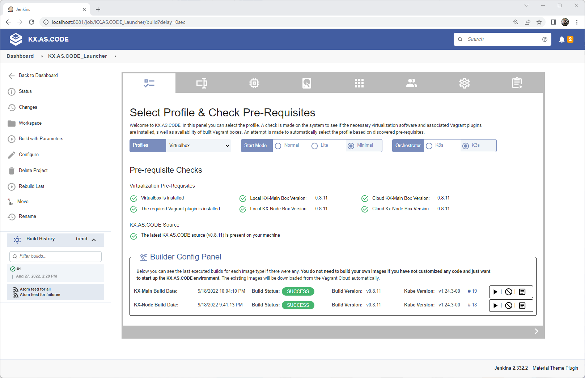{: .zoom}

On the next tab, you can setup some general parameters. These are all optional. If you don't change anything, then the default username and password will be "kx.hero" amd "L3arnandshare". The domain for all provisioned tools will be *.demo1.kx-as-code.local.

!!! info Additional Toggles
    - **Enable Standalone Mode** - this sets number of main nodes to 1 and worker nodes to 0, and disables no longer needed network storage. It also sets Allow Workloads On Kubernetes Master to true, otherwise it would not be possible to deploy anything.
    - **Allow Workloads on Kubernetes Master** - Must be set if starting KX.AS.CODE with just the main node and no worker nodes, else it will be impossible to deploy any workloads.
    - **Disable Linux Desktop** - Set this to boot the VM into the command prompt instead of the KDE Plasma GUI. This is useful is you are low on resources.

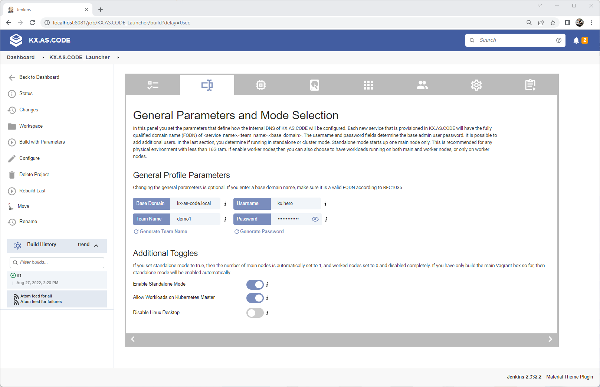{: .zoom}

The resource configuration tab allows you to select the host resources that you wish to allocate to the KX.AS.CODE virtual machine.

!!! warning 
    Do not over allocate. The performance worsens if your host is starved of resources. At a minimum, leave at least 4 threads and 6gb ram to your host, so for a host with 32GB RAM and an Octa processor, you should allocate maximum, 12 of the 16 threads, and 24GB of the 32GB RAM available.

    | Host | RAM Allocation | CPU vCores Allocation | 
    | ---------------|----------------|----------------|
    | 8GB RAM, 8 vCores | 4GB | 2 Cores |
    | 16GB RAM, 16 vCores | 10GB | 12 vCores |
    | 32GB RAM, 16 vCores | 24GB | 12 vCores |
    
    Although the idea was originally for KX.AS.CODE to also work on low spec 8GB RAM laptops, experience has shown that the experience is very poor on such a low spec'd' host.

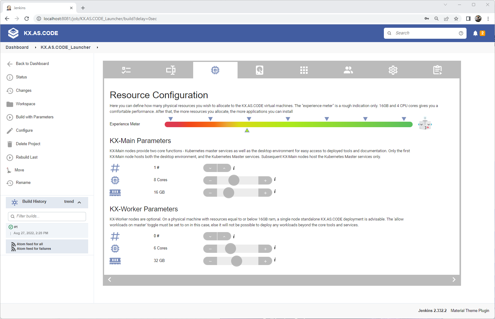{: .zoom}

On the storage tab you shouldn't need to change anything. The local volumes will be provisioned as logical volume mounts and then allocated to the Kubernetes local storage provisioner. They are accessible via the `local-storage-sc` storage class.
The network storage will only be provisioned in the "normal" startup mode.

If running in standalone, Lite or Minimal mode, the GlusterFS Network storage services will not be provisioned.

If the network service is provisioned, the storage can be allocated automatically in Kubernetes using the `gluster-heketi-sc` storage class in the persistent volume claim.

!!! tip 
    All storage is allocated thinly, so you can over allocate without issue, as long as you don't intend to actually use all the space. Over-allocating is useful, in order to give you more volumes of varying sizes to play with, when deploying Kubernetes workloads.

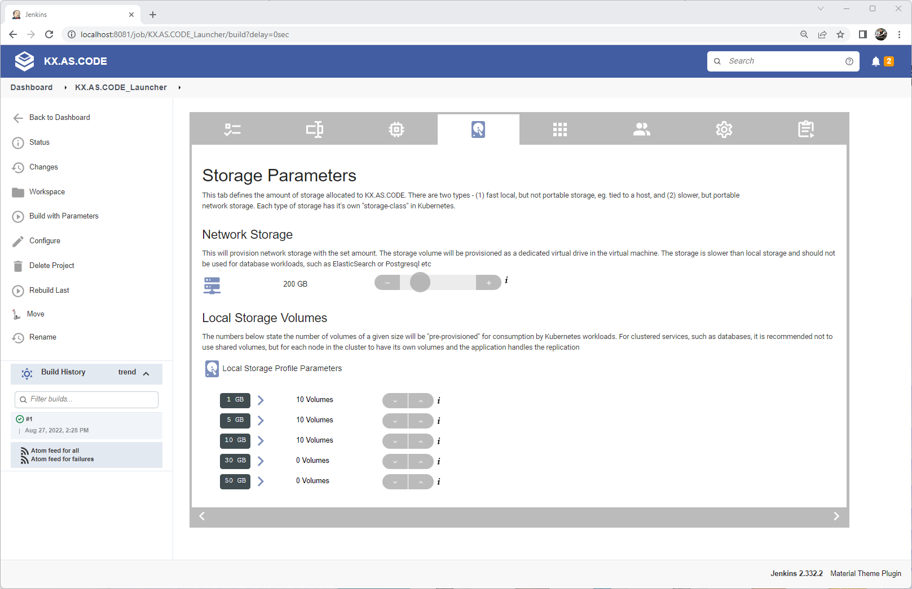{: .zoom}

In the template selector you can pre-define which applications should be installed automatically after the core services have been installed. You can select multiple application groups. Careful not to select too much, else your experience will suffer, and you will start getting bouncing pods as they are evicted due to lack of physical resources.
!!! note 
    Remember you can add and remove applications later once KX.AS.CODE is up. It is not necessary to select everything now.

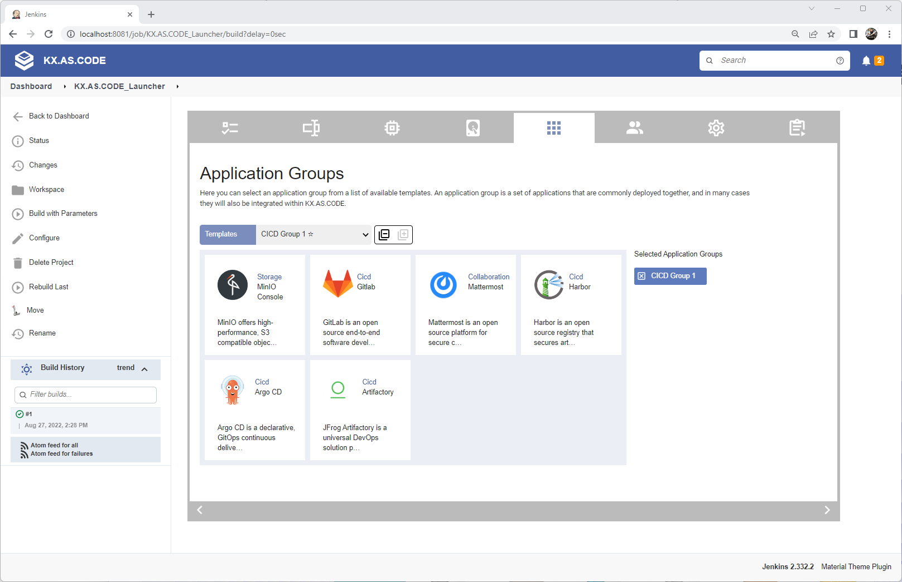{: .zoom}

User provisioning was implemented to allow team usage of KX.AS.CODE. This is most suited to KX.AS.CODE deployments to the public or private clouds, eg. AWS and OpenStack. Scripts for both of these are available in the KX.AS.CODE repository.
If you are just starting KX.AS.CODE on a local virtualization solution, such as VirtualBox, VMWare Desktop/Fusion, or Parallels, for your own use, you can ignore this tab.

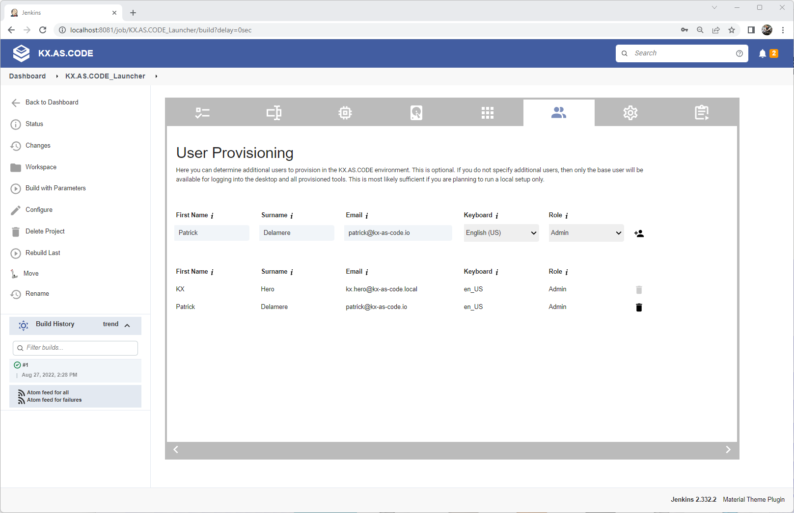{: .zoom}

The next tab allows you to add custom global properties to the profile. You only needs to complete this if you have created a custom component that requires a custom global variable to be defined.

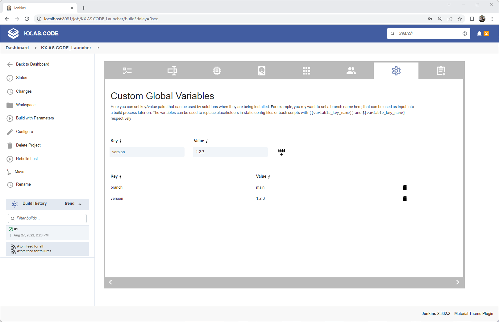

Finally, after completing the previous tabs, you come to the last tab, where you can review everything that was selected.

Examine the pie charts and see if anything needs to be adjusted. If storage is red, you may be able to ignore it, since the storage is thinly provisioned anyway.
When happy, click the play button and start KX.AS.CODE!

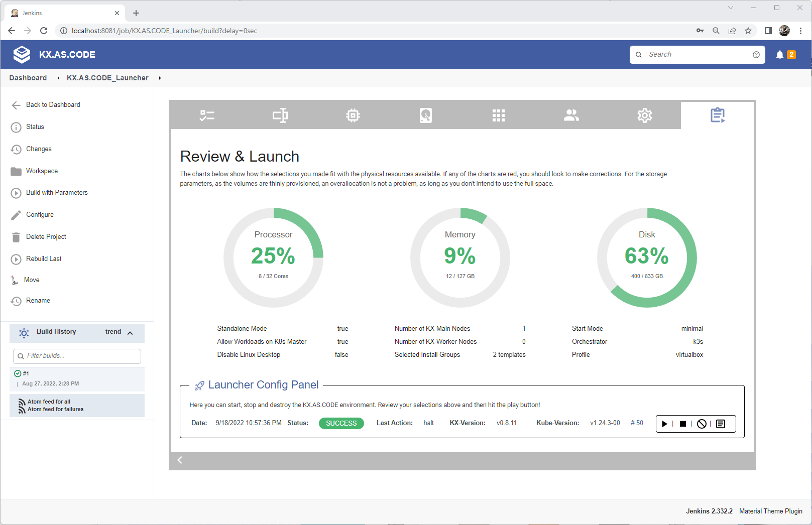{: .zoom}

Once you have clicked play, you should see the progress dots. You can either hover over the logs icon to see progress in a preview popup, or you can click on the log icon to see the full log. 

Once successfully completed, you will get a green status. If the status is red with failed, check the log and make the required adjustments as per the error message.

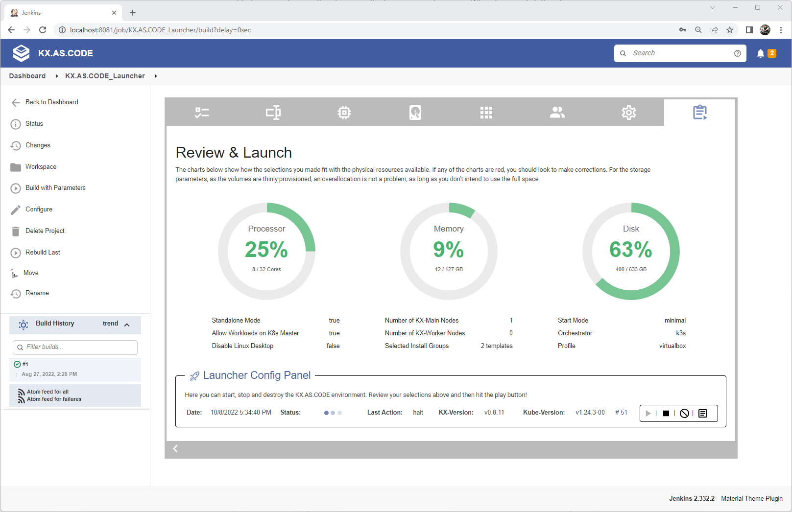{: .zoom}

Once up, you should see the following in VirtualBox.
In this example, KX.AS.CODE was started with 1 KX-Main node and 2 KX-Worker nodes.

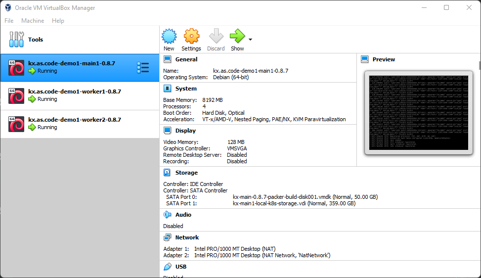{: .zoom}

In this example, KX.AS.CODE was started without the desktop, to re-enable it, execute the following script.
`/usr/share/kx.as.code/workspace/reEnableKdeDesktopOnBoot.sh`

Once done, you can type `startx` to start the desktop immediately without rebooting.
    
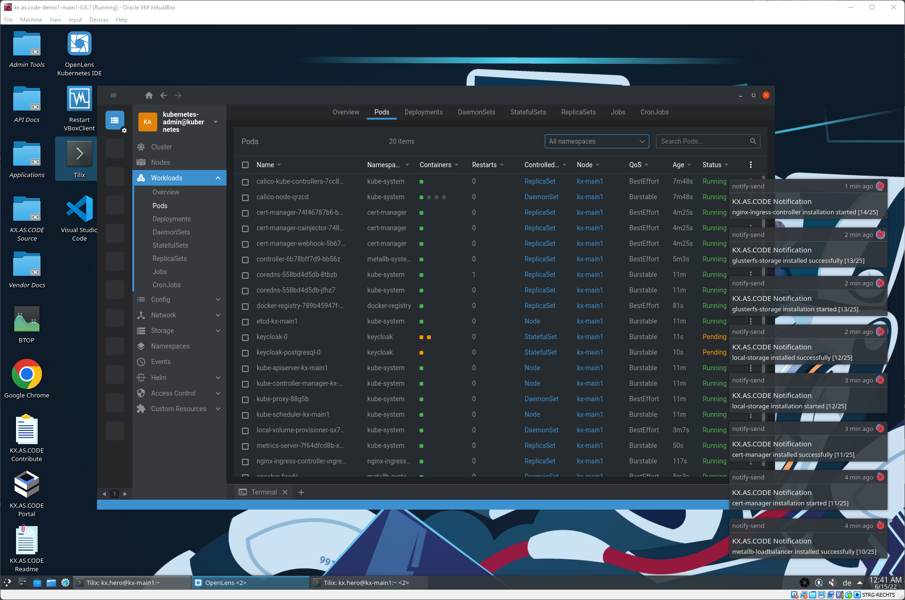{: .zoom}

More documentation to come in future, but this should have gotten you started. Here some basic troubleshooting steps and dos/donts.

!!! danger "Donts"
    - Do not reboot the Virtual Machine until the core setup is completed. You will get a "Congratulations" message when done.
    - Do not stop and start the machine directly via VirtualBox. Always ensure the box is stopped cleanly, either via the "stop" button in the Jenkins based KX.AS.CODE configurator, or by entering `vagrant halt` in the profile directory for the virtualization solution you are using.
    - Do not over allocate CPU and RAM. Starving your host of resources will give you a terrible experience.
    - Do not go crazy and select all the template application groups, unless you have a beast of a machine. It is possible if you have a host with 128GB of RAM and 32 vCores (I tested it and it works), but most likely your laptop does not have this specification.
    
!!! warning "Troubleshooting"
    - Nothing seems to be happening. I logged onto the desktop, but not getting any installation notifications. Check your internet connection works and DNS is resolvable. If you are behind a company proxy, you may have issues. KX.AS.CODE relies heavily on downloading workloads from the internet.
    - Nothing is happening part II - check that `/vagrant` has been mounted correctly. If not, remove the environment and redeploy. Something seems to have blocked vagrant from provisioning this standard mount correctly. This mount is important as it contains property files needed to start the installation process.    
    - I am getting warnings that my Dockerhub download limit is used up. You have 2 choices, either wait for 6 hours for the restriction to be lifted, or sign up to a free docker account, which increases your free limit. Ensure you comply with any licensing limitations. You can then enter the Dockuerhub user name and password into the profile-config.json in your profiles directory. 
    - I want to access my VM via SSH externally, but this is not working. First of all, check you are using the correct port. For KX-Main1, the port is mapped to `localhost:2230`. If it still does not work, log into the workstation and check that `enp0s8` correctly go an IP address. In VirtualBox, the standard IP that is setup is `10.100.76.200`. If this is not configured, try rebooting the VM. If that does not help, try re-provisioning the environment.

!!! tip "Hot tips"
     - If anything fails, you can always move it back into the "actions queue". You should soon be able to manage this via the KX-Portal. If the feature is not yet available, go into the admins folder on the desktop and open RabbitMQ. Login with `guest/guest`. Go to the queues tab, and click on the `failure_queue`. Find the "move" option and move the message to the `retry_queue`. Before you retry, be sure to check the logs in `/usr/share/kx.as.code/workspace`. Each item on the queue has its own log file.
