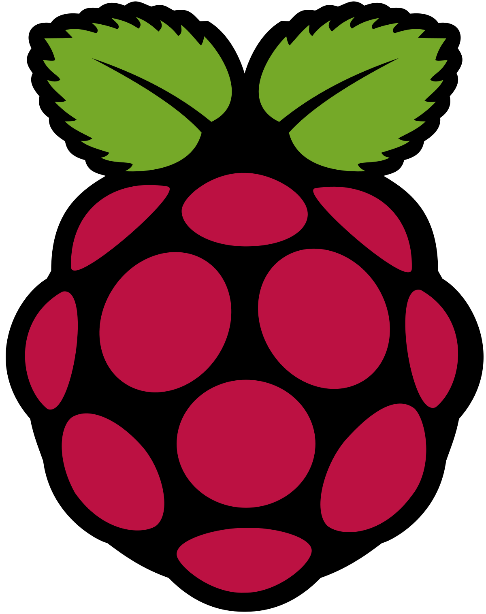

# Welcome!

Welcome to the KX.AS.CODE workstation. This virtual workstation was initially created with two primary goals in mind, but has since become so much more!

*   Play, learn, experiment, innovate! :muscle: :trophy:
*   Share knowledge as code!

!!! tip
    KX.AS.CODE was built with the belief that playing and experimentation is the best way to learn new tricks and ultimately innovate.

!!! abstract "Quick Start Guide"
    Want to get started quickly? Read our [Quick Start Guide](./Quick-Start-Guide/).

## What is the KX.AS.CODE Workstation?

KX.AS.CODE can be considered as a `local cloud like` Kubernetes environment with a lot of things you would expect to see when managing a Kubernetes cluster in the cloud, including an ingress controller, storage cluster, DNS, a certificate authority... and the best bit, you just have to fill out a couple of config files and `vagrant up`/`terraform apply`, and you are on your way!

!!! info "Applications Library"
    Check out the [applications library](Overview/Application-Library/), to see which solutions can be installed with a single click!

!!! question "Questions & Answers"
    To find out more about what KX.AS.CODE is, and how it came about, read our [Questions and Answers](Overview/Questions-and-Answers/).

## What else?

Currently, KX.AS.CODE fulfills the following use cases:

1. DevOps training environment
2. Fullstack development/DevOps environment
3. A HomeLab DevOps environment - see below our Raspberry Pi project!

## Where can I deploy KX.AS.CODE?
KX.AS.CODE can be deployed locally or in the cloud, be it a private or public cloud. The most tested solutions are currently OpenStack and VirtualBox. Here a full list of solutions we have run KX.AS.CODE on.

1. VMWare Workstation/Fusion (MacOSX, Linux and Windows)
2. VirtualBox (MacOSX, Linux and Windows)
3. Parallels (MacOSX)
4. AWS
5. OpenStack
6. VMWare VSphere (needs updating)

!!! danger "NEW! Raspberry Pi Enablement!"

    { width="35" align=left loading=lazy }

    We just started a new project to enable ARM64, and more specifically, KX.AS.CODE on a Rasbperry Pi cluster. Read more in the Raspberry Pi [build](Build/Raspberry-Pi-Cluster/) and [deployment](Deployment/Raspberry-Pi-Cluster/) guides.

!!! example "Contribute an application"
    If you want to contribute another application to KX.AS.CODE, read our [development walk-through](Development/Adding-a-Solution/)

## KX.AS.CODE Highlights

### Jenkins based launcher for building and launching KX.AS.CODE

Configure your KX.AS.CODE instance using the Jenkins based launcher. On this screen you can select between K3s and K8s amongst others.

{: .zoom}

### Optionally select application groups to install

You can also configure application groups that will be installed on first launch of KX.AS.CODE. More groups and individual applications can be added later.

{: .zoom}

### Review configuration and launch KX.AS.CODE

Once done configuring KX.AS.CODE in the launcher, you can review the settings and launch the KX.AS.CODE environment.

{: .zoom}

### Login screen
Depending on whether the defaults were changed or not, you can either log in with your own user, or the default `kx.hero`. 

Additional users will also be available if applied before launching KX.AS.CODE. See the [User Management Guide](Deployment/User-Management/).

{: .zoom}

### KX.AS.CODE desktop

This is the home of KX.AS.CODE from where you can launch the deployed applications, read manuals, test API calls, administer the VM, and so on.

{: .zoom}

### Administration tools

The tools for administering some elements of KX.AS.CODE. More details will be published on the administration page (wip).

{: .zoom}

### Installed applications

The applications folder show the icons of the applications that have been installed so far and are available to launch. Use `GoPoass` to get the password for accessing the application. 

{: .zoom}

### Kubernetes IDE

OpenLens, known as the Kubernetes IDE, displays information about the running workloads in Kubernetes and their status. It is useful for debugging if there is an issue with any of the workloads.

{: .zoom}

### GoPass password manager

All administration passwords for accessing all admin tools and applications are stored here. The passwords for the users are also available here.

{: .zoom}

### Example application, Gitlab

Here an example Gitlab application that was installed via the KX.AS.CODE automated install scripts.

{: .zoom}

### User manuals

User manuals are useful if you are new to an application and want to read up on how it works.

{: .zoom}

### API documentation

Since we are in the world of DevOps here, API documentation is important for automating any workflows. API documentation is automatically linked for all applications installed via KX.AS.CODE.

{: .zoom}

### Swagger API documentation

If an application has a Swagger endpoint, this is also accessible via the API docs folder.

{: .zoom}

### Postman API documentation

If an application has a Postman endpoint or public link, this is also accessible via the API docs folder.

{: .zoom}

### Source code in VSCode

Since KX.AS.CODE is all about sharing knowledge as code, a pre-configured VSCode is installed that includes all the KX.AS.CODE source code.

{: .zoom}

### KX.AS.CODE Portal

The KX.AS.CODE portal makes adding and removing applications easier, and provides status on current installed items.

!!! warning 
    The portal is still in ALPHA, so may not always behave as expected.

{: .zoom}

### KX.AS.CODE Application Management

Applications and be removed and added from the KX.AS.CODE Portal's application screen.

!!! warning
    The portal is still in ALPHA, so may not always behave as expected.

{: .zoom}

### KX.AS.CODE Application Groups

Applications can be installed in integrated groups. This is still a work in progress. Currently, this page provides a view of the available groups, but not yet an option to install them.
See the [manual installations](User-Guide/Manual-Provisioning/#installation-groups) page, on how to install the groups manually without the portal.

!!! warning 
    The portal is still in ALPHA, so may not always behave as expected.

{: .zoom}

## Contributing
We are happy to receive contributions, ideas and dare I say it, bug fixes or suggestions on how to do things better! We never stop learning! :nerd_face:

For more details on how you can contribute to the project, checkout the [CONTRIBUTE.md](Development/Contribution-Guidelines/) file

Wish you all the best and enjoy the DevOps workstation! :smile:

Patrick Delamere (Accenture Song), creator of KX.AS.CODE
