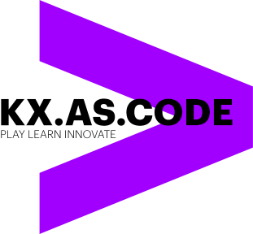

# README
:exclamation: `A COPY OF THIS TEMPLATE MUST BE MADE AND INCLUDED IN EACH NEW SOLUTION'S SUB FOLDER.`

## Description
Lorem ipsum dolor sit amet, consetetur sadipscing elitr, sed diam nonumy eirmod tempor invidunt ut labore et dolore magna aliquyam
- ..
- ...

## Architecture
Lorem ipsum dolor sit amet, consetetur sadipscing elitr, sed diam nonumy eirmod tempor invidunt ut labore et dolore magna aliquyam
- ..
- ...


## Assumptions
Lorem ipsum dolor sit amet, consetetur sadipscing elitr, sed diam nonumy eirmod tempor invidunt ut labore et dolore magna aliquyam
- ..
- ...


## Required Components
Lorem ipsum dolor sit amet, consetetur sadipscing elitr, sed diam nonumy eirmod tempor invidunt ut labore et dolore magna aliquyam
- ..
- ...


## Important Information / Pitfalls
Lorem ipsum dolor sit amet, consetetur sadipscing elitr, sed diam nonumy eirmod tempor invidunt ut labore et dolore magna aliquyam
- ..
- ...
```bash
$ command
$ command
```

## Installation
Lorem ipsum dolor sit amet, consetetur sadipscing elitr, sed diam nonumy eirmod tempor invidunt ut labore et dolore magna aliquyam
- ..
- ...
```bash
$ command
$ command
```

## Configuration
Lorem ipsum dolor sit amet, consetetur sadipscing elitr, sed diam nonumy eirmod tempor invidunt ut labore et dolore magna aliquyam
- ..
- ...
```bash
$ command
$ command
```


## Usage

Lorem ipsum dolor sit amet, consetetur sadipscing elitr, sed diam nonumy eirmod tempor invidunt ut labore et dolore magna aliquyam
- ..
- ...
```bash
$ command
$ command
```

### Troubleshooting
Lorem ipsum dolor sit amet, consetetur sadipscing elitr, sed diam nonumy eirmod tempor invidunt ut labore et dolore magna aliquyam
- ..
- ...
```bash
$ command
$ command
```
